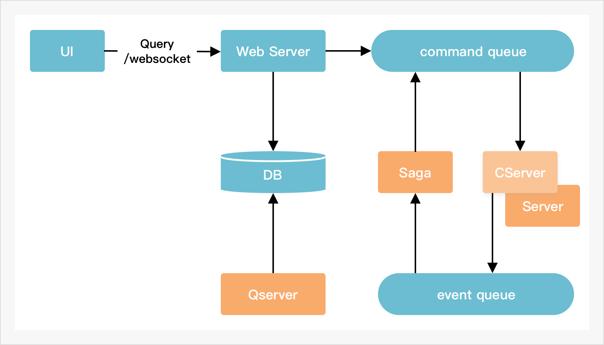
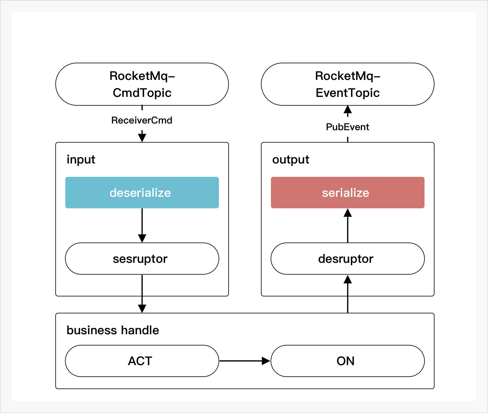

**感谢[RocketMQ官微](https://mp.weixin.qq.com/s?__biz=MzIxODM2NTQ3OQ==&mid=2247484214&idx=1&sn=d17f889cd8ddefe65fb4dae8e95c1354&chksm=97eae87ea09d6168a3a13ea4266e2c0a9cbf0c4d2d67cb16a83a822e9f6b8f8281be1c23ff8c&scene=27#wechat_redirect)采稿**

> 摘要：Phoenix是宽拓科技架构团队研发的内存计算框架，借鉴了LMAX的架构思路，采用CQRS和EventSouring理念打造。本文简单介绍Phoenix，以及RocketMQ在Phoenix中的应用与实践。 注：该Phoenix不是Apache开源的那个Phoenix。

<!--truncate-->

## 行业背景
在金融资管投资交易领域，业务场景复杂，如在交易处理场景中，存在事前的风控头寸控制需求，导致交易事件必须串行处理，无法并发，且单次交易事件处理中，存在高密度的复杂业务逻辑计算且依赖数据范围广，所以系统的性能问题非常突出。

目前业内一般基于关系型数据库来处理单个交易事件，会存在复杂SQL运算逻辑和多次IO读取数据，因此很难做到低延迟。并且由于业务逻辑比较复杂，经常陷入与表模型纠缠当中。

因为交易事件必须串行处理，所以基于SpringCloud/Dubbo这类分布式框架，并不能享受到横向扩容带来的计算能力提升的好处，反而在多点部署的时候需要引入全局锁来做好并发保护，增加了业务实现的复杂度。

基于此我们在借鉴了英国外汇交易中心的LMAX架构基础上，结合CQRS + EventSouring理念，落地了一套基于Java的内存计算框架Phoenix。目标是要把复杂的业务逻辑拿到内存中计算，摆脱对关系型数据库的依赖，结合DDD设计思路，让业务开发人员真正面向对象编程，大大降低单个事件的处理延时，通过低延迟获取高吞吐回报。同时利用单线程模式，避免了并发场景，降低了编程复杂度。

## Phoniex介绍
Phoenix是对CQRS + EventSouring理念落地的JAVA开发框架，围绕Phoenix开发框架打造了一套开发运维平台。Phoenix框架具有如下特性： ln-Memory、支持分布式事务（SAGA）、微服务、单线程、支持同步/异步调用。 在开发运维平台上提供，内存查询/修改、快照管理，事件编排，调用链跟踪、实时监控、个性化业务指标监控、性能指标统计等。目前已经在生产中使用

### 架构图

### 概念术语

**Command**：由CServer定义，表示请求的入参。

**Event** ：由CServer定义，表示领域内已发生的事件。

**CServer**： 业务处理服务，采用内存保存数据状态。收到请求Command后，通过业务处理逻辑，产⽣结果Event，然后Event再驱动内存数据状态改变。当服务重启后， 利用EventSouring来恢复内存数据。

**QServer**：订阅CServer产生的领域Event，加工后得到查询端的数据模型。 如可以持久化到关系数据库供查询，又或者持久化到内存数据库供高速查询。

**Saga**：负责分布式事务协调，接收Event，产生Command， 协调各个CServer一起工作，共同完成事务。

### RocketMQ和Phoenix

​上面简单介绍了行业背景和Phoenix，关于CQRS和EventSouring相关理念，这里不多阐述，大家可以上网搜索相关资料来理解Phoenix。回到与RocketMQ相关，在Phoenix框架里RocketMQ承担了什么角色？我们为什么选用RocketMQ，这里要从EventSouring说起。

### RocketMQ和EventSouring
​Phoenix应用基于的内存来计算，最大的问题就是进程重启或Crash，内存数据全部丢失。而EventSourcing就是用于进程重启后恢复内存数据状态的。

​举例：有一个Java对象account，ID为001，当前状态：余额10元。假设是经过如下三个操作达到了该状态：

- Account account = new Account(001, 0);  — 初建对象
- account.amt = account.amt + 14; — 转入14元
- account.amt = account.amt - 4; — 转出4元

如果进程重启，根据EventSouring思想，我们可以重播操作1、2、3来恢复重启前的Account状态。

对于Phoenix，我们做了如下思考：

**思考1**： Phoenix应用通过领域Event回溯可以重建内存状态，那领域Event该怎么存储？

首先回溯的时一定要确保领域Event有序且不漏，这里我们选择了RocketMQ来存储领域Event:
1. RocketMQ中同步刷盘机制，可以保证消息不丢。
2. topic的单queue模式，可以保证消息有序存储，有序消费。
3. RocketMQ是一个基于文件持久化的高性能MQ，支持重复消费。
4. RocketMQ本身经历过阿里双12的考验，更适合金融场景。

**思考2**：对比采用数据库保存数据状态，Phoenix采用了RocketMQ来持久化领域Event，两者都存在数据持久化动作，那么两者性能对比如何？我们来分析一下一个账户的转入操作。

使用数据库的处理方式：
1. 根据账户ID从数据库中取出账户信息，开启事务且加锁。
2. 程序进行账户的加钱操作，写会数据库，提交事务(写数据库还涉及建立索引，写binlog，redolog等)。

使用Phoenix的处理方式：
1. Phoenix应用从RocketMQ中读取Command，完成消息反序列化。
2. 路由Command到具体的聚合根对象，调用处理函数act，产生领域Event，Event驱动内存数据状态改变。
3. 将Event序列化后publish到RocketMQ。

​以上3个步骤，采用disruptor，以流水线方式处理。处理过程，是采用先修改内存状态，再持久化Event到RocketMQ。之所以可以这样设计，是因为Event的发布和存储是在一个事务中完成的。

​显然，存储状态需要进行两次IO操作，并且如果是一个新增操作，建立索引等耗时都是要考虑在内的。而RocketMQ存储领域Event时，只需要把Event内容追加到commitlog文件尾（1~2ms），配合着GroupCommit技术，可以做到非常高的吞吐量，效率更高。

### RocketMQ下的Phoenix框架性能

​单个CServer，在PC机（X99平台 + Intel(R) Core(TM) i7-5820K CPU @ 3.30GHz + SSD) 下的采用echo测试结果：TPS=2w/s, latency = 1~2ms

​虽然这个TPS对比Dubbo这类的框架下单服务TPS并不算高， 但得益于内存计算，回到开篇提到的复杂业务逻辑计算下，单个交易事件的业务处理耗时能做到ms下，TPS可以达到 k/s 级别。 端到端延时在毫秒级。这在基于数据库的模式下是很难做到的。

### RocketMQ的消息存储问题
​根据EventSouring的描述，理想情况下我们是需要RocketMQ永不清理消息，可以通过调整broker的配置设置`fileReservedTime=99999999999`消息时间。这里RocketMQ没有提供直接关掉清理策略开关，其中一条清理策略是，如果磁盘空间达到85%以上，RocketMQ无论消息过期都会清理消息。

​在实际生产场景中，我们并不会要求RocketMQ永不清理消息。因为CServer应用会采用快照功能，每天都会定时把内存状态和当时Queue的Offset存储到数据库中（存储快照）。在EventSouring的时候，就不需要从Offset为0的地方开始回溯，就可以根据快照先恢复近期的数据状态，再从快照记录的Offset之后做回溯。

​一般情况下把`fileReservedTime=168`设置消息过期时间为7天即可。

### RocketMQ的部署方案
​在Phoenix中，由于消息需要做到严格的有序且不丢，所以RocketMQ的部署方案，我们只能采用1master-1slave， 同步刷磁盘机制+同步写Slave节点模式。 

​在1master-1slave场景下，RocketMQ是不能保证主备的自动切换的，所以目前主发生故障的时候，我们采用人工手动切换方式。

​在RocketMQ的Deleger版本中，提供了多副本的解决方案，可以做到自动选主，自动切换，正在探索是否是一个好的解决的方案。

## Phoenix后续的RoadMap

- CServer主备切换
- 横向扩容支持
- RocketMQ故障自动切换（基于Deleger方案）

