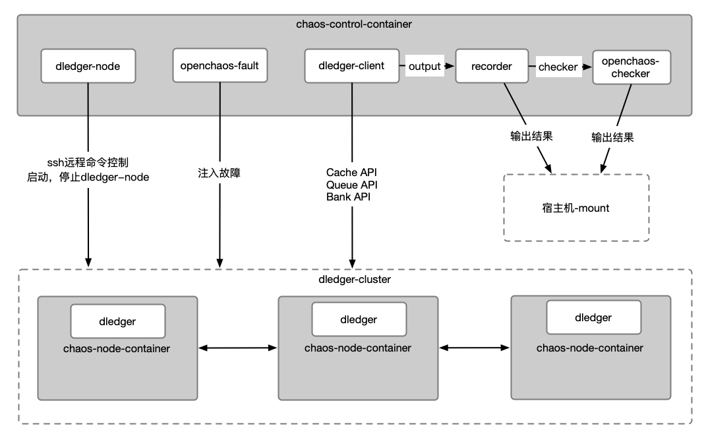
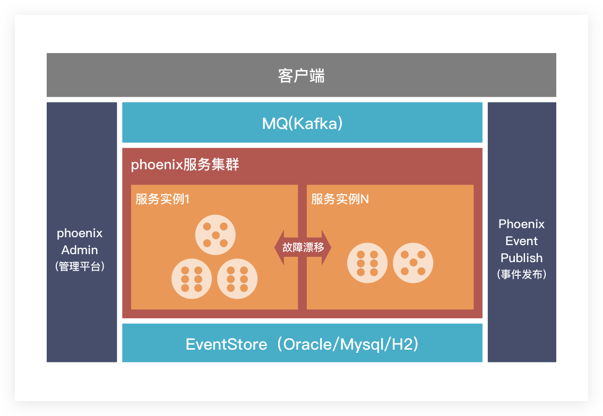
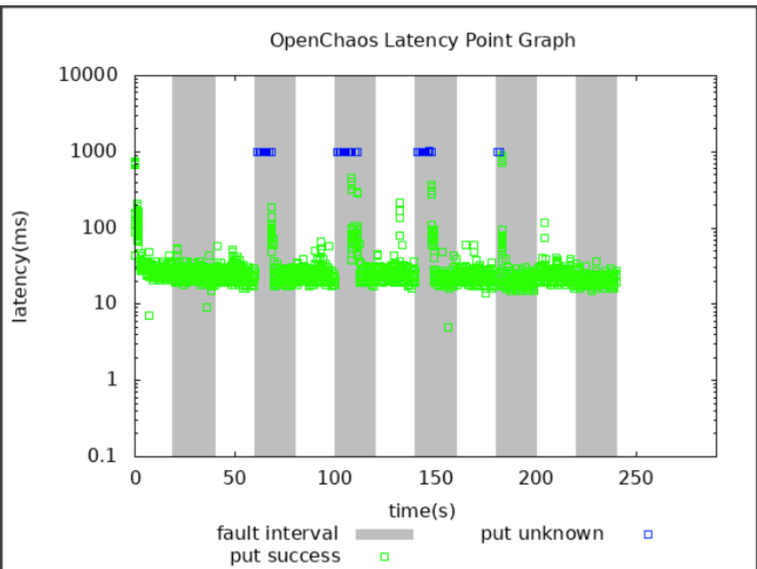
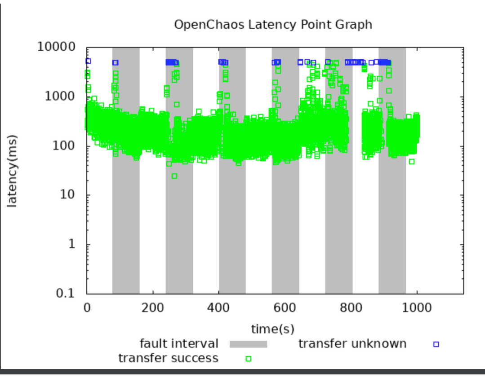
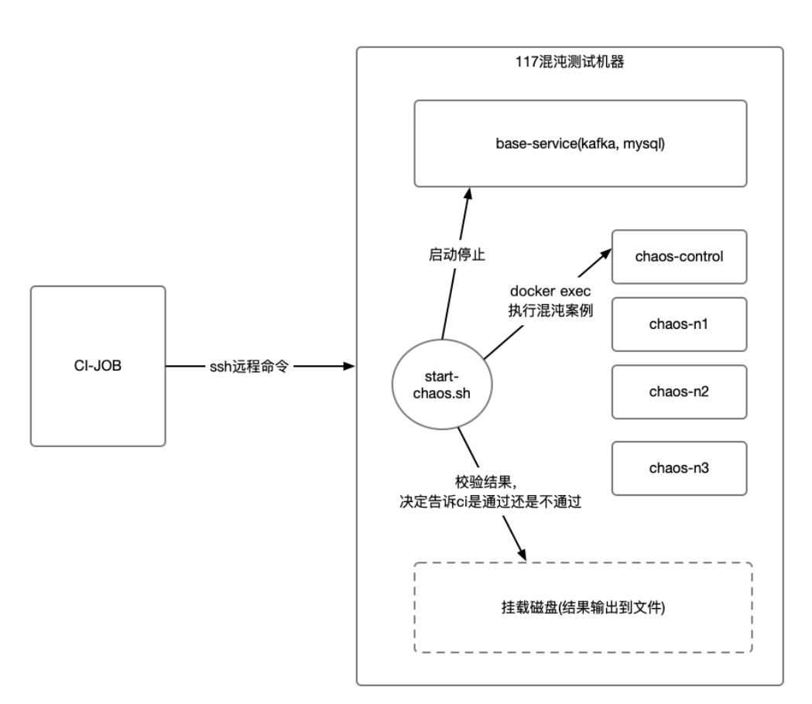

> 本文将分享Phoenix在使用[openchaos](https://github.com/openmessaging/openchaos) 进行混沌测试的实践

{/* truncate */}

## 一、为什么需要混沌测试？

随着计算机技术的发展，系统架构从集中式演进到分布式。分布式系统相对于单台机器来说提供了更好的可扩展性，容错性以及更低的延迟，但在单台计算机上运行软件和分布式系统上运行软件却有着根本的区别，其中一点便是单台计算机上运行软件，错误是可预测的。当硬件没有故障时，运行在单台计算机的软件总是产生同样的结果；而硬件如果出现问题，那么后果往往是整个系统的故障。因此，对于单体系统来说，要么功能完好且正确，要么完全失效，而不是介于两者之间。

而分布式系统则复杂的多。分布式系统涉及到多个节点和网络，因而存在部分失效的问题。分布式系统中不可靠的网络会导致数据包可能会丢失或任意延迟，不可靠的时钟导致某节点可能会与其他节点不同步 ，甚至一个节点上的进程可能会在任意时候暂停一段相当长的时间（比如由于垃圾收集器导致）而被宣告死亡，这些都给分布式系统带来了不确定性和不可预测性。事实上，这些问题在分布式系统中是无法避免的，就像著名的 CAP 理论中提出的，P（网络分区）是永远存在的，而不是可选的。

既然分布式系统中故障是无法避免的，那么处理故障最简单的方法便是让整个服务失效，让应用“正确地死去”，但这并不是所有应用都能接受。故障转移企图解决该问题，当故障发生时将其中一个从库提升为主库，使新主库仍然对外提供服务。但是主从数据不一致、脑裂等问题可能会让应用“错误地活着”。代码托管网站 Github 在一场事故中，就因为一个过时的 MySQL 从库被提升为主库 ，造成 MySQL 和 Redis 中数据产生不一致，最后导致一些私有数据泄漏到错误的用户手中 。为了减轻故障带来的影响，我们需要通过某种手段来确保数据的一致性，而如何验证大规模分布式系统在故障下依然正确和稳定（可靠性）成为了新的难题。

目前比较常用的有如下框架：

| 框架名称 | 支持平台 | 支持自动部署被测试服务 | 故障类型是否丰富 | 可视化界面 | 是否支持断言 |
|--|--|--|--|--|--|
| Chaos Mesh | Kubernetes | 不支持 | 丰富 |有 |否|
| chaosblade | Docker、Kubernetes、OS | 不支持 | 丰富 |否 |否|
| jepsen | Docker、OS | 支持 | 丰富 |否 |是|
| openchaos | Docker、OS | 支持 | 丰富 |否 |是|

准确的来说，像**Chaos Mesh**和**openchaos**的定位是不太相同的，**Chaos Mesh**主要提供比较完整的混沌实验故障注入的手段，而**Openchaos**则是需要针对某些类型中间件做固定Module运行，同时提供故障注入和结果校验的手段（比如Cache Module, QueueModule等）。**Phoenix**作为框架来说很适合**openchaos**这种轻量级，可扩展度高、支持结果校验的测试框架。

## 二、openchaos框架介绍

openchaos是openmessage组织下开源的一款混沌测试框架，主要用来测试各种开源分布式系统的可靠性、可用性和恢复能力。目前已经支持的有RocketMQ、Kafka、Dledger等。Openchaos可以基于用户的扩展一键发布运行所测试的服务，并且支持各种手段故障的注入机制，比如网络分区，进程崩溃，CPU超载等。另一方面还提供了各种校验模型，Cache，Queue来检测故障下是否还能满足预期。下面图中展示了Dledger在Openchaos中运行时的架构图。





## 三、Phoenix在Openchaos的实践

[Phoenix](https://phoenix.iquantex.com/docs/introduce)是一款有状态分布式计算框架，其提供以DDD中聚合根为概念的编程模型，可以帮助用户构建有状态的分布式服务。Phoenix依赖MQ通信和数据库存储事件。Phoenix可以保证MQ中数据精确一次消息语义（Exactly-once-semantics），这很适合Openchaos的Cache模型测试。



### 3.1 Phoenix Openchaos Cache Module 测试

Openchaos运行时可以指定运行CacheModule，Cache测试分为两阶段，第一阶段由不同的客户端调用Cache API接口并发的向待测试集群添加不同的数据（每个客户端的key是相同的），中间会进行故障注入。Phoenix实现了其API，并实现了负责Key-Value存储的聚合根。

```java
    /**
    *  key始终是唯一的，每次put都是给key下面增加元素
    */
    InvokeResult put(Optional<String> key, String value);
    
    /**
     * 获取这个key下所有的value（前面put进去的），在测试结束时调用
     */
    List<String> getAll(Optional<String> key);

```

第二阶段，Opencahos会向待测试集群一次性读取结果集，最后验证每一个添加的元素都在最终结果集当中，Openchaos会把调用过程以及结果输出以下信息，根据Phoenix的Exactly-once-semantics语义，Phoenix可以通过判断 `putInvokeCount == getSuccessCount`来校验结果是否符合预期。

在实际测试过程中，我们开启了10个客户端并发的向待测试的Phoenix连续添加不重复的数字，中间会引入特定故障，比如随机杀死节点，非对称网络分区等。故障引入时间是60S，60S正常，60S故障，一直循环，整个过程持续300S。故障注入方面，我们测试以下几种故障注入：

1. minor-kill模拟随机杀节点故障测试
2. fixed-partition非对称网络分区测试
3. OOM，CPU吃满等慢节点测试（ongoing）

```
---
isValid: false
name: "CacheTestResult"
putInvokeCount: 4725
putSuccessCount: 4542
getSuccessCount: 4725
lostValueCount: 0
lostValues: []
pass: true
```

可以看到10个客户端一共调用4725次，其中直接返回成功的有4542次（网络超时），最终调用结果集查询是4725次，公式验证通过`getSuccessCount==putInvokeCount`最终输出`pass: true`。

Openchaos支持输出图表更好的分析测试过程中的表现情况，Phoenix Cache Module测试操作情况和延时如下图所示。



### 3.2 Phoenix Openchaos Bank Module 测试

Phoenix提供了分布式事务组件来解决跨聚合根处理的一致性问题。我们提供了银行转账的案例，在没有使用Openchaos之前，我们可以手动的发起N个账户的随机转账，最终校验账户总额不变来验证事务的可靠性。

得益于Openchaos提供灵活扩展的API，我们扩展了Openchaos新的模型：bank module，bank module可以更好的验证phoenix的分布式事务模块的可靠性和一致性。

第一阶段Openchaos会通过N个客户端发起对M个账户的随机转账随机金额，调用transfer api，同样中间也会引入故障注入。第二阶段Openchaos会发起所有账户的余额查询，每个账户初始金额是固定的（100），最终校验`所有余额汇总 == 100 * M`

```java
    /**
     * transfer account amt
     * @param outAccount
     * @param inAccount
     * @param amt
     * @return
     */
    InvokeResult transfer(String outAccount, String inAccount, int amt);

    /**
     * get all account amt
     * @param accounts
     * @return
     */
    List<Integer> getAllAmt(List<String> accounts);
```

在实际测试过程中，我们开启了10个客户端并发的向待测试的Phoenix连续添加不重复的数字，中间会引入特定故障，比如随机杀死节点，非对称网络分区等。故障引入时间是60S，60S正常，60S故障，一直循环，整个过程持续300S。故障注入方面，我们同样测试以下几种故障注入：

1. minor-kill模拟随机杀节点故障测试
2. fixed-partition非对称网络分区测试
3. OOM，CPU吃满等慢节点测试（ongoing）

```
---
isValid: false
name: "BankTestResult"
transferInvokeCount: 7245 # 请求转账册数
transferSuccessCount: 6790 # 转账成功次数
accountAmtTotal: 1000   # 银行总额
```

可以看到10个客户端一共调用7245次，其中直接返回成功的有6790次（网络超时），最终总金额为1000（10个账户，每个账户100），验证通过。

Openchaos支持输出图表更好的分析测试过程中的表现情况，Phoenix Cache Module测试操作情况和延时如下图所示。



### 3.3 Phoenix Openchaos自动化混沌测试方案

有了以上两个模型的测试验证，Phoenix还希望构造一个混沌测试方案，即每次可以一键方便运行所有案例，并且支持校验功能。目前希望做到的

1. 每次发版前进行回归混沌测试案例，整个过程自动化
2. 平时希望可以自动不断运行混沌测试案例，来测试Phoenix

如下图所示，我们准备了一台专门负责跑混沌测试的机器，然后配置ci-job免密到这台机器之上，通过调用`start-openchaos.sh`脚本来完成所有案例的运行和校验




`start-chaos.sh`脚本当中，一次会跑四次混沌案例

1. cache模型的杀节点
2. cache模型的网络分区
3. bank模型的杀节点
4. bank模型的网络分区

四次案例跑完之后，会统一展示并校验结果，并且可以再job的日志当中看到。

1. cache模型校验: putInvokeSuccess == getSuccessCount
2. bank模型校验: allAmtTotal == 1000

两种模型最终都会有一个 pass: true/false 值，然后start_openchaos.sh脚本会匹配这个值做校验决定是正常退出还是错误退出（决定ci是否通过）


我们利用gitlab的自动调度机制，配置了每小时执行一次job，即简单了做到每天自动化的跑混沌测试场景，当后续案例更丰富之后，可以增加更多的场景自动化运行。并且后续每次发版前可以做到新版本的混沌测试，具体步骤如下:

1. openchaos默认是使用的 master-SNAPSHOT 的phoenix版本。
2. phoenix每次发版前，把dev代码合并到master分支，触发更新master-SNAPSHOT版本
3. 给openchaos打一个和pheonix同样的tag，自动触发进行上述4个案例跑的测试，（openchaos跑之前会重新build）（打同样tag的原因也是想保持一个版本一致性，如果openchaos也有变更可以和phoenix匹配起来。）
4. 跑完结果通过job日志观察
5. 并且把末尾的最终结果数据拷贝出来，放到每次发phoenix版本的那个issue上。


## 四、总结展望

Phoenix经过Openchaos的实践，测试并修复了Phoenix很多BUG，最终可以通过cache和bank模型的可靠性验证。后续还希望支持更多的混沌案例，比如更复杂极端的网络情况，OOM，CPU负载高等等。

由于Phoenix运行时依赖于第三方存储和通信服务，目前的混沌测试还仅限于Phoenix本身，后续计划加上依赖的中间件一起进行混沌测试。


参考链接：

1. https://cloud.tencent.com/developer/news/481465
2. https://github.com/openmessaging/openchaos