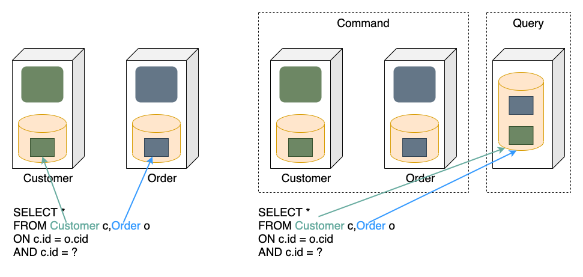

> 事件驱动型微服务就是在微服务架构中使用事件驱动思想。事件驱动系统的核心结构是事件的捕获、通信、处理和持久化，事件驱动架构的系统可以实现最小耦合，在现代分布式程序架构中尤为有用。
>
> 本文从如何在微服务架构中解耦微服务出发，介绍事件驱动型微服务。

## 微服务架构介绍 \{#introduce\}

在 2014 年 Martin Flower 和 James Lewis 合写的文章《[MicroServices](https://martinfowler.com/articles/microservices.html)》定义了微服务架构风格。
在该文章中概括了"微服务架构"术语的含义：**微服务架构风格是一种通过多个小型微服务组合来构建一个应用的架构风格，这些服务围绕业务能力而非特定的技术构建。每个服务可以采用不同的语言、数据存储技术在独立的进程中运行、自动化部署和运维。
服务间通过轻量级的机制通信。** 并且列举了微服务架构应该具备的九大特征：

- 以微服务而不是类库的方式实现程序组件化
- 围绕业务范围搭建团队
- 产品化思维
- 强终端弱管道
- 分散治理
- 数据去中心化
- 基础设施自动化
- 容错性设计
- 演进式设计

微服务架构是一种模块方法，将应用系统以业务能力拆分为多个高度自治的微服务。使得开发大型复杂应用程序的团队能够更快地的交付软件。也可以让团队更轻松地的采用新技术，还可以使每个服务部署在最合适的硬件上来提高应用程序的扩展性。

然而微服务并不是灵丹妙药，特别是”领域模型“、”事务“和”查询“正在抵抗微服务架构的拆分能力。

### 微服务架构挑战1: 分解领域模型 \{#challege-1\}

领域模型设计模式是实现复杂业务逻辑的好办法。例如线上商城的域模式可以简单分解为：订单、订单详情、用户、产品。

然而分解领域模型的挑战在于类之间经常会相互引用：

1. ”订单类“需要引用“用户类”
2. ”订单详情类“需要引用“产品类”

那么应该如何处理跨越服务边界的引用呢？稍后我们将介绍领域驱动设计（DDD）中的聚合概念来解决此问题。

### 微服务架构挑战2: 实现跨服务的事务 \{#challege-2\}

微服务架构的一个显着特征是服务拥有的数据只能通过该服务的 API 访问。例如，在线上商城中，`订单服务`有一个包含订单数据表的数据库，而`用户服务`有一个包含用户数据表的数据库。

这种封装下，服务间是松耦合的，开发时，程序员可以更改其服务的架构而无需和其他团队的人员协调；运行时，服务之间彼此隔离（一个服务不会因等待另一个服务的数据库锁而阻塞）。

但是这种封装下，数据库的功能分解让数据一致性和多种查询的变得更难。

传统的单体(`monolithic`)架构可以依赖数据库的 ACID 事务来执行业务规则。以线上商城举例，用户拥有一个额度信息，创建新订单时必须检查该额度是否足够。应用程序必须确保潜在的多次并发的订单尝试后，
用户的信用额度不会超额使用，如果订单和用户在同一个数据库那么用 ACID 事务非常简单。

然而，在微服务架构下，订单和用户彼此隔离，其数据库表被不同的微服务维护，只能通过 API 访问。

传统的解决方案是分布式事务（2PC），但这不是现代应用的可行技术。CAP 定理要求我们在可用性和一致性中间作出取舍，大部分情况下可用性都是更好的选择。另外大多数的 NoSQL 数据库甚至都不支持 ACID 事务，更不用说 2PC 了。

保持数据一致性非常重要，因此需要另一个解决方案。稍后我们会介绍基于事件溯源（EventSourcing）的事件驱动架构。

### 微服务架构挑战3: 查询 \{#challege-3\}

维护微服务架构中数据的一致性并不是唯一的挑战，另一个挑战是数据的查询。

传统的单体架构中，使用连接('join')编写查询非常常见。但是在微服务架构中，订单数据和用户数据可能被不同的微服务维护，只能通过 API 访问。以及在挑战 2 中介绍的事件溯源技术让查询更具挑战性。

稍微我们会介绍一个叫做命令查询职责分离（CQRS）的设计模式来维护查询视图。

## 一. DDD 聚合是微服务的构建块 \{#ddd\}

在领域驱动设计中，Evans 为领域模型定义了几个构建块，大部分已经成为了日常开发人员语言的一部分：

- 实体（entity）：具有持久化身份的对象
- 值对象（value object,VO)：没有身份的对象，由其属性定义其身份
- 服务（service）：包含了不属于实体和值对象的业务逻辑
- 存储库（repository）：代表持久化实体的集合

除了 DDD 纯粹主义者之外，大多数开发人员忽略了一个基础的构建块：**聚合**。然而事实上聚合才是开发微服务的关键。

聚合可以看作一个单元的域对象集群，它由一个根实体（root entity）和可能的一个或者多个关联的实体和值对象组成。

例如：线上商城的域模型包含诸如订单和用户等聚合，例如订单聚合组成为：

- 一个订单实体（根，root）
- 一个或多个订单详情值对象或者其他对象（送货地址、付款信息）组成

用户聚合的组成为：

- 一个用户实体（根）
- 其他值对象（送货地址、付款信息）

使用聚合将域模型分解为更容易理解的块。它还明确了加载和删除等操作的范围：

- 聚合通常从数据库中完整加载
- 删除聚合会删除所有对象

- 然而，聚合的好处远远不止模块化领域模型。那是因为聚合必须遵守某些规则。

### 规则1: 聚合间引用必须是用主键 \{#rule-1\}

第一条规则是聚合通过标识（如主键）而不是对象引用来相互引用。

例如：订单使用用户 ID 而不是用户对象；订单详情使用产品 ID 而不是产品对象

使用标识而不是对象引用意味着聚合是松耦合的，可以轻松地将不同的聚合放在不同的服务中。

事实上，服务的业务逻辑由一个域模型组成，它是聚合的集合。例如订单服务包含订单聚合、用户服务包含用户聚合。

### 规则2: 一个事务创建或更新一个聚合 \{#rule-2\}

聚合必须遵守的第二条规则是一个事务只能创建或更新一个聚合。

在开发域模型时，我们必须做的一个关键决策是确定每个聚合的大小。

理想情况下，聚合应该很小：它通过分离关注点来提高模块化，更高效（effective)。除此之外，对每个聚合的更新按顺序执行，使用细粒度的聚合将增加应用程序的并行能力，从而提高伸缩性。
细粒度聚合还降低了两个用户更新同一聚合的可能性。

不过另一层面上，聚合是事务范畴，所以可能需要定义更大的聚合来让特定的更新成为原子操作。

即使事务只能创建或更新单个聚合，应用程序仍必须保持聚合之间的一致性。

例如，订单服务必须验证新的订单聚合不会超过用户聚合的额度限额。有几种不同的方法可以保持一致性： 

- 一种选择是在单个事务中作弊的方式创建/更新多个聚合。这只有在所有聚合都属于同一个服务并持久保存在同一个数据库系统中时才有可能
- 另一个更正确的选择是使用最终一致的、事件驱动的方法来维护聚合之间的一致性

## 二. 使用事件保持数据一致性 \{#eda\}

在现代应用中，事务存在各种限制，这使得跨服务维护数据一致性变得具有挑战性。

每个服务都有自己的私有数据，但 2PC 不是一个可行的选择。因此，现代应用程序必须使用事件驱动的、最终一致的事务模型。

### 1. 什么是事件 \{#event\}

事件的定义是已经发生的事实。

在本文中，我们将领域事件定义为发生在聚合上的事实。一个事件通常代表一个状态改变。

例如，线上商城案例中，订单聚合的事件包括：订单已创建、订单已取消、订单已发货。 事件可以表示违反业务规则（例如用户额度限制）的尝试。

### 2. 使用事件驱动架构 \{#use-eda\}

在[维基百科](https://en.wikipedia.org/wiki/Event-driven_architecture)中是这样定义了事件驱动架构：**事件驱动系统由事件生产者，事件消费者和事件通道组成，在松散耦合的组件或服务之间传输事件.**

将事件驱动架构应用到微服务架构中时，服务间通信不再通过同步阻塞地网络调用，而是通过向事件通道发送事件和接受事件来完成。这意味着，发送事件的微服务无需知道接受事件的微服务是否存在，
也无需知道下游微服务如何进一步处理事件。因此，围绕事件驱动架构构建微服务系统能够带来一些好处：

1. 松耦合：事件生成方和使用方在逻辑上是分离，松耦合，意味着服务可以独立伸缩，更新和部署。
2. 高性能：异步通信能够获得更快的响应，服务可以立即处理下一个请求，没有时间浪费在阻塞上，整体吞吐率提高。
3. 可用性：松耦合的服务对故障更具弹性，当个别服务不可用时，其他服务不受影响，整体系统仍能对外提供服务，提高了系统的容错能力。
4. 简化审计和事件溯源：基于事件的程序架构实现事件溯源模式十分简单。

在本文中，服务使用事件来维护聚合之间的一致性。例如：每发生一件值得关注的事情时，聚合就会发布一个事件（例如自身状态的改变或违反业务规则）。其他聚合订阅事件，并通过更新自己的状态来响应事件。

在线上商城案例为：

1. 订单聚合变更状态为 CREATE，并发布“订单已创建事件”
2. 用户聚合订阅“订单已创建事件”，检查用户额度，成功则为订单保留一定的额度信息（状态变化），最后发布”额度已保留事件“
3. 订单聚合订阅”额度已保留事件“，并将其状态改编成订单已确认（CONFIRM）

如果是用户额度不足（资金不足），那么用户聚合将会发出“额度保留失败事件”，订单聚合观察到该事件后会讲状态改变成待支付（UNPAID）或已取消（CANCEL）

在这个架构下，每个服务的业务逻辑都由一个或多个聚合组成。服务执行的每个事务都会更新或创建一个聚合，服务间通过事件维护聚合之间的数据一致性。

## 三. 使用事件溯源开发微服务 \{#eventsourcing\}

### 1. 如何可靠地更新状态和发布事件 \{#reliable\}

从表面上看，使用事件来保持聚合之间的一致性似乎非常简单。当服务在数据库中创建或更新聚合时，它只是发布一个事件。但是有一个问题：更新数据库和发布事件必须以原子方式完成。
否则，如果服务在更新数据库之后崩溃，系统会保持不一致的状态（丢失事件）

### 2. 事件溯源 \{#event-sourcing\}

事件溯源（EventSourcing）是一种以事件为中心的持久化方法。在 2005 年 Martin Flower 在企业应用架构模式的进一步发展系列文章中总结了 [EventSourcing](https://martinfowler.com/eaaDev/EventSourcing.html) 模式，文中描述了其概念：**将应用程序状态的所有变更捕获为一系列事件**

使用事件溯源的服务将每个聚合持久化为事件序列，当创建和更新聚合时，该服务会在数据库中保存一个或多个事件。聚合的状态通过加载事件并重播（reply）来重建。

因为事件就是状态，所以不再需要原子地“更新状态和发布事件”。

例如线上商城的订单服务：每个订单聚合持久保存为一系列事件订单创建、订单批准、订单发货等

一些事件包含大量数据。例如，”订单已创建“事件包含完整的订单，包括“用户信息、送货地址、付款信息”。其他事件，如”订单已交付“事件，包含很少或不包含数据，仅代表状态转换。

严格来说，事件溯源只是将聚合持久化为事件。然而，将它用作可靠的事件发布机制也很简单。保存事件本质上是一种原子操作，可确保事件存储将事件传递给感兴趣的服务。

例如：如果将事件存储在数据库系统中的表中，那么订阅者可以简单地轮询该表来获取新事件。

### 3. 事件溯源的优点和缺点 \{#es-pros-and-cons\}

事件溯源既有优点也有缺点。

优点：

- 在聚合状态发生变化时可靠地发布事件，提供了一个保证准确的审计日志，事件流可用于各种其他目的，包括向用户发送通知和应用程序集成
- 存储了每个聚合的整个历史，可以轻松检索和聚合过去状态的时态查询
- 避免了“[对象关系阻抗不匹配](https://en.wikipedia.org/wiki/Object%E2%80%93relational_impedance_mismatch)”的问题

缺点：

- 一种不同的编程模型，存在学习曲线，迁移现有代码需要成本
- 事件在消息代理（message broker）中传递时，只能保证至少一次传递。非幂等事件处理必须检测并丢弃重复事件
- 事件的模式（schema）和快照信息（状态）会随着时间的推移而演变，服务在重建聚合时需要兼容可能多个模式的事件
- 查询事件存储具有挑战性（不能直接编写业务查询，因为事件存储通常是多聚合通用的 DDL）

## 四. 使用 CQRS 实现查询 \{#cqrs\} 

事件溯源是在微服务架构中实现高效查询的主要障碍。例如：在线上商城中查询订单金额较高的用户

在微服务架构中，您无法连接”用户“和”订单“表。每个表都由不同的服务拥有，并且只能通过该服务的 API 访问。 您不能编写连接多个服务拥有的表的传统查询。

事件溯源还让事情变得更糟，阻止您编写简单、直接的查询。

### 1. 使用 CQRS  \{#use-cqrs\}

在事件溯源中实现查询的一种方法是使用称为命令查询责任分离 (CQRS) 的架构模式。

CQRS 是一种架构模式，CQRS 将系统的操作分为两类：`命令`和`查询`，其核心思想是将两类不同的操作进行分离，在两个独立的服务中实现。这种分离的好处是通过直接
应用单一职责原则来阐明和简化代码，并且能够独立扩展每个服务。不同于 CQS，CQRS 应用的不是代码级别，而是应用程序级别的分离。

CQRS 将应用拆分为两部分：

- 命令端：处理命令以创建、更新和删除聚合
- 查询端：通过查询聚合的一个或者多个视图来处理查询。通过订阅命令端发布的事件来保持视图和聚合的同步

每个查询端视图都是使用对其必须支持的查询有意义的任何类型的数据库来实现的。

在许多层面上，CQRS 是一种基于“事件的广泛使用方法”的概括，通过数据库系统和文本搜索引擎来处理文本查询，此外还通过订阅事件近乎实时地更新查询端视图。

### 2. CQRS 的优点和缺点 \{#cqrs-pros-and-cons\}

CQRS 既有优点也有缺点。

优点：

- 可以在微服务架构（尤其是事件溯源架构）中实现查询
- 关注点分离会简化应用的查询端和命令端

缺点：

- 命令端和查询端存在“滞后”，延迟

## 总结 \{#conclusion\}

本文从微服务架构的解耦出发，一步步引入事件驱动架构、EventSourcing 和 CQRS，到文末已经足够建立一个成熟的松耦合、可伸缩、高可用、高性能的微服务架构，但此时也引入了复杂性，并且在实际的生产环境中还需要考虑到一些边界条件，以及上述并未解决的一些问题，如：事件的版本控制。

基于此，宽拓自主研发了基于 EventSourcing 和 CQRS 实现的事件驱动型微服务框架 [**Phoenix**](https://phoenix.iquantex.com/)帮助开发者落地高性能的事件驱动型微服务架构，Phoenix 的可用性在金融场景的生产环境中得到了验证，后续的文章将从 Phoenix 实现微服务出发，介绍 Phoenix 的能力以及面对问题时 Phoenix 的解决方案。

## 引用 \{#reference\}

博客和文章：
- [微服务](https://martinfowler.com/articles/microservices.html). Martin Fowler
- [事件驱动的含义](https://martinfowler.com/articles/201701-event-driven.html). Martin Fowler
- [事件溯源](https://martinfowler.com/eaaDev/EventSourcing.html). Martin Fowler
- [CQRS](https://martinfowler.com/bliki/CQRS.html). Martin Fowler
- [基于消息的异步通信](https://docs.microsoft.com/et-ee/dotnet/architecture/microservices/architect-microservice-container-applications/asynchronous-message-based-communication). Microsoft

会议演讲：
- [事件驱动架构的多种含义](https://www.youtube.com/watch？v=STKCRSUsyP0). Martin Fowler
- [创建事件驱动架构的微服务](https://www.youtube.com/watch？v=ksRCq0BJef8). Andrew Schofield
- [不只是事件：开发异步化微服务](https://www.youtube.com/watch？v=kyNL7yCvQQc). Chris Richardson