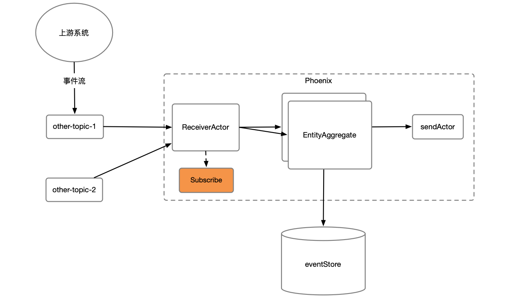
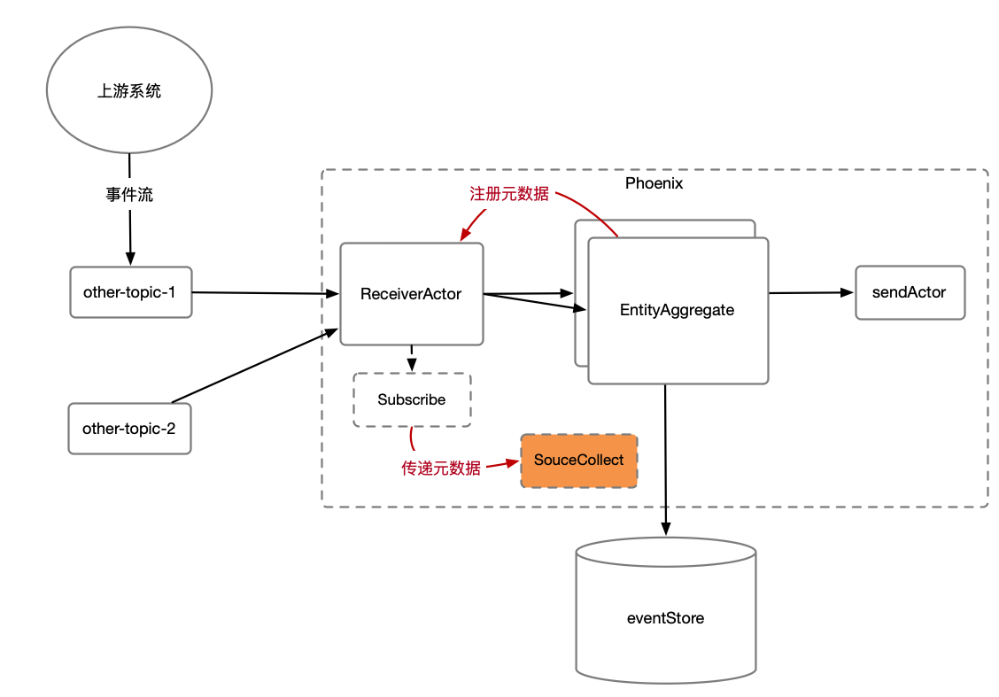

## 订阅 \{#subscribe\}

### 功能介绍 \{#sub-introduce\}

在流/批计算场景，上游业务系统会把数据发送至消息队列。但并不是按聚合根用户定义的命令的协议，而是上游系统自己的协议。这时可以使用Phoenix的Subscribe功能，扩展订阅的功能，做协议转换，分发，广播等操作。





如上图所示，**Subscribe**是用户自定声明注入到Phoenix框架的（Phoenix目前提供默认的KafkaSubscribe），其功能如下：

1. Subscribe可以控制Phoenix接收消息的并发粒度，以KafkaSubscribe为例，每个Partition则会生成一个ReceiverActor来复杂消息拉取。
2. Subscribe提供SourceCollect接口，当框架拉下数据之后，会调用SourceCollect接口进行数据的反序列化以及转换操作(后面会讲解该接口)。

有了Subscribe，用户即可灵活的订阅各种Topic，并且自己完成协议的转换(上游协议转聚合根的命令)，以及广播等操作。


### Subscribe使用 \{#sub-usage\}

用户不需要自己编写Subscribe，可以直接使用Phoenix提供的`KafkaSubscribe`(将来也会支持更多的消息队列)，使用时只需要构造该对象，启动时给到Phoenix即。
在phoenix-spring-boot-starter中，可以直接把`KafkaSubscribe`丢给Spring容器即可。

```java
@Configuration
public class PhoenixSubscribeConfig {

    @Bean("customSubscribe")
    public Subscribe customSubscribe() {
        Properties properties = new Properties();
        properties.putIfAbsent(ConsumerConfig.AUTO_OFFSET_RESET_CONFIG, "latest");
        return new KafkaSubscribe(
                mqAddress, subscribeTopic, appName, properties, new SourceCollect());
    }
}
```

`KafkaSubscribe`可以通过自定义`Properties`来设置Topic消费的额外配置，Properties是Map类型，Key和Value都是String类型，并且Key是ConsumerConfig类中的常量值，Value对应Kafka相关配置。

可以注意到，除了Kafka基本的配置之外，用户还需要提供一个`SourceCollect`的实现。

:::tip[提示]

`KafkaSubscribe` 默认会订阅 `Topic` 下的所有 `Partition`, 但是用户也可以通过以下方式自定义订阅 `Partition`

:::

```java
@Configuration
public class CustomPartitionSubscribeConfig {

    @Bean("customPartitionSubscribe")
    public Subscribe customPartitionSubscribe() {
        Properties properties = new Properties();
        properties.putIfAbsent(ConsumerConfig.AUTO_OFFSET_RESET_CONFIG, "latest");
        return new KafkaPartitionSubscribe(
            mqAddress, subscribeTopic, partitionNum, appName, properties, new SourceCollect());
    }
    
    /**
     * 继承的 KafkaSubscribe 实现，重写 split()
     */
    class KafkaPartitionSubscribe extends KafkaSubscribe {

        // topic下partition的数量
        private int partitionNum;
        // 分隔符；注意有些字符不能当做分隔符使用，如"|"，http请求无法从url中解析"|"
        private static final String SEPARATOR = "_";

        public KafkaPartitionSubscribe(String mqAddress, String topic, int partitionNum, String group,
            Properties properties, SourceCollect sourceCollect) {
            super(mqAddress, topic, group, properties, sourceCollect);
            this.partitionNum = partitionNum;
        }

        @Override
        public String getSplitRangeId(){
            return super.getSplitRangeId().concat(SEPARATOR).concat(String.valueOf(partitionNum));
        }   

        @Override
        public List<SplitId> split() {
            // 父类中则是通过 KafkaProducer 获取全部 PartitionNum, 然后生成同数量的 SplitID
            return Arrays.asList(new SplitId(getSplitRangeId(), partitionNum));
        }
    }
}
```


### SourceCollect使用 \{#sourcecollect\}

SourceCollect 是消息转换器，当 Phoenix 从上游拉取到消息之后，会调用**SourceCollect**来实现数据反序列化和数据转换操作。

用户可以自定义实现**SourceCollect**接口来实现上游数据到本集群命令的转换。如下案例所示：
1. 根据records.getKey()获取上游放入的className。
2. 如果匹配事件一致则进行反序列化（这里模拟了事件是JSON序列化的，实际应用当中应根据上游发送的协议进行反序列化）
3. 根据上游事件内容构造本业务系统聚合根可以处理的命令并返回。

```java
public class SelfSourceCollect implements SourceCollect {

    @Override
    public List<CollectResult> collect(Records records, CollectMetaDataQuery collectMetaDataQuery) {
        List<CollectResult> collectResults = new ArrayList<>();
        if (UpperAccountAllocateEvent.class.getName().equals(records.getKey())) {
            // 反序列化上游事件
            UpperAccountAllocateEvent upperAccountAllocateEvent = JsonUtil.decode(new String(records.getValue()), records.getKey());
            // 根据上游事件要素构造出聚合根的cmd
            Account.AccountAllocateCmd accountAllocateCmd =
                    Account.AccountAllocateCmd.newBuilder()
                            .setAccountCode(upperAccountAllocateEvent.getaccountCode())
                            .setAmt(upperAccountAllocateEvent.getAmt())
                            .setAllocateNumber(UUIDUtils.genUUID())
                            .build();
            collectResults.add(new CollectResult(accountAllocateCmd, true));
        }
        return collectResults;
    }
}
```

可以看到，Collect的返回体是List，如果上游事件内要素可以做到构造出多个不同聚合根的命令(聚合根id)不同，则可以返回多个命令，来让多个聚合根实例处理。


#### 批量处理 \{#batching\}

:::tip N+1 问题

对于一些复杂场景，必须通过 I/O 调用才能获取信息，Phoenix 在 SourceCollect 中提供了批量处理接口（默认关闭）。

假设在默认接口方法中执行 I/O 调用，会导致经典的 N + 1 的问题：一批 Kafka 消息（一次 I/O）的序列化，发生了 n 消息数量的 I/O 调用。
这会极大的影响 Phoenix 消息摄入的性能。

Phoenix Subscribe 的 MetaData 功能则无此问题，元数据会一批消息中一次拉取。

:::

如要使用 SourceCollect 的批量处理能力, 则需要重写下面的两个方法。

**在使用 `batchCollect()` 时，请根据业务决定是否按原始的消息顺序排序（原始消息 Records 为此新增了原始 Kafka 消息的 Offset 信息）**


```java
public interface SourceCollect {

    /**
     * 是否支持批量转换消息.
     *
     * @return
     */
    default boolean supportBatchCollect() {
        return false;
    }

    /**
     * 批量转换消息. 使用批量消息转换时, 必须严格按照源数据集合的顺序处理. 为了帮助排序, {@link Records} 提供了 Kafka 消息的原始 Offset 信息.
     *
     * @param recordsList 源数据集合
     * @param collectMetaDataQuery 转换注册源数据查询接口
     * @return 消息实体列表
     */
    default List<CollectResult> batchCollect(
            List<Records> recordsList, CollectMetaDataQuery collectMetaDataQuery) {
        return Collections.emptyList();
    }
}

```

#### 性能、死锁问题 \{#perf\}

:::caution[死锁问题]

Distributed-Data（分布式数据）的响应会经过 SourceCollect, 避免在 SourceCollect 中对 DData 发起同步调用，以避免发生业务上的死锁。

:::

:::danger[性能问题]

SourceCollect 是消息入口, 应避免/禁止在此发起 I/O 调用, 否则将会导致性能问题，如应用需要在流量入口对命令加工并该信息能通过聚合根提供，
请使用 Phoenix 的 MetaData 能力。

如：维护已处理聚合根的 ID 集合，在流量入口处过滤无效流量。

:::


#### 为消息附加元数据 \{#metadata\}

SourceCollect 除了支持返回 `Command` 之外, 也支持返回 `Message` 对象，可以基于 `MessageFactory` 增加元数据信息，如更改 EventPublish 投递 Key，增加消息优先级信息等。

```java
public class SelfSourceCollect implements SourceCollect {

    @Override
    public List<CollectResult> collect(Records records, CollectMetaDataQuery collectMetaDataQuery) {
        List<CollectResult> collectResults = new ArrayList<>();
        if (UpperAccountAllocateEvent.class.getName().equals(records.getKey())) {
            // 反序列化上游事件
            UpperAccountAllocateEvent upperAccountAllocateEvent = JsonUtil.decode(new String(records.getValue()), records.getKey());
            // 根据上游事件要素构造出聚合根的cmd
            Account.AccountAllocateCmd accountAllocateCmd =
                    Account.AccountAllocateCmd.newBuilder()
                            .setAccountCode(upperAccountAllocateEvent.getaccountCode())
                            .setAmt(upperAccountAllocateEvent.getAmt())
                            .setAllocateNumber(UUIDUtils.genUUID())
                            .build();
            Message message = MessageFactory.getCmdMsg("send_topic", "reply_topic",
                accountAllocateCmd);
            message = message.withMessagePriority(MessagePriority.HIGH_PRIORITY);

            collectResults.add(new CollectResult(message, true));
        }
        return collectResults;
    }
}
```


### StreamSubscribe \{#stream-sub\}

:::info
在 2.6.0 之后，此模式为默认的 Subscribe 实现.（后续也可能变更）
:::

旧版本的 Phoenix 中，对于 Subscribe 的实现是单个类既实现自旋的 Poll 模式，也实现了可靠性投递、MetaData、Ack 的接收等，因此导致单个类的职责过重，并且
导致单线程模型下成为性能瓶颈点。因此，Phoenix 在 2.6.0 推出了基于 Akka Stream, 实现了背压机制的 StreamSubscribe，并且是默认开启。StreamSubscribe 除了背压机制外，
在线程模型上将 KafkaConsumer 于可靠性投递、MetaData 隔离，因此在某些场景（高吞吐量）下会有更好的性能表现，在低频下会增加一小部分延迟。

下面是变动的部分：

1. server-starter 新增依赖:

```xml
<dependency>
    <groupId>com.iquantex</groupId>
    <artifactId>phoenix-stream-kafka</artifactId>
</dependency>
```

2. 配置文件默认配置变动:

```yaml
quantex:
  phoenix:
    server:
      mq:
        consumer-type: push # 默认为 PUSH 模式，用户可选旧版 POLL 模式
        address: 127.0.0.1:9092,127.0.0.1:9092,127.0.0.1:9092
        subscribe:
          - topic: topic
```


3. 对于自定义订阅的使用, 则通过以下示例代码启动:

```java
@Configuration
public class PhoenixSubscribeConfig {
    
    private String subscribeTopic;
    private String mqAddress;
    private String groupName;

    /**
     * 创建 Stream 的 Subscribe.
     * @param actorSystem 由 Phoenix 自动创建为 Spring Bean.
     * @return
     */
    @Bean("StreamSubscribe")
    public Subscribe streamSubscribe(ActorSystem actorSystem) {
        Properties properties = new Properties();
        properties.putIfAbsent(ConsumerConfig.AUTO_OFFSET_RESET_CONFIG, "latest");
        return new KafkaStreamSubscribe(
                mqAddress, subscribeTopic, groupName, properties, new SourceCollect(), actorSystem);
    }
}
```


## 广播 \{#broadcast\}

### 功能介绍 \{#feature\}

通过上面订阅模型的介绍，我们知道`SourceCollect`在转换一个上游事件时可以返回多个命令来让多个聚合根处理，前提是需要能在上游事件中提取出能符合发给多个聚合根对象的属性。

有时上游事件无法完整的构造出本业务的聚合根可以处理命令(上游事件当中没有构造聚合根id所需要的要素)，但却有相关要素。比如，一个基金产品聚合根有用很多股票持仓，当某只股票价格变化（上游事件），希望触发所有有这只股票的产品聚合根重新计算资产。

我们可以在产品聚合根处理持仓（新增和删除持仓）时，向ReceiverActor注册一个元数据（产品001 -> 股票001）。在ReceiverActor拉取到股票的变更事件后，便会在调用`SourceCollect#collect`把该元数据传递给用户定义的实现类，
这样用户就可以方便的拿到哪些产品拥有该只股票，进而构造出行情变更命令，触发重新计算净资产。



如上图所示，Phoenix可以保证该元数据(CollectMetaData)可以最终一致的可靠存储下来，Phoenix提供方便的注册元数据以及取消注册元数据的功能。

### 注册CollectMetaData \{#metadata\}

在实体聚合根的Command处理方法中，用户可以自定义注册CollectData到**Topic的处理端(SourceCollect)**。

```java
    @CommandHandler(aggregateRootId = "fundCode", isCommandSourcing = true)
    public ActReturn act(PositionChangeCmd positionChangeCmd) {
    
        // 处理持仓变更的业务逻辑
        // dosomething...

        RegistryCollectData registryCollectData = null;
        // 新增持仓时注册元数据
        if(positionChangeCmd.type == ADD) {
            registryCollectData = new RegistryCollectData(RegistryCollectData.Type.REGISTRY,
                                  KafkaSubscribe.genSplitRangeId(mqAddress, subscribeTopic),
                                  Arrays.asList(positionChangeCmd.getSecuCode())
                                  fundCode);
        }
        
        // 删除持仓时删除元数据
        // .. 构造 RegistryCollectData.Type = UN_REGISTRY
        
        // 返回
        retrun ActReturn.builder()
               .registryCollectData(registryCollectData)
               .其他要素
        .build();
    }
```

:::caution[注意：在用户配置了聚合根的**存活时间**后，当实体聚合根从内存中淘汰后，框架会自动取消该聚合根所有的注册数据，并且在聚合根恢复后，也不会自动恢复注册。]
:::

```java
@EntityAggregateAnnotation(
        aggregateRootType = "BankAccountAggregateBroadCast",
        surviveTime = 1000 * 60 * 10) // 10分钟后淘汰聚合根，自动取消所有注册
```

#### 1. 注册多个 MetaData \{#register-mutiple\}

**ActReturn.registryCollectData()** 方法支持注册多个 `RegistryCollectData`.每一个 `registryCollectData` 传入的参数都被会被注册到 SourceCollect, 适用于开发者注册 MetaData 到不同的 Topic.

:::info
当使用 `registryCollectData` 注册多个 MetaData 时注意, 两次 `registryCollectData` 的调用使用了同一个 Topic 时, 后者将会覆盖前者.

当两次调用为不同 Topic 时, 则不会被覆盖.
:::

**示例代码**:

```java
// 因为 MQ 地址和 Topic 相同. 所以 overSeasTag 会被覆盖.
RegistryCollectData overSeasTag = null;
if (createCmd.getAccountCode().contains("OS")) {
    overSeasTag =new RegistryCollectData(
                    RegistryCollectData.Type.REGISTRY,
                    KafkaSubscribe.genSplitRangeId(mqAddress, subscribeTopic),
                    Arrays.asList("Overseas"),
                    createCmd.getAccountCode());
}
RegistryCollectData registryCollectData = null;
if (balanceAmt == 10.0) {
    registryCollectData =new RegistryCollectData(
                    RegistryCollectData.Type.REGISTRY,
                    KafkaSubscribe.genSplitRangeId(mqAddress, subscribeTopic),
                    Arrays.asList("amtEQ10","secondTag"), // 同 MQ 下在此定义多个 Tags
                    createCmd.getAccountCode());
}
return ActReturn.builder()
    .retCode(RetCode.SUCCESS)
    .retMessage(message)
    .event(new AccountCreateEvent(createCmd.getAccountCode(), createCmd.getBalanceAmt()))
    .registryCollectData(overSeasTag) // 该 tag 会被覆盖
    .registryCollectData(registryCollectData)
    .build();
```

#### 2. 以 K,V 模式注册 MetaData \{#register-kv\}

除了为一个 Value 注册多个 TAG 的用法（基于构造函数）, MetaData 注册还支持 K,V 格式的注册（基于 Builder）

**示例代码**:

```java
RegistryCollectData overSeasTag = null;
if (createCmd.getAccountCode().contains("OS")) {
    // 单个多次调用
    overSeasTag =
            RegistryCollectData.builder()
                    .type(RegistryCollectData.Type.REGISTRY)
                    .splitRangeId(KafkaSubscribe.genSplitRangeId(mqAddress, subscribeTopic))
                    .registryValue("OS_AMT", String.valueOf(this.balanceAmt))
                    .registryValue("Overseas", this.account)
                    .build();
    // 直接传入 Map
    Map<String, String> registryKVMap = new HashMap<>();
    registryKVMap.put("OS_AMT", String.valueOf(this.balanceAmt));
    registryKVMap.put("Overseas", this.account);
    overSeasTag =
            RegistryCollectData.builder()
                    .type(RegistryCollectData.Type.REGISTRY)
                    .splitRangeId(KafkaSubscribe.genSplitRangeId(mqAddress, subscribeTopic))
                    .registryKV(registryKVMap)
                    .build();
}
```


### 使用CollectMetaData \{#use-metadata\}

上面产品聚合根向ReceiverActor注册了元数据(CollectMetaData)，这样用户在编写SourceCollect时则可以通过查询接口 `CollectMetaDataQuery` 获取元数据，转化命令。


#### CollectMetaDataQuery 查询接口 \{#query-api\}

CollectMetaDataQuery 用于查询 CollectMetaData 元数据，该接口不会发生 I/O 行为，最大的开销是对象拷贝。

该查询接口支持的查询方法有：

- `tags()`：获取所有的 Tag
- `all()`：获取所有的元数据
- `get(String metaDataTag)`：根据 Tag 获取某个指定的元数据
- `get(List<String> metaDataTags)`：根据 Tag 集合获取指定集合 Tag 的元数据
- `exist(String metaDataTag)`：查询是否存在某个 MetaDataTag
- `exist(String metaDataTag, String aggregateId)`：查询某个 MetaDataTag 下是否存在 AggregateID

#### 查询示例、用户案例 \{#query-example\}

基于元数据，用户可以将产品数据拥有的持仓上报到元数据中，然后在行情变动时，对所有包含该券的产品聚合根，构造行情变动的命令，从而实现行情变动通知的效果。

示例代码如下：

```java
public class MarketEventCollect implements SourceCollect {
    @Override
    public List<CollectResult> collect(Records records, CollectMetaDataQuery collectMetaDataQuery) {

        List<CollectResult> collectResults = new ArrayList<>();
        try {
            // 反序列化股票行情变更事件
            MarketEvent marketEvent = JSON.enCode(records.getKey, records.getValue());
            // 获取注册的元数据: 哪些产品聚合根拥有该只股票持仓
            Set<String> metaDataValue = collectMetaDataQuery.get(marketEvent.getSecucode());
            for (String fundCode : metaDataValue) {
                // 构造产品聚合根的行情变更命令
                MarketChangeCmd marketChangeCmd = new MarketChangeCmd(fundCode, marketEvent);
                collectResults.add(new CollectResult(marketChangeCmd, true));
            }
        } catch (InvalidProtocolBufferException e) {
            e.printStackTrace();
        }
        return collectResults;
    }
}
```

可以看到，通过实体聚合根注册元数据，和SourceCollect转换时获取该笔元数据转换，进而完成了行情驱动资产变更的模型。实际上，用户可以根据业务需求，灵活的给自己的产品聚合根打标签，来完成更复杂精确的消息转换任务。


:::tip
除了可以将注册到 MetaData 的数据用于广播特性外, 也可以将 MetaData 用作过滤器使用.
:::

**示例代码**:

```java
import java.util.Collections;

public class MarketEventCollect implements SourceCollect {
    @Override
    public List<CollectResult> collect(Records records, CollectMetaDataQuery collectMetaDataQuery) {

        List<CollectResult> collectResults = new ArrayList<>();
        try {
            // 反序列化股票行情变更事件
            MarketEvent marketEvent = JsonUtil.decode(records.getValue(), MarketEvent.class);
            // 1. 查询所有结果
            CollectMetaData collectMetaData = collectMetaDataQuery.all();
            // 如果该股票未被使用（没有注册到 MetaData）, 则过滤该行情消息
            if (!collectMetaData.containsKey(marketEvent.getSecucode())) {
                return Collections.emptyList();
            }
            // 2. 或者直接使用 exist
            if (collectMetaDataQuery.exist("MARKET_TAG", marketEvent.getSecucode())) {
                return Collections.emptyList();
            }
            MarketChangeCmd marketChangeCmd = new MarketChangeCmd(fundCode, marketEvent);
            collectResults.add(new CollectResult(marketChangeCmd, true));
        } catch (InvalidProtocolBufferException e) {
            e.printStackTrace();
        }
        return collectResults;
    }
}
```


## FAQ \{#faq\}

### 1. 为什么我的消息会丢失 \{#message-lost\}

默认情况下以及当用户自定义的 SourceCollect 返回的 CollectResult 显式指定可靠交付时，Kafka Message 将会交给 Phoenix 内部的可靠性投递处理.

Phoenix 的可靠性投递能够在配置的年龄内(`quantex.phoenix.server.mq.properties.transactionReliabilityMaxAge`)尽最大可能将消息交付给聚合根.

但也有一种情况是，KafkaConsumer 并没有将消息交付给 Phoenix 内部的可靠性投递或后者在处理过程中出现了异常，以下是可能发生的情况：

1. 反序列化异常（请检查`DeserializationException`）
2. 获取聚合根 ID 异常：长度超限（请检查`AggregateRootIdGetException`）
3. 可靠性投递处理失败：持久化事务失败，可能是体积超出 EventStore 限制（请检查`SQLException`）

在 Phoenix 2.6.0 版本中，以针对该问题提供了容错方案：**当消息在上述处理过程中出现异常时，将会由批量处理回退到单笔处理，当单笔失败时则跳过这条消息**。
这样保证了尽最大可能交付所有的消息。
