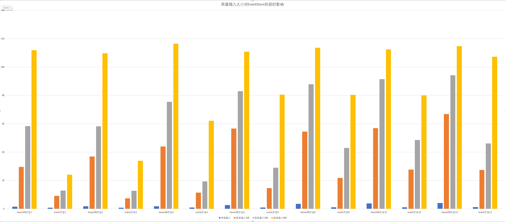
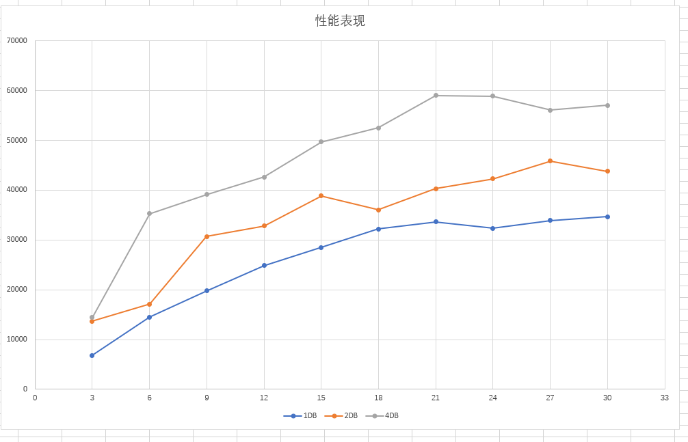
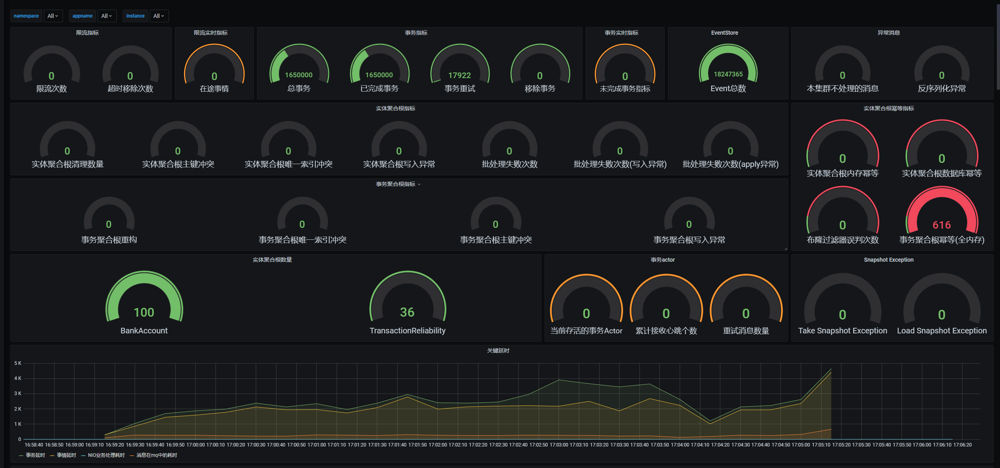

> 实体聚合根性能测试: Phoenix在华为云环境的性能测试报告。版本: 2.2.6

## 测试目的

在华为云上部署 Phoenix 2.2.6 版本，做系统性的性能测试。

本次测试重点关注如下三个指标:

- TPS: 账户管理集群每秒能处理请求的数量
- 时延: 从发起请求到处理结束的耗时
- 实例个数: 集群中启动服务实例的个数

根据三个指标构造如下案例:

- 华为云 GaussDB 基准测试：单独使用一个 phoenix-server 实例对 GaussDB 进行基准测试
- 纯框架线性测试: 不带 EventStore 的线性能力测试
- 带存储的线性测试: 带 EventStore 的线性能力测试

在上述案例中将会使用 Phoenix 开发的账户管理业务来测试，用户可以发起对指定账户余额的增减请求。

## 测试环境

###  硬件资源信息

以下机器在一个网段上。

| 机器名称 | 操作系统                                            | CPU                                              | 内存 | 硬盘 | 部署服务                                                     |
| -------- | --------------------------------------------------- | ------------------------------------------------ | ---- | ---- | ------------------------------------------------------------ |
| kunlun-phoenix-1(裸金属) | EulerOS 2.3 64bit for BareMetal | Intel(R) Xeon(R) Silver 4114 CPU @ 2.20GHz | 8*16GB DDR4 RAM(GB) | 机械 | benchmark-client, auto-benchmark, prometheus                                               |
| kunlun-phoenix-2(裸金属) | EulerOS 2.3 64bit for BareMetal | Intel(R) Xeon(R) Gold 6161 CPU @ 2.20GHz | 12*32GB DDR4 | 机械 | phoenix-web                                               |
| kunlun-phoenix-3(裸金属) | EulerOS 2.3 64bit for BareMetal | Intel(R) Xeon(R) Gold 6161 CPU @ 2.20GHz | 12*32GB DDR4 | 机械 | phoenix-web                                               |
| kunlun-phoenix-4(裸金属) | EulerOS 2.3 64bit for BareMetal | Intel Xeon Gold 5118 V5 (2*12Core 2.30GHz) | 192GB DDR4 RAM(GB) | 机械 | phoenix-server |
| kunlun-phoenix-5(裸金属) | EulerOS 2.3 64bit for BareMetal | Intel Xeon Gold 5118 V5 (2*12Core 2.30GHz) | 192GB DDR4 RAM(GB) | 机械 | phoenix-server                                               |
| kunlun-phoenix-6(裸金属) | EulerOS 2.3 64bit for BareMetal | Intel Xeon Gold 5118 V5 (2*12Core 2.30GHz) | 192GB DDR4 RAM(GB) | 机械 | phoenix-server                                               |
| kunlun-phoenix-7(裸金属  | EulerOS 2.3 64bit for BareMetal | Intel Xeon Gold 5118 V5 (2*12Core 2.30GHz) | 192GB DDR4 RAM(GB) | 机械 | phoenix-server                                               |
| kunlun-phoenix-8(裸金属) | EulerOS 2.3 64bit for BareMetal | Intel Xeon Gold 5118 V5 (2*12Core 2.30GHz) | 192GB DDR4 RAM(GB) | 机械 | phoenix-server                                                       |
| kunlun-phoenix-9(裸金属) | EulerOS 2.3 64bit for BareMetal | Intel Xeon Gold 5118 V5 (2*12Core 2.30GHz) | 192GB DDR4 RAM(GB) | 机械 | phoenix-server                                                       |

### 软件资源信息

Kafka

|  |      | 
| -------- | ----------- |
| 实例名称 | kafka-phoenix |  
| 版本 |  2.3.0 |
| 基准带宽  | 1,200 MB/s |
| 分区上限  | 1800个 |
| 磁盘类型  |  	超高I/O |	

GaussDB

|  |      | 
| -------- | ----------- |
| 实例名称 |  db-phoenix |
| 节点个数 | 2 |
| 兼容的数据库版本 | MySQL 8.0 |
| 时区  |  UTC+08:00 |
| 性能规格 |  gaussdb.mysql.4xlarge.x86.4  16核 64 GB |
| 区域 | 上海一 |
| 存储空间  | 500G |

### 软件版本信息

| 软件名称   | 软件版本       | 备注     |
| ---------- | -------------- | -------- |
| phoenix    | 2.2.6          |          |
| GaussDB     | gaussdb.mysql.4xlarge.x86.4 |  兼容MySQL 8.0          |
| kafka      | 	2.3.0        |     华为云分布式消息服务kafka     |
| grafana    | v7.1.1         |          |
| prometheus | v2.19.0        |          |

### 关键参数配置

- Phoenix 服务参数
```
quantex.phoenix.server.performance.transactionReliabilityMaxAge = 5
quantex.phoenix.server.performance.transactionReliabilityRetryTimeIntervalMs = 20000
quantex.phoenix.server.performance.transactionReliabilityBatchRetry = 50
quantex.phoenix.server.performance.limitMaxLiveThings = 1000
quantex.phoenix.server.performance.limitMaxRemoveTimeoutMs = 100000
quantex.phoenix.server.performance.batchProcess = 100
quantex.phoenix.server.performance.batchPersist = 200
quantex.phoenix.server.performance.eventSourcingReadBatchSize = 1000
quantex.phoenix.benchmark.single-thread-max-tps = 20000
```

- Kafka 服务参数
```
KAFKA_NUM_PARTITIONS=36   // 默认prtition为36个
```

## 测试案例

### 案例1 GaussDB基准测试

> 在测试之前，对华为云的GaussDB做一下基准测试，有助于后面分析框架性能瓶颈。

测试记录参见: [GaussDB基准测试](../assets/file/benchmark/huaweiyun/gaussdb-benchmark.xls)

#### 测试结果

批量插入大小对 GaussDB 最大 TPS 的影响


批量插入大小对 GaussDB 的延时影响



#### 测试结论

1. 在一个实例下做的基准测试，GaussDB 的 TPS 为 3W 左右
2. 在 TPS 与时延方面，单实例下压测的 GaussDB 的性能表现不如 Oracle。当批量插入 400 的数据量时，GaussDB 的时延在 100ms 居高不下

### 案例2 带EventStore的性能测试

该案例分别设置不同的`实例数量`与`DB数量`，测试出框架在时延低于 **1000ms** 下所能达到的最大 TPS，通过不断增加实例个数与 DB 个数期望得出下面结论

1. 增加实例个数对 TPS 提升的能力
2. 增加 DB 个数对 TPS 有一个线性的提升

#### 资源配置

| 资源名称     | 取值范围       |
| ---------- | -------------- | 
| 实例数量    | [3~30] 步长3          |
| 聚合根数量   | [1000]|
| 单实例配置   | 4C, 8GB          |
| GaussDB  | 1、2、4         |
| kafka    | 36partition         |

#### 测试结果

在1、2、4DB下 1000 聚合根的情况下比对折线图


#### 测试结论

1. 实例数超过 18 之后，TPS 增长缓慢。
2. 目前资源下带上 EventStore 的最大 TPS 在 5W5 上下
3. 随着 DB 的增加，TPS 确有提升

测试记录参见: [带EventStore的性能测试](../assets/file/benchmark/huaweiyun/huaweiyun_eventstore_tps.xls)

### 案例3 纯框架性能测试

该案例不配置 EventStore，仅仅对 Phoenix 做性能测试。

#### 资源配置

| 资源名称     | 取值范围       |
| ---------- | -------------- | 
| 实例数量    | [3~18] 步长3          |
| 聚合根数量   | [1000]|
| 单实例配置   | 12C, 8GB          |
| kafka    | 36partition         |

#### 测试结果

当实例数超过12个时，即每个节点分布两个实例，一共使用24C时，TPS到达最大15w


#### 测试结论

1. 实例数超过 12 个之后，TPS 最大 15W，并且再增加实例数后不会增长 TPS。

测试记录参见: [纯框架的性能测试](../assets/file/benchmark/huaweiyun/huaweiyun_tps.xls)

----------

> 事务聚合根性能测试: 测试2.3.0版本下事务聚合根最大处理能力

## 测试环境

公司rancher/phoenix-benchmark环境

## 测试案例

- Phoenix version: 2.3.0
- CPU: 4C
- MEMORY: 8G
- 实例个数: 10
- 聚合根数量: 100
- Kafka partition: 36

### 测试结果

测试最大 TPS 为 5500.


