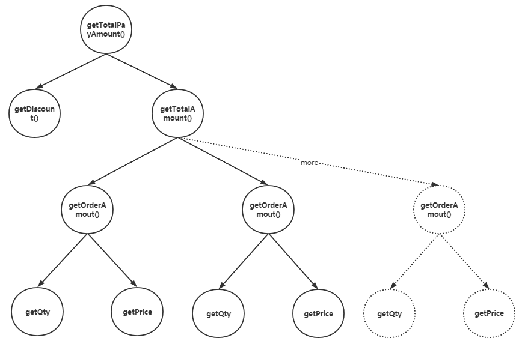

DGC 提供以下三个注解头：

- @Model
- @Compute
- @Observable

## @Model \{#model\}

如果一个类需要使用 DGC 功能，则需要在类头上添加 `@Model` 注解。只有加了 @Model 注解的类，DGC 在实例化对象时才会动态代理。

## @Observable \{#observable\}

`@Observable` 作用于 `@Model` 标识的类中的属性上。

如果一个属性被 `@Observable` 注解标识，需要为该属性提供相应的 get/set 方法。

同时 DGC 会对该属性进行监听：

 - 当调用该属性的 get 方法时，会根据调用关系构建依赖关系图。
 - 当调用该属性的 set 方法时，会根据 DGC 中维护的依赖关系图，将所有涉及到的方法的缓存置为失效（删除）。

```java
@Observable(implClass = CopyOnWriteArrayList.class)
private List<String> list;
```

## @Compute \{#compute\}

`@Compute` 作用于 `@Model` 标识的类中的方法上。

被 `@Compute` 标识的方法，在每次计算之后会对结果进行缓存。如果在下次访问该方法之前，方法中计算逻辑所涉及到的属性值没有发生变化，则下次访问该方法时会直接返回缓存中的结果，不会再次计算一遍。

**注意：** `@Compute` 注解所标识的方法中只能存在 get 逻辑，不允许出现 set 逻辑。

## DgcObjectManager \{#dgc-manager\}

DgcObjectManger是 DGC 的核心入口类，用户在使用 DGC 时应首先实例化DgcObjectManager。

```java
DgcObjectManager dgcObjectManager = new DgcObjectManager()
```
一个 DgcObjectManager 对象即可管理 DGC 对象依赖图，当然如果为了追求并发，也可以创建多个 DgcObjectManager（比如 Phoenix 集成 DGC 时，每个聚合根对象拥有一个 DgcObjectManger 对象）。

有了 DgcObjectManager 之后对象之后，可以使用 DgcObjectManager 创建被 `@Model` 注解标识的类的对象，这样该对象的操作就会被 DGC 所代理。

```java
public <T> T getDgcObject(Class<T> targetCls);
public <T> T getDgcObject(Class<T> targetCls, Object... arguments)
```

DgcManager 有一个全局的功能开关，决定是否启用 DGC 功能，默认为 true（开启）。结合 Phoenix 来用时，可以通过在 phoenix-server 的配置中添加如下配置进行启用/停用：

```yaml
quantex.phoenix.server.dgc-enable: true
```
如果是单独使用 DGC 模块的功能，可以通过如下方式选择开启/关闭 DGC 功能。

```java
DgcObjectManager dgcObjectManager = new DgcObjectManager()
dgcObjectManager.setEnable(true/false);
```

## 扩展类使用 \{#extend\}

针对自定义的类属性，我们可以通过提供相应的 get/set 方法来对属性进行访问和更新，并且通过添加 `@Compute` 注解来对相关方法的值进行缓存。

但是如果使用的类是第三方类库提供的，这个时候我们是没有办法对这些类进行修改的（无法添加 `@Model`、`@Observable`、`@Compute` 等注解）。

例如 List、Set、Map 类型的集合类，对这些集合的更新，就不能简单的通过 set 方法来进行了，集合的很多方法都有可能导致集合数据更新（例如 List 的 add、remove 等方法都会导致集合数据进行更新）。除了这些集合类之外，我们依赖的其他第三方类库提供的类也存在同样的问题。

DGC 针对这种情况提供了一种扩展方式，来使得第三方类库的类也可以使用 DGC 能力。

DGC 提供了 `ExtendClassDefine` 接口，针对第三方类库的类，需要手动添加一个该接口的实现类。

```java
public interface ExtendClassDefine<EXCLASS> {

    /** 判断是否是该扩展(类/接口)的(子类/实现类),或者自己. */
    boolean isSubClassOrSelf(Object obj);

    /** 判断是否是这个扩展类的写方法 */
    boolean isWriteOps(Method method);

     /** 如果扩展类容纳了dgc中的对象使用,比如Map,List,那么需要提供获取所有对象的方法 */
    Set<Object> getCollections(EXCLASS extendObject);
}
```

`ExtendClassDefine` 接口对 `set 方法` 进行了抽象，统一用写方法来表示。一个第三方类中的方法，只要会导致数据的更新（增删改），都属于写方法。

DGC 对所有的扩展类提供了一个统一的抽象类，使用时需要继承这个抽象类，从而实现具体的扩展类实现类。并注册到 DGC 中。之后即可正常使用。

```java
public abstract class AbstractExtendClassDefine<EXCLASS> implements ExtendClassDefine<EXCLASS> {

    /** 写方法集合 */
    protected Set<String> writeName = new HashSet<>();

    @Override
    public abstract boolean isSubClassOrSelf(Object obj);

    @Override
    public boolean isWriteOps(Method method) {
        return writeName.contains(method.getName());
    }

    @Override
    public abstract Set<Object> getCollections(EXCLASS extendObject);
}
```

## 案例展示 \{#example\}

在使用 phoenix-dgc 时，可以随 phoenix-server 模块一起使用，也可以单独引入使用。如果已经引入了 phoenix-server 模块的依赖，则不需要再单独引入 phoenix-dgc 模块的依赖

```maven
<dependency>
    <groupId>com.iquantex</groupId>
    <artifactId>phoenix-dgc</artifactId>
    <version>2.6.1</version>
</dependency>
```

下面通过一个购物案例来展示 DGC 的功能。

```java
@Slf4j
@Model
@Getter
@Setter
public class Order {
    /** 物品名称 */
    private String itemName;
    /** 物品数量 */
    @Observable private long qty;
    /** 物品价格 */
    @Observable private double price;

     /** 订单金额 (物品数量 * 物品价格) */
    @Compute
    public double getOrderAmount() {
        double amount = getQty() * getPrice();
        log.info("* get order itemName<{}> orderAmount<{}>", getItemName(), amount);
        return amount;
    }
}

@Slf4j
@Model
@Getter
@Setter
public class ShoppingCar {
    /** 所有订单 */
    @Observable private List<Order> orderList;
    /** 折扣 */
    @Observable private double discount;

    public double getDiscount() {
        log.info("* get discount <{}>", discount);
        return discount;
    }

     /** 总支付金额 (折扣 * 所有订单总价格) */
    @Compute
    public double getTotalPayAmount() {
        double amount = getDiscount() * getTotalAmount();
        log.info("* calc total pay amount<{}>", amount);
        return amount;
    }

     /** 所有订单总价 */
    @Compute
    public double getTotalAmount() {
        return getOrderList().stream().map(Order::getOrderAmount).reduce(0.0, Double::sum);
    }
}
```

在上面购物车案例中涉及到两个类：Order 和 ShoppingCar。这两个类均被 `@Model` 注解进行了标识。

Order 类中包含三个属性：

- 物品名称 itemName
- 物品数量 qty
- 物品价格 price。

计算每个订单的价格的算法为：`物品数量 * 物品价格`

其中物品名称 itemName 不影响计算逻辑，所以 itemName 属性不需要被 `@Observable` 注解标识，另外两个属性物品数量 qty 和 物品价格 price，他们的值一旦更新，就会影响订单总额的计算结果。所以这两个属性需要被 `@Observable` 注解标识。并提供对应的 get/set 方法，对这两个属性值的获取和更新都需要通过 get/set 方法进行。通过对 getOrderAmount() 方法添加 `@Compute` 注解，DGC 会对该方法的计算结果进行缓存，从而达到加速的效果。

ShoppingCar 类中包含两个属性：

- 订单列表 orderList
- 折扣 discount

计算总支付价格的算法为：`折扣 * 所有订单的价格总和`

订单列表中一旦有一个（或多个）订单的数据（物品数量或者物品价格）发生变化，或者折扣发生变化，都会影响到最后总支付金额的计算结果，所以这两个属性都被 `@Observable` 标识。同理也需要对这两个属性添加 get/set 方法。 getTotalPayAmount() 方法和 getTotalAmount() 方法通过添加 `@Compute` 注解来达到加速效果。

DGC 会根据上面的计算逻辑，构建如下结构的依赖关系。



下面代码展示了如何使用 DGC 构造对象并测试相关 DGC 功能逻辑。
```java
public void test() {
    // 1. 构造购物车实例，通过 DgcHelper.newProxy 生成 ShoppingCar 的代理类
    DgcObjectManager dgcObjectManager = new DgcObjectManager();
    ShoppingCar car = dgcObjectManager.getDgcObject(ShoppingCar.class);
    car.setDiscount(1);
    
    // 2. 构造订单实例(模拟购买1000种水果)，通过 DgcHelper.newProxy 生成 Order 的代理类
    for (int i = 0; i < 1000; i++) {
        Order order = dgcObjectManager.getDgcObject(Order.class);
        order.setItemName("fruit-" + i);
        order.setQty(i);
        order.setPrice(i * 0.1d);
        car.getOrderList().add(order);
    }
    
    // 3. 计算总价，这时由于第一次计算所以涉及到的每个方法都会计算一遍。这次计算完成之后Dgc会对计算结果进行缓存 
    log.info("first call car getTotalPayAmount");
    car.getTotalPayAmount();

    // 4. 修改折扣后，再次计算总价。
    // 修改折扣(setDiscount)会导致 getDiscount() 和 getTotalPayAmount() 这两个方法对应的缓存数据失效，由于订单数据并没有被修改，所以 getTotalAmount() 可以直接取内存值，不需要在次进行计算。
    log.info("change discount then call car getTotalPayAmount");
    car.setDiscount(0.8);
    car.getTotalPayAmount();
}

first call car getTotalPayAmount
* get discount <1.0>
* calc the total price of <1000> fruits
* calc total pay amount<3.328335E7>
change discount then call car getTotalPayAmount
* get discount <0.8>
* calc total pay amount<2.662668E7>
```

在上面的案例中，购物车中的 getTotalAmount() 方法是一个比较耗时的操作（遍历购物车中所有的水果计算总价），在订单数据不变的情况下，如果每次都需要重新计算，从最终结果来看会存在多次重复的计算，白白浪费计算资源。DGC 通过缓存该方法的计算结果来达到加速的效果。如果订单数据不变，每次计算时，直接可以从缓存中拿到计算结果，不需要在重新执行计运算逻辑。

#### 注意事项 \{#tips\}

在使用 DGC 功能时，请注意如下几点：

1. 所有对属性的操作都需要被方法包装，即对一个属性的操作需要通过 get/set 方法，不能直接使用 `类.属性`。
2. 需要生成代理的类需要提供无参构造函数。
3. 如果属性的定义为 List 接口（例如 `private List<> demo`）则默认生成的代理类的类型为 ArrayList。如果想要使用其他的实现类，可以在定义属性时使用具体的实现类，或者通过 `@Observable` 注解指定 implClass。
4. `@compute` 注解标注的方法只能包含读操作，不能出现写操作
5. 在使用 DGC 之前，要结合实际的应用场景考虑清楚是否要使用 DGC 功能。毕竟 DGC 维护依赖关系图的操作，也存在一定的复杂度。如果实际运算逻辑的复杂度要远远高于 DGC 维护依赖关系图的复杂度，且是运用在读操作多余写操作的场景，那么使用 DGC 将是不错的选择。