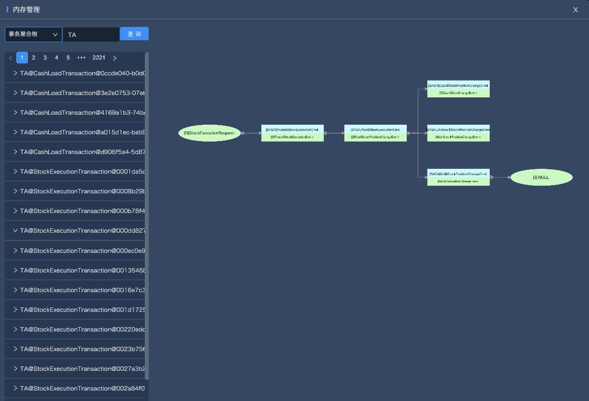

## 背景

2.2.4版本经过一个月的迭代,是一个对比2.2.2(3)更稳定的版本,建议都升级.


## 内存查询支持事务调用链查看

在内存查询当中可以根据`transId`查出事务聚合根，点击即可展示当下聚合根的调用链情况。


## 聚合根注解头支持环境变量配置

对于聚合根头上的注解，支持环境变量配置，需要在配置文件中声明，例如账户聚合根可以这样配置。


## 聚合根必须设置序列化ID

1. 聚合根必须实现序列化接口以及添加serialVersionUID
2. 消息定义类需要加serialVersionUID

```java
@Getter
@EntityAggregateAnnotation(aggregateRootType = "BankAccount", idempotentSize = 100, bloomSize = 1000000, snapshotInterval = 100000)
public class BankAccountAggregate implements Serializable {
    // 必须添加序列化Id,不然启动会失败
    private static final long     serialVersionUID          = 6073238164083701075L;
}
```

## 单元测试MockBean方式有变化

在使用`EntityAggregateFixture`测试工具类时,对于使用`聚合根对象`的成员变量有Mock需求的,可以参考下面方式注入Mock的对象，如下。

注意: 这样要求聚合根对提供成员的get方法
```java
        MockService mockService = Mockito.mock(MockService.class);
        Mockito.when(mockService.isPass()).thenReturn(true);
        EntityAggregateFixture testFixture = new EntityAggregateFixture(BankAccountAggregate.class.getPackage().getName());
        testFixture.mockBean(BankAccountAggregate::getMockService, mockService);
```


## phoenix-admin升级为GZL框架

phoenix-admin升级为GZL框架，使用体验上有所区别。

1. 打开页面需要登录,默认密码 admin/admin
2. 支持与portal集成
3. 交互体验有所变化,比如每个菜单页面通过下拉框选择项目.


## EventPublish支持发布到多partition上

EventPublish在以往版本只会发送到topic的`partition = 0`上，这样是不利于扩展的。

该版本默认会以聚合根ID做路由到不同的`partition`上，支持多partition。


## 修复BUG列表如下

* phoenix-admin修复Instance指标显示不全 phoenix-admin#26
* phoenix-admin 项目id中包含"/"导致无法删除 phoenix-admin#28
* 内存查询分页BUG #818
* 查询Cmd没有聚合根ID报错要提示出来 #825
* 单独引用phoenix-client-starter报错 #822
* kafka配置集群IP报监控错误 #824
* 引入event-store-jdbc后用户自定义单元测试报错 #826
* phoenix-admin展示key为空的字符串的map #859
* 代码混淆要排除掉序列化和传输的包 #862
* eventMsg参数错误导致事务不能完成 #863
* 新增事务和完成事务指标在杀节点时不一致 #873 


