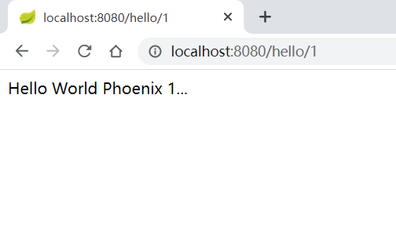

**Phoenix**框架提供了一些列 Phoenix-Starter 可以帮助用户快速构建应用。

## 案例工程

### What You Need
- 最喜欢的文本编辑器或 IDE
- JDK 1.8
- Maven 3.2+
- 创建一个空的Spring Boot项目(2.0版本)
- 正常运行的Kafka，如果没有合适的Kafka，可以使用内存版Kafka，参见：[KafkaEmbeddedConfig](https://github.com/PhoenixIQ/phoenix-samples/blob/master/hello-world/application/src/main/java/com/iquantex/samples/helloworld/config/KafkaEmbeddedConfiguration.java)

> 您还可以将代码直接导入您的IDE:[PhoenixIQ/phoenix-samples/hello-world](https://github.com/PhoenixIQ/phoenix-samples/tree/master/hello-world)

### Step 1: maven依赖

```xml
<dependency>
    <groupId>com.iquantex</groupId>
    <artifactId>phoenix-server-starter</artifactId>
    <version>2.4.1</version>
</dependency>
<dependency>
    <groupId>com.iquantex</groupId>
    <artifactId>phoenix-client-starter</artifactId>
    <version>2.4.1</version>
</dependency>
```

### Step 2: 配置文件

```yaml
spring:
  application:
    name: hello # 自定义服务名称

quantex:
  phoenix:
    client:
      name: ${spring.application.name}-client	# 服务名称
      mq:
        type: kafka	                            # mq类型
        address: 127.0.0.1:9092                 # mq地址
    server:
      name: ${spring.application.name}    # 服务名称
      package-name: com.iquantex.phoenix.samples.account   # 聚合根包所在路径
      mq:
        type: kafka                       # mq类型
        address: 127.0.0.1:9092           # mq服务地址
        subscribe:
          - topic: ${spring.application.name}
      event-store:
        driver-class-name: org.h2.Driver  # 数据库驱动
        data-sources:
          - url: jdbc:h2:file:./data/test;DB_CLOSE_DELAY=-1;DATABASE_TO_UPPER=FALSE;INIT=CREATE SCHEMA IF NOT EXISTS PUBLIC # 数据库链接url
            username: sa                  # 数据库账户
            password:                     # 数据库密码
```

### Step 3: 消息定义

关于Command和Event解释可以[参考文档](https://phoenix.iquantex.com/docs/phoenix-2.x/phoenix-core/phoenix-core-event-souring)。

聚合根接收**Command**产生**Event**。**Command**和**Event**需要实现**Serializable**接口。

Phoenix 支持 `protostuff`、`javaBean`、`protobuf` 等序列化协议，可以通过以下配置进行指定。

```yaml
quantex.phoenix.server.default-serializer: proto_stuff
```

本文使用`javaBean`序列化协议进行示范。

#### Command定义

```java
@Data
@NoArgsConstructor
@AllArgsConstructor
public class HelloCmd implements Serializable {
  private static final long serialVersionUID = -8667685124103764667L;
	/** hello 指令id */
    private String helloId;
}
```

#### Event定义

```java
@Data
@NoArgsConstructor
@AllArgsConstructor
public class HelloEvent implements Serializable {
  private static final long serialVersionUID = 4778468915465985552L;
	/** hello 指令id */
    private String helloId;
}
```

### Step 4: 聚合根定义

**聚合根类定义规则：**

1. 聚合根类需要使用 `@EntityAggregateAnnotation` 进行标记,`aggregateRootType` 值需要全局唯一
2. 聚合根类需要实现`Serializable`接口
3. `act` 方法接收**Command**，`act` 方法只能包含一个入参且方法返回值为`ActReturn`。
4. `act`方法需要增加 `@CommandHandler` 或 `@QueryHandler`,其中 `aggregateRootId` 为聚合根id
5. `on` 方法接收**Event**，`on` 方法只能包含一个入参且方法返回值为`void`

```java
/**
 * hello 聚合根
 */
@Slf4j
@Data
@EntityAggregateAnnotation(aggregateRootType = "Hello")
public class HelloAggregate implements Serializable {

  private static final long serialVersionUID = -1L;

  /**
   * 状态: 计数器
   */
  private long num;

  /**
   * 处理hello指令,产生HelloEvent
   *
   * @param cmd hello 指令
   * @return 处理结果
   */
  @CommandHandler(aggregateRootId = "helloId")
  public ActReturn act(HelloCmd cmd) {
    return ActReturn.builder().retCode(RetCode.SUCCESS).retMessage("Hello World Phoenix " + cmd.getHelloId() + "...")
        .event(new HelloEvent(cmd.getHelloId())).build();
  }

  /**
   * 处理helloEvent
   *
   * @param event hello事件
   */
  public void on(HelloEvent event) {
    num++;
    log.info("Phoenix State: {}", num);
  }
}
```

### Step 5: 服务调用接口定义

增加`phoenix-client-starter`依赖启动服务后**Phoenix**会自动注入**PhoenixClient** Bean，可以通过调用 **PhoenixClient** 的 **send()** 发送Command信息

```java
@Slf4j
@RestController
public class SendMessageController {

    @Value("${spring.application.name}")
    private String topic;
    
    @Autowired
    private PhoenixClient client;

    @GetMapping("/hello/{helloId}")
    public String send(@PathVariable String helloId) throws ExecutionException, InterruptedException {
        HelloCmd helloCmd = new HelloCmd(helloId);
        Future<RpcResult> future = client.send(helloCmd, topic, "");
        return future.get().getMessage();
    }
}
```

### 总结
恭喜！您已经完成用 Phoenix 构建一个 Hello World 工程。



## 相关链接

[服务提供者详情](./phoenix-core-entity-aggregate)

[服务调用者详情](./phoenix-core-client)

[配置文件详情](./phoenix-core-config)

