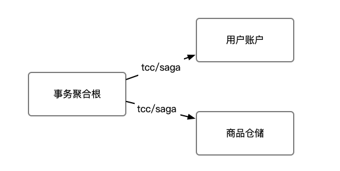

**Phoenix**框架提供了一些列 Phoenix-Starter 可以帮助用户快速构建应用。

### maven依赖

```xml
<dependency>
    <groupId>com.iquantex</groupId>
    <artifactId>phoenix-server-starter</artifactId>
    <version>2.4.1</version>
</dependency>

<dependency>
    <groupId>com.iquantex</groupId>
    <artifactId>phoenix-transaction</artifactId>
    <version>2.4.1</version>
</dependency>
```

## 案例工程

phoenix事务聚合根可以对实体聚合根提供的`TCC`和`SAGA`接口灵活组装。该案例使用的是`TCC+Saga`模式。更多的事务模式请参见：[PhoenixIQ/phoenix-samples/shopping](https://github.com/PhoenixIQ/phoenix-samples/tree/master/shopping)

购买商品是很常见的业务场景，一般涉及购买方账户扣减，以及商家库存扣减，和订单生成。该案例为了简化实现，不生成订单。

整个业务逻辑由2个聚合根(微服务)构成:

1. 仓储服务: 对给定的商品扣除仓储数量。
2. 账户服务: 从用户账户中扣除余额。


### 架构图



### 消息定义

聚合根接收**Command**产生**Event**，**Command**和**Event**类需要实现**Serializable**接口

#### command/event定义

Phoenix支持`protostuff`和`javaBean`协议进行序列化，可以通过以下配置进行指定，设定值分别为:`proto_stuff`和`java`

```yaml
quantex.phoenix.server.default-serializer: java
```

这里使用`javaBean`序列化协议进行示范.

##### 事务服务

```java
@Getter
@AllArgsConstructor
public class BuyGoodsCmd implements Serializable {
    private static final long serialVersionUID = -8667685124103764667L;
    private String            accountCode;
    private String            goodsCode;
    private long              qty;
    private double            price;
}
```

##### 账户服务

```java
@Getter
@AllArgsConstructor
public class AccountTryCmd implements Serializable {
    private static final long serialVersionUID = 4778468915465985552L;
    private String accountCode;
    private double frozenAmt;
}

@Getter
@AllArgsConstructor
public class AccountConfirmCmd implements Serializable {
    private static final long serialVersionUID = 6915539313674995272L;
    private String accountCode;
    private double frozenAmt;
}

@Getter
@AllArgsConstructor
public class AccountCancelCmd implements Serializable {
    private static final long serialVersionUID = 3086192070311956483L;
    private String accountCode;
    private double frozenAmt;
}

@Getter
@Setter
@AllArgsConstructor
public class AccountTryOkEvent implements Serializable {
    private static final long serialVersionUID = 1525408241428571363L;
    private String accountCode;
    private double frozenAmt;
}

@Getter
@Setter
@AllArgsConstructor
public class AccountTryFailEvent implements Serializable {
    private static final long serialVersionUID = -8352616962272592136L;
    private String accountCode;
    private double frozenAmt;
    private String remark;
}

@Getter
@Setter
@AllArgsConstructor
public class AccountConfirmOkEvent implements Serializable {
    private static final long serialVersionUID = -6789245872360028227L;
    private String accountCode;
    private double frozenAmt;
}

@Getter
@Setter
@AllArgsConstructor
public class AccountCancelOkEvent implements Serializable {
    private static final long serialVersionUID = -1017410771260579937L;
    private String accountCode;
    private double frozenAmt;
}

```

##### 仓储服务

```java

@Getter
@AllArgsConstructor
public class GoodsSellCmd implements Serializable {
    private static final long serialVersionUID = -4615713736312293797L;
    private String goodsCode;
    private long   qty;
}

@Getter
@AllArgsConstructor
public class GoodsSellCompensateCmd implements Serializable {
    private static final long serialVersionUID = -1797830080849363235L;
    private String goodsCode;
    private long   qty;
}

@Getter
@Setter
@AllArgsConstructor
public class GoodsSellOkEvent implements Serializable {
    private static final long serialVersionUID = 873406977804359197L;
    private String goodsCode;
    private long   qty;
}

@Getter
@Setter
@AllArgsConstructor
public class GoodsSellFailEvent implements Serializable {
    private static final long serialVersionUID = 4825942818190006297L;
    private String goodsCode;
    private long   qty;
    private String remark;
}

@Getter
@Setter
@AllArgsConstructor
public class GoodsSellCompensateOkEvent implements Serializable {
    private static final long serialVersionUID = 3256345453720913064L;
    private String goodsCode;
    private long   qty;
}
```

### 定义聚合根

#### 定义事务聚合根

事务聚合根在接收到购买命令时，分别返回`账户服务TCC`和`仓储服务Saga`的命令给到事务状态机，事务状态机会发送并协调驱动达到最终状态。

事务聚合根可以独立运行，也可以和实体聚合根一起运行。独立运行的情况下，设置targetTopic为实体聚合根的Topic，这里为了方便就设置为空串""代表和实体聚合根集成运行。

事务聚合根的具体定义规则请参考 [事务聚合根定义](02-transaction-aggregate.md)

```java
@TransactionAggregateAnnotation(aggregateRootType = "ShoppingAggregateSagaTcc")
public class ShoppingAggregateSagaTcc implements Serializable {
    private static final long serialVersionUID = 7007603076743033374L;
    private BuyGoodsCmd       request;
    private String            remark           = "";

    @TransactionStart
    public TransactionReturn on(BuyGoodsCmd request) {
        this.request = request;
        double frozenAmt = request.getQty() * request.getPrice();
        return TransactionReturn
            .builder()
            .addAction(
                TccAction.builder().tryCmd(new AccountTryCmd(request.getAccountCode(), frozenAmt))
                    .confirmCmd(new AccountConfirmCmd(request.getAccountCode(), frozenAmt))
                    .cancelCmd(new AccountCancelCmd(request.getAccountCode(), frozenAmt)).targetTopic("")
                    .subTransId(UUID.randomUUID().toString()).tryMaxRetryNum(2).confirmRetryNum(3).cancelRetryNum(3)
                    .build())
            .addAction(
                SagaAction.builder().targetTopic("").tiCmd(new GoodsSellCmd(request.getGoodsCode(), request.getQty()))
                    .ciCmd(new GoodsSellCompensateCmd(request.getGoodsCode(), request.getQty())).tiMaxRetryNum(2)
                    .ciMaxRetryNum(2).subTransId(UUID.randomUUID().toString()).build()).build();
    }

    // ... on method
}
```

#### 定义实体聚合根

实体聚合根中对**Command**的处理需要遵循 SAGA或TCC 规范，具体的定义规则可以参考 [实体聚合根定义](../02-phoenix-core/02-entity-aggregate.md)

```java
@EntityAggregateAnnotation(aggregateRootType = "AccountAggregate")
public class AccountAggregate implements Serializable {
    private static final long serialVersionUID = 1989248847513267951L;
    private double            amt;
    private double            frozenAmt;
    
    @CommandHandler(aggregateRootId = "accountCode")
    public ActReturn act(AccountTryCmd cmd) {
        if (amt - frozenAmt > cmd.getFrozenAmt()) {
            return ActReturn.builder().retCode(RetCode.SUCCESS)
                .event(new AccountTryOkEvent(cmd.getAccountCode(), cmd.getFrozenAmt())).build();
        } else {
            String retMessage = String.format("资金可用不足，剩余:%f, 当前需要冻结:%f", amt - frozenAmt, cmd.getFrozenAmt());
            return ActReturn.builder().retCode(RetCode.FAIL).retMessage(retMessage)
                .event(new AccountTryFailEvent(cmd.getAccountCode(), cmd.getFrozenAmt(), retMessage)).build();
        }
    }

    public void on(AccountTryOkEvent event) {
        frozenAmt += event.getFrozenAmt();
    }

    public void on(AccountTryFailEvent event) { }

    @CommandHandler(aggregateRootId = "accountCode")
    public ActReturn act(AccountConfirmCmd cmd) {
        return ActReturn.builder().retCode(RetCode.SUCCESS)
            .event(new AccountConfirmOkEvent(cmd.getAccountCode(), cmd.getFrozenAmt())).build();
    }

    public void on(AccountConfirmOkEvent event) {
        amt -= event.getFrozenAmt();
        frozenAmt -= event.getFrozenAmt();
    }

    @CommandHandler(aggregateRootId = "accountCode")
    public ActReturn act(AccountCancelCmd cmd) {
        return ActReturn.builder().retCode(RetCode.SUCCESS)
            .event(new AccountCancelOkEvent(cmd.getAccountCode(), cmd.getFrozenAmt())).build();
    }

    public void on(AccountCancelOkEvent event) {
        frozenAmt -= event.getFrozenAmt();
    }
}

@EntityAggregateAnnotation(aggregateRootType = "GoodsTcc")
public class GoodsAggregate implements Serializable {
    private static final long serialVersionUID = -6111851668488622895L;
    private long              qty;
    private long              frozenQty;

    @CommandHandler(aggregateRootId = "goodsCode")
    public ActReturn act(GoodsSellCmd cmd) {
        if (cmd.getQty() < 0) {
            throw new RuntimeException("数不能小于0");
        }
        if (qty > cmd.getQty()) {
            return ActReturn.builder().retCode(RetCode.SUCCESS)
                .event(new GoodsSellOkEvent(cmd.getGoodsCode(), cmd.getQty())).build();
        } else {
            String ret = String.format("余额不足，剩余:%d, 当前需要:%d", qty, cmd.getQty());
            return ActReturn.builder().retCode(RetCode.FAIL).retMessage(ret)
                .event(new GoodsSellFailEvent(cmd.getGoodsCode(), cmd.getQty(), ret)).build();
        }
    }

    public void on(GoodsSellOkEvent event) {
        qty -= event.getQty();
    }

    public void on(GoodsSellFailEvent event) { }

    @CommandHandler(aggregateRootId = "goodsCode")
    public ActReturn act(GoodsSellCompensateCmd cmd) {
        return ActReturn.builder().retCode(RetCode.SUCCESS)
            .event(new GoodsSellCompensateOkEvent(cmd.getGoodsCode(), cmd.getQty())).build();
    }

    public void on(GoodsSellCompensateOkEvent event) {
        qty += event.getQty();
    }
}
```

### 配置文件

在**Spring Boot**配置文件中增加**Phoenix**的相关配置

```yaml
quantex:
  phoenix:
    server:
      name: ${spring.application.name}    # 服务名称
      package-name: com.iquantex.phoenix.samples.account # 聚合根包路径
      mq:
        type: kafka                       # mq类型
        address: 127.0.0.1:9092           # mq服务地址
        subscribe:
          - topic: ${spring.application.name}
      event-store:
        driver-class-name: org.h2.Driver  # 数据库驱动
        data-sources:
          - url: jdbc:h2:file:./data/test;DB_CLOSE_DELAY=-1;DATABASE_TO_UPPER=FALSE;INIT=CREATE SCHEMA IF NOT EXISTS PUBLIC # 数据库链接url
            username: sa                  # 数据库账户
            password:                     # 数据库密码
      default-serializer: java
```

## 服务调用者

### maven依赖

```xml
<dependency>
    <groupId>com.iquantex</groupId>
    <artifactId>phoenix-client-starter</artifactId>
    <version>2.4.1</version>
</dependency>
```

### 调用服务

增加`phoenix-client-starter`依赖启动服务后**Phoenix**会自动注入**PhoenixClient**的Java Bean，可以通过调用**PhoenixClient**的**send()**方法发送**Command**信息。

```java
@Slf4j
@RestController("/goods")
public class GoodsController {

  @Value("${spring.application.name}")
  private String topic;

  @Autowired
  private PhoenixClient client;

  @GetMapping("/buy")
  public String buy(String helloId) throws ExecutionException, InterruptedException {
    BuyGoodsCmd buyGoodsCmd = new BuyGoodsCmd("A1", "book", 1, 101.0);
    Future<RpcResult> future = client.send(buyGoodsCmd, topic, "");
    return future.get().getMessage();
  }
}
```

### 配置文件

```yaml
quantex:
  phoenix:
    client:
      name: ${spring.application.name}-client	# 服务名称
      mq:
        type: kafka	                            # mq类型
        address: 127.0.0.1:9092                 # mq地址：embedded表示使用内存kafka
```


