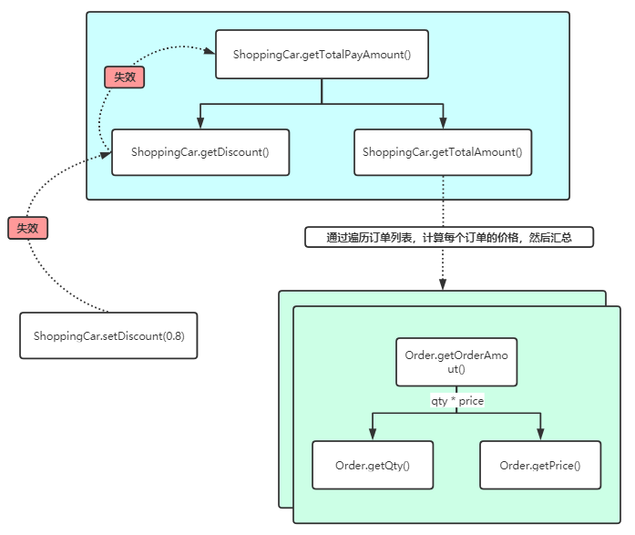

## 基本功能测试

phoenix-dgc 的核心功能是通过对方法的结果进行缓存来达到加速计算的效果，同时为了保证计算结果的准确性，如果涉及到属性值的更新，则会导致缓存失效。下面我们通过购物车案例来进行测试，看 DGC 功能是否能够正常使用

#### 案例构造

```java
@Test
public void test() {
    DgcObjectManager dgcObjectManager = new DgcObjectManager();
    ShoppingCar car = dgcObjectManager.getDgcObject(ShoppingCar.class);
    car.setDiscount(1);

    Order order1 = dgcObjectManager.getDgcObject(Order.class);
    order1.setItemName("apple");
    order1.setQty(100);
    order1.setPrice(8);
    car.getOrderList().add(order1);

    Order order2 = dgcObjectManager.getDgcObject(Order.class);
    order2.setItemName("banana");
    order2.setQty(100);
    order2.setPrice(2);
    car.getOrderList().add(order2);

    log.info("first call car getTotalPayAmount");
    car.getTotalPayAmount();

    log.info("change discount then call car getTotalPayAmount");
    car.setDiscount(0.8);
    car.getTotalPayAmount();

    log.info("change order1 qty then call car getTotalPayAmount");
    car.getOrderList().get(0).setQty(200);
    car.getTotalPayAmount();

    log.info("{}", DgcHelper.showGraph(2));
}

日志输出:

first call car getTotalPayAmount
* get discount <1.0>
* get order itemName<apple> orderAmount<800.0>
* get order itemName<banana> orderAmount<200.0>
* calc total pay amount<1000.0>
change discount then call car getTotalPayAmount
* get discount <0.8>
* calc total pay amount<800.0>
change order1 qty then call car getTotalPayAmount
* get order itemName<apple> orderAmount<1600.0>
* calc total pay amount<1440.0>
```

通过上面案例中的日志输出，可以验证 DGC 功能正常。

## 内存占比测试

DGC 为了达到加速的效果，会在内存中缓存方法的结果，以及方法之间的依赖关系。在 DGC 中将每个方法封装为 DgcKey 

```java
public class DgcKey implements Serializable {
    private static final long serialVersionUID = 4176002715044714991L;
    /** 代理对象 */
    private Object obj;
    /** 1. 调用Observable注解的成员对应的get方法(成员可能是基本类型，自定类，集合类) 2. 调用Compute注解的方法 */
    private Method method;
    // ...
}
```

在整个依赖关系图中，每个节点都是一个 DgcNode, 每个节点中都包含了该节点的缓存值，以及该节点的孩子节点列表/父亲节点列表

```java
public class DgcNode implements Serializable {
    private static final long serialVersionUID = 2701772077242744179L;
    /** 当前节点 */
    private DgcKey current;
    /** 当前节点计算结果 */
    private Object cache;
    /** 孩子节点 */
    private Set<DgcKey> childKeySet = new HashSet<>();
    /** 父亲节点 */
    private Set<DgcKey> parentKeySet = new HashSet<>();
}
```

下面我们通过一个案例来进行一组内存占比测试（该测试仅用来评估参考，具体内存占用情况，还需根据实际项目进行评估&测试）

#### 案例构造

```java
@Model
@Getter
@Setter
public class Order {
    /** 物品名称 */
    @Observable private String itemName;
    /** 物品数量 */
    @Observable private long qty;
    /** 物品价格 */
    @Observable private double price;

    /**
     * 订单金额
     *
     * @return orderAmount
     */
    @Compute
    public double getOrderAmount() {
        num.incrementAndGet();
        double amount = getQty() * getPrice();
        log.info("* get order itemName<{}> orderAmount<{}>", getItemName(), amount);
        return amount;
    }
}

DgcObjectManager dgcObjectManager = new DgcObjectManager();
for (int i = 0; i < 10000; i++) {
	Order order = dgcObjectManager.getDgcObject(Order.class);
	order.setItemName("apple");
	order.setQty(100);
	order.setPrice(8);
	order.getOrderAmount();
}
```

在上面的案例中，共构造了 10000 个 Order 对象，每个 Order 对象在内存中会存在 4 个 Dgckey (三个属性的 get 方法和 getOrderAmount() 方法)，以及 4 个 DgcNode。

执行完之后，内存中存在 40000 个 DgcKey 和 40000 个 DgcNode，他们的内存消耗情况如下：


## 性能对比测试

下面我们针对 DGC 的性能做一组对比测试，测试案例基于购物车案例进行改造。

根据购物车案例中的计算逻辑，我们可以得出如下依赖关系图。



#### 读多写少场景

针对性能测试，我们对购物车案例进行如下改造：

1. 构造一个购物车实例
2. 给购物车实例增加 1000 个订单实例
3. 计算总金额（计算过程中，以一定的频率对购物车中的折扣进行重新赋值）

为了模拟读多写少的场景，在测试中会以一定的频率重新设置 discount 的值（这个操作对于正常案例来说没有太大影响,对于 DGC 的场景来说,每次更新 discount 的值都会到时缓存失效,从而导致重新计算）

对上面的案例，分别用两种不同的实现来进行测试，最终得出性能对比结果。

**正常案例**

本案例没有使用 DGC 功能。方法的每次调用都会进行完整的计算逻辑。

```java
/** 正常案例 */
public static void normal_test(int crycle) {
    ShoppingCar car = new ShoppingCar();
    car.setDiscount(1);

    List<Order> list = new ArrayList<>();
    for (int i = 0; i < 1000; i++) {
        Order order = new Order();
        order.setItemName("apple" + i);
        order.setQty(100);
        order.setPrice(8);
        list.add(order);
    }
    car.setOrderList(list);

    long startTime = System.currentTimeMillis();
    for (int i = 0; i < crycle; i++) {
        if (i % 15 == 0) {
            car.setDiscount(0.8);
        }
        car.getTotalPayAmount();
    }
    log.debug(
            "====> [循环 <{}> 次] 未开启Dgc功能时耗时：<{}> ms",
            crycle,
            System.currentTimeMillis() - startTime);
}
```

**DGC 案例**

本案例开启 DGC 功能，针对属性的 get 方法，以及 `@Compute` 注解标识的方法，每次计算过一次之后会对计算结果进行缓存，以达到加速效果。当计算逻辑中设计到的属性有更新时，会导致缓存失效。

在本案例中，我们通过以一定频率重新赋值购物车中的折扣的值，来模拟缓存失效的操作。

```java
public static void dgc_test(int crycle) {
    DgcObjectManager dgcObjectManager = new DgcObjectManager();    
    ShoppingCar car = dgcObjectManager.getDgcObject(ShoppingCar.class);
    car.setDiscount(1);

    List<Order> list = new ArrayList<>();
    for (int i = 0; i < 1000; i++) {
        Order order = dgcObjectManager.getDgcObject(Order.class);
        order.setItemName("apple" + i);
        order.setQty(100);
        order.setPrice(8);
        list.add(order);
    }
    car.setOrderList(list);

    long startTime = System.currentTimeMillis();
    for (int i = 0; i < crycle; i++) {
        if (i % 15 == 0) {
            car.setDiscount(0.8);
        }
        car.getTotalPayAmount();
    }
    log.debug(
            "====> [循环 <{}> 次] 开启Dgc功能后耗时：<{}> ms",
            crycle,
            System.currentTimeMillis() - startTime);
}
```

对上面的测试案例分别进行了10次测试，得出如下结果（结果取平均值）

| 循环次数 | 开启DGC(耗时/ms) | 未开启DGC(耗时/ms) |
| -------- | ------- | --------- |
| 100      | 48      | 70        |
| 1000     | 10      | 74        |
| 10000    | 17      | 220       |
| 100000   | 20      | 2200      |
| 1000000  | 120     | 12800     |
| 10000000 | 1100    | 129000    |

#### 写操作耗时场景

为了模拟写操作比较耗时的的场景，在 ShoppingCar 的 getTotalPayAmount 方法中添加一个 1亿 次的空循环。

对上面的测试案例分别进行了10次测试，得出如下结果（结果取平均值）

| 循环次数 | 开启DGC(耗时/ms) | 未开启DGC(耗时/ms) |
| -------- | ------- | --------- |
| 100      | 50      | 80        |
| 1000     | 23      | 90        |
| 10000    | 21      | 340       |
| 100000   | 20      | 2400      |
| 1000000  | 140     | 13600     |
| 10000000 | 1100    | 136000    |
