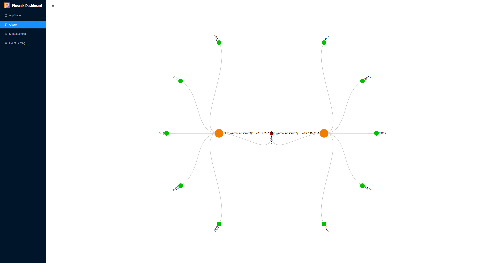

## 集群能力

在高并发场景中，应用系统的处理能力通常是个严峻的挑战。

在提高系统的并发处理能力上，Phoenix 框架使用聚合根对象作为调度单位进行线程调度，以提升单节点部署的情况下线程资源的利用效率。此外，借助 Akka-Cluster 和 Akka-Cluster-Sharding 的能力实现横向扩展，通过部署多个服务节点组成集群，聚合根对象可以在集群节点之间灵活调度，使得系统可以通过增加节点的方式提升处理能力。


Phoenix 框架提供应用系统的伸缩性。与横向扩展相似，Phoenix 服务集群可以动态缩减节点数量。Akka-Cluster 和 Akka-Cluster-Sharding 可以对聚合根对象进行集群调度和管理，在集群减少服务节点数量时，Akka可以将这些节点中的聚合根对象转移到剩余节点中。在进行节点移除的过程中，配合 EventSourcing 的能力，被移除节点中的聚合根可以在剩余节点中重新构建并恢复状态。

## 集群配置

Phoenix 支持在多种环境中运行。 下面分别介绍下 Phoenix 服务在集群时 Akka 的配置项需要如何进行配置。

#### 本地单点运行

phoenix的默认配置就是本地模式，直接启动即可，不用在 `application.yaml` 或者 `application.properties` 中显式配置。

#### 本地集群运行

添加或修改以下几项配置，保证多个实例的端口不能冲突。

```yaml
server:
  port: 8080

quantex:
  phoenix:
    akka:
      discovery-method: config  # 默认config，服务发现
      artery-canonical-port: 2552  # 集群端口
      management-http-port: 8559 # 集群管理的http端口 
      artery-canonical-hostname: 192.168.1.9   # 节点的ip地址
      seed-node: akka://account-server@192.168.1.9:2551,akka://account-server@192.168.1.9:2552  # 集群中seed-node的节点地址,一般会把所有节点都设置, 另外`account-server`要和应用${spring.application.name}的名字相同
```

#### K8s集群运行

Phoenix 的集群能力依赖于 Akka-Cluster, Akka-Cluster 提供了方便的 Kubernetes API 来帮助我们在 kubernetes 环境中发现服务以及组集群。

在 kubernetes 环境上运行集群需要提供如下内容：

- Deployment：用来在 kubernetes 中创建一个服务 pod
- Role 和 RoleBinding：使phoenix服务（akka pod）可以访问 kubernetes api

一个 Deployment 示例。

```yaml
apiVersion: apps/v1
kind: Deployment
metadata:
  name: phoenix-demo # 服务名
  labels:
    app: phoenix-demo # 需要设置labels
...
```

允许节点查询 Kubernetes API 服务器的Role 和 RoleBinding示例：

```yaml
# 创建一个角色 `pod-reader`，它可以列出 pod，并将绑定部署到的命名空间中的默认服务帐户绑定到该角色。
kind: Role
apiVersion: rbac.authorization.k8s.io/v1
metadata:
  name: pod-reader
rules:
  - apiGroups: [""] # "" indicates the core API group
    resources: ["pods"]
    verbs: ["get", "watch", "list"]
---
kind: RoleBinding
apiVersion: rbac.authorization.k8s.io/v1
metadata:
  name: read-pods
subjects:
  # Create the default user for the akka-cluster-1 namespace
  - kind: User
    name: system:serviceaccount:{{- printf "%s" .Release.Namespace | trunc 63 -}}:default
roleRef:
  kind: Role
  name: pod-reader
  apiGroup: rbac.authorization.k8s.io
```

Phoenix服务同时还需要进行如下配置

```yaml
quantex:
  phoenix:
    akka:
      # 服务发现的方式
      discovery-method: kubernetes
      # k8s服务发现默认集群域名后缀
      # 默认值
      k8s-pod-domain: cluster.local
      # [可选配置]:设置 Selector label 的格式，`%s` 将替换为配置的有效名称（这个需要在 Deployment 自己设置）
      # 默认值
      pod-label-selector: app=%s
```

#### Consul 集群运行

使用 Consul 运行集群则较为简单，配置如下参数即可。

```yaml
quantex:
  phoenix:
    akka:
      discovery-method: consul # 修改服务发现为consul
      consul-host: 127.0.0.1 # 配置Consul地址
      consul-port: 8500 # 配置consul地址
```

## 集群运维

使用集群能力之后，可以配合 phoenix-console 提供的监控面板来实时查看集群的状态。

#### 应用状态查看

phoenix-console 提供的应用总览页面，可以查看一下两个信息：

- 应用状态 [就绪/组集群中/故障]
- 集群方式 [集群/单点]

通过以上两个信息，可以方便的判断当前服务运行状态是否正常。

#### 集群状态展示

在Phoenix运行时，最小调度单位为聚合根，在 phoenix-console 提供的集群管理页面中可以展示Phoenix服务中聚合根的分布情况。

红点: 当前Phoenix集群的集群名称
橙点: 当前Phoenix集群内的节点的IP和端口
绿点: 聚合根shard集合,数字代表每个shard后聚合根的数量


