 ## 概述

Phoenix 是宽拓自主研发的一款消息驱动型的高性能 Java 开发框架，专注于降低金融行业中业务复杂性高、性能要求高的应用系统的开发难度，助力研发团队打造专业、高效的微服务化的金融应用系统。
 本篇测试报告主要验证了 Phoenix 提供的如下功能:
  - 基于 bank-account 账户划拨功能正常
  - Grafana 使用正常
  - EventSourcing 使用正常
  - Snapshot 使用正常

## bank-account 划拨功能

### 概述

验证 bank-account 账户划拨功能是否可以正常使用。

### 原理介绍

bank-account 提供了随机划拨和定向划拨两个功能:
 1. 定向划拨:指定账户进行转入转出操作（每个账户默认初始有100元，划拨金额大于0为转入操作，划拨金额小于0为转出操作）
 2. 随机划拨:指定账户范围和转账次数，多个账户同时进行划拨操作。

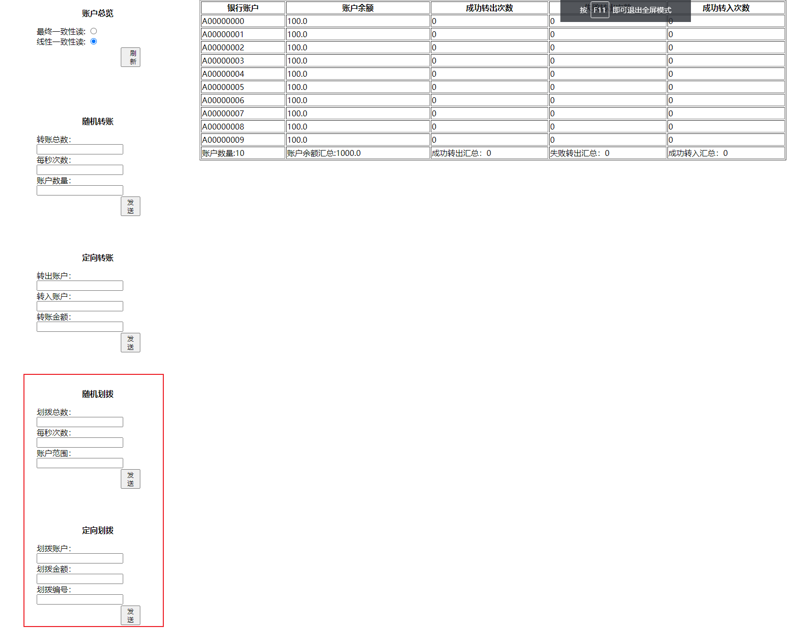

### 测试方案

#### 场景描述

分别使用 bank-account 提供的两个划拨接口进行下单测试。

#### 校验方法

 - 定向划拨:每次划拨之后校验余额
 - 随机划拨:转入次数 + 转出次数 + 错误转出 = 转账次数

### 测试步骤

 1. 使用 bank-account 的下单页面以每秒 100 笔的速率下单，同时限制账户个数为 10 个，划拨总次数为 1000
 2. 待下单完毕后，进行校验.
   使用 bank-account 的内存查询接口查询内存数据 (转入次数 + 转出次数 + 错误转出 = 转账次数)

   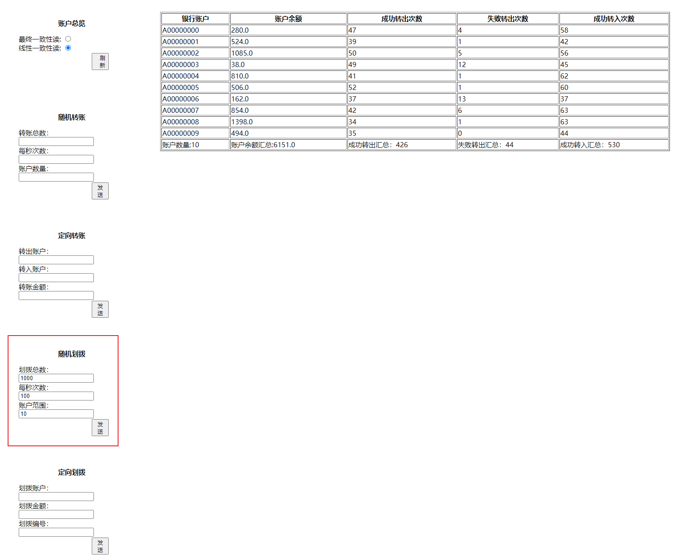

 3. 使用定向转账功能，从 A00000000 账户中转出 100 元（通过以上图片发现经过随机转账之后 A00000000 账户中余额为 280 元）
    转账之后，通过内存查询接口查看账户余额（余额为 180 元）（定向划拨中的划拨编号可以用来测试幂等逻辑，如果本次划拨编号和上次划拨编号一直，则账户金额不会有任何变动）

    

### 测试结果

符合预期，bank-account 账户划拨功能可以正常使用。


## phoenix metrics 功能

### 概述

Phoenix 联合 Grafana 提供了一套监控服务，可用于监控 Phoenix 应用运行过程中的各项指标。根据面板可以分为以下几块:

- phoenix jvm
- phoenix source aggregate
- phoenix entity aggregate
- phoenix transaction aggregate
- phoenix event store
- phoenix message elasticsearch
- phoenix event publish
- phoenix client

### 原理介绍

通过在 bank-account 服务中进行埋点，并将相应的数据上传至 Elasticsearch 最终通过 Grafana 友好的展示出来。不仅可以实时的监控 Phoenix 应用每次下单之后的运行情况，还可以分析上面的指标判断服务的性能。

- phoenix source aggregate、phoenix entity aggregate、phoenix transaction aggregate、phoenix event store、phoenix event publish、phoenix client、phoenix jvm: 这些面板中的数据采用 JMX + Prometheus + Grafana监控机制，可以实时采集服务的运行情况，并通过 Grafana进行展示,其中 JVM 和 phoenix overview 采集的phoenix server服务指标
- phoenix message:该面板展示了phoenix server处理后的所有事件的监控数据，EventPublish 将事件上传到消息队列，通过配置phoenix admin服务的上报配置，phoenix admin服务会将指定的消息队列中的事件数据持久化到 Elasticsearch 服务中，最后在Grafana进行展示

### 测试方案

#### 场景描述

使用 bank-account 提供的随机划拨功能以固定的速率进行下单测试，然后打开 Grafana 监控面板监测数据。

#### 校验方法

观察 Grafana 中展示出来的各个指标是否符合预期

### 测试步骤

 1. 使用 bank-account 的下单页面以每秒 100 笔的速率下单，同时限制账户个数为 10 个，划拨总次数为 10000
 2. 待下单完毕后，进行校验。
    通过 Grafana 可视化面板查看

    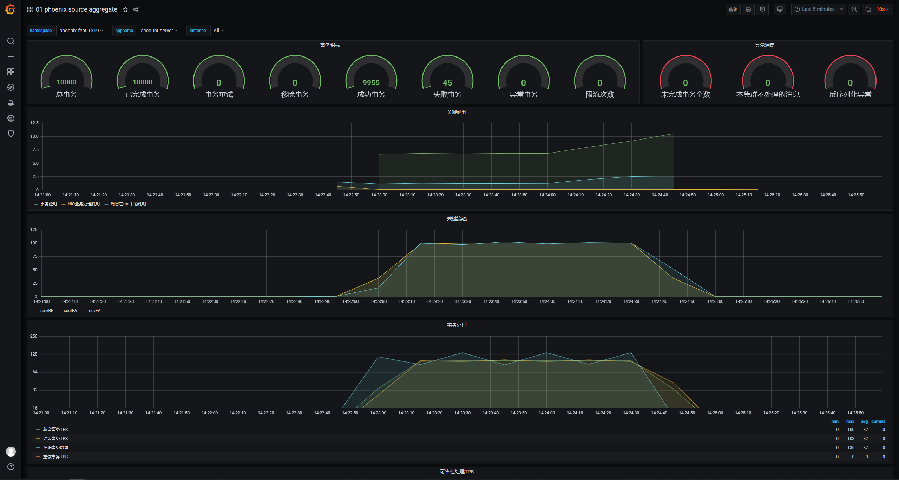
    
    
    
    通过 Grafana 可视化面板可以观察到一共发送了 10000 条消息（总事务 = 10000）,并全部处理完成。整个处理过程耗时平均在 30 ms以下。

 3. 在phoenix overview 根据实例IP地址查看其中一个节点的处理情况
 
    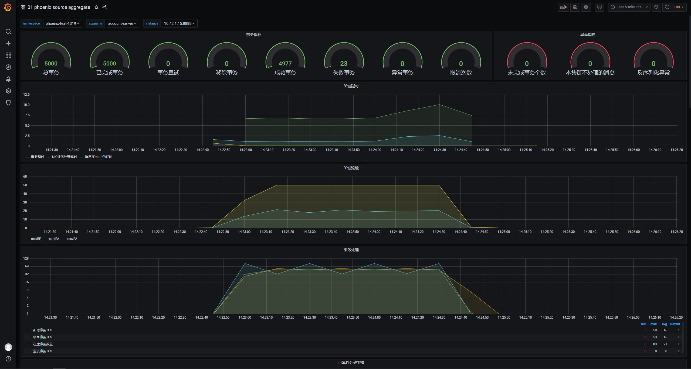
    
    通过上图我们还可以看出来，该节点一共处理了 5000 笔请求（一个 10000 笔请求，共两个处理节点），说明了多个节点之间是可以做到负载均衡的。
    
 4. 在phoenix message 面板通过查看每一类消息的处理情况（这里查看划拨失败事件的处理情况）
 
    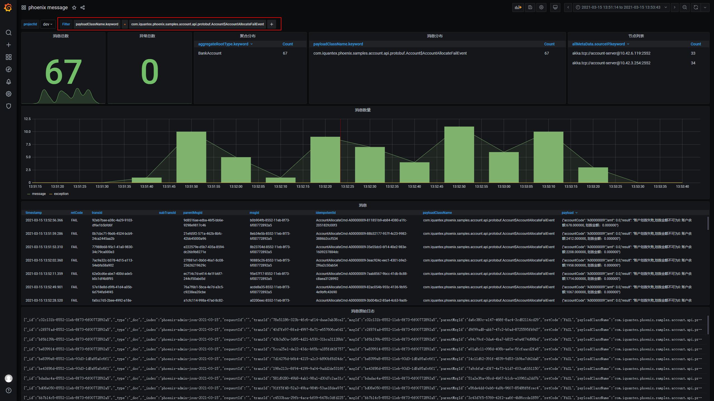
    
 5. phoenix client监控图
  
    
  
 6. phoenix eventPublish 监控图
  
    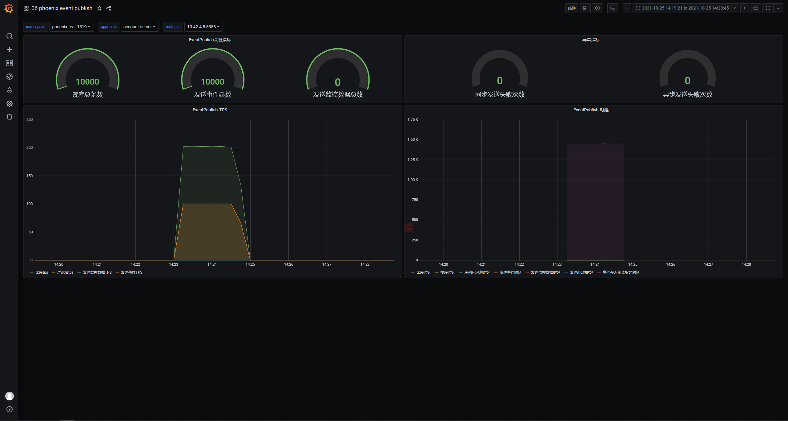
 
 7. JVM 监控图
 
    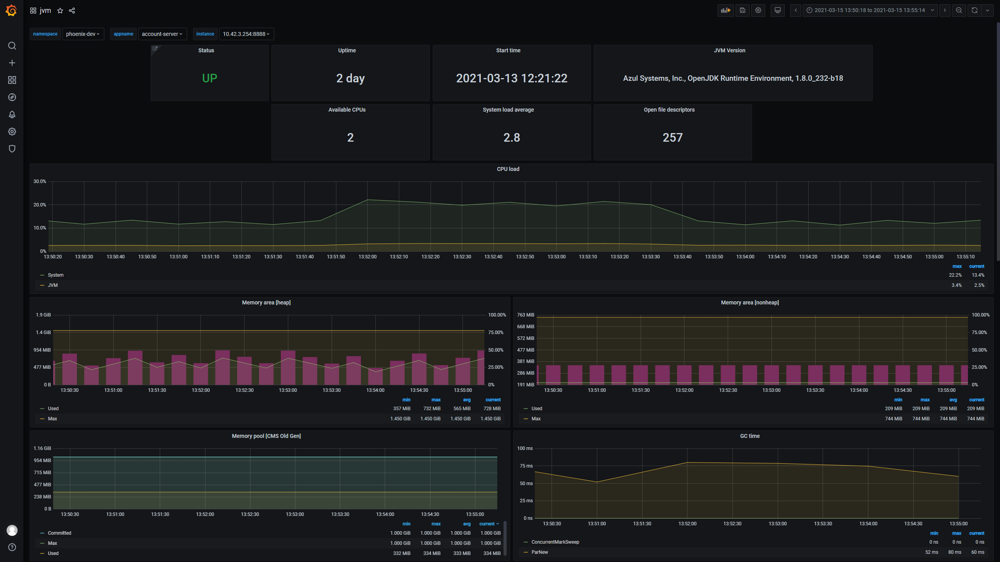

### 测试结果

符合预期，可以证明 Grafana 监控功能够可以正常使用

## phoenix console 功能

### 概述

phoenix console是 Phoenix 框架默认提供的轻量级、嵌入式监控平台，该平台共提供四大操作模块：

- overview
- cluster
- state manager
- event manager

### 原理介绍

phoenix console支持对 Phoenix 服务进行系统状态管理、事件管理、性能监控、业务监控、事务调用链追踪以及异常分析。

### 测试方案

#### 校验方法

观察 phoenix console 中展示出来的各个功能是否符合预期、是否正常使用

服务地址：IP/phx-console

### 测试步骤

 1. 使用 bank-account 的下单页面以每秒 100 笔的速率下单，同时限制账户个数为 10 个，划拨总次数为 10000
 2. 待下单完毕后，进行校验。
    通过 phoenix console 可视化页面查看
    
 3. 应用总览
 
 
    
 4. 扇子图
 
 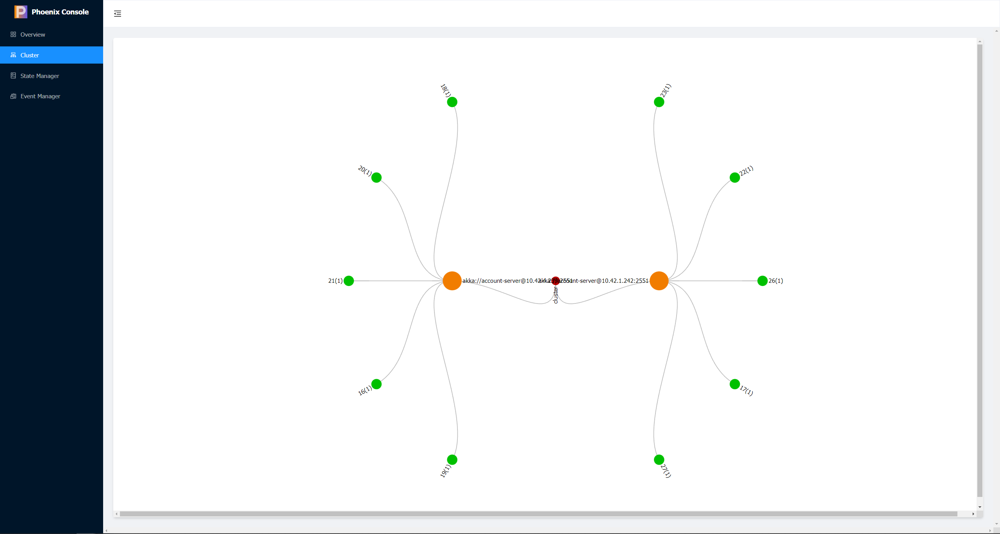
 
 5. 内存管理
 
   
 
 6. 事件管理

  

### 测试结果

符合预期，可以证明 Grafana 监控功能够可以正常使用


## EventSourcing 功能

### 概述

Phoenix 保证其内存数据正确性的核心原理在于 EventSourcing (事件溯源技术)。

### 原理介绍

Phoenix 是 EDA 架构的框架，可以基于事件重塑内存，Phoenix 会对所有处理过的事件进行持久化，在节点重启或者聚合根漂移时通过 EventSourcing 重塑内存状态。

### 测试方案

#### 场景描述

使用 bank-account 提供的随机划拨功能，首先构造固定数量的请求，处理完成之后观察内存数据情况，然后重启节点后再次观察内存状态是否和之前保持一致，重启之后再进行定向划拨观察服务时候能够正常运作。

#### 校验方法

在 bank-account 页面通过内存查询功能，观察最终的结果是否正确。

### 测试步骤

 1. 使用 bank-account 的下单页面以每秒 100 笔的速率下单，同时限制账户个数为 10 个，划拨总次数为 1000
 2. 待所有请求处理完成之后，查询内存数据
    
 3. 重启服务之后，再次查询内存数据
    重启过程中发现各个聚合根确实存在EventSourcing的过程
    
    并且重启前后内存数据没有变化
    

### 测试结果

符合预期，可以证明 Phoenix 提供的 EventSourcing 功能够可以正常使用


## Snapshot 功能

### 概述

Phoenix 应用可以通过 EventSourcing 功能进行内存数据恢复，使用 Snapshot 可以加快 EventSourcing 的内存恢复的速度。

### 原理介绍

Snapshot 是对某一瞬间 Phoenix 应用内存的一次存储。Phoenix 提供的快照功能提供了如下操作:

1. 单个聚合根默认每处理100000笔消息自动打一次快照，可以通过`@EntityAggregateAnnotation(snapshotInterval = 1000l)`进行设置
2. 手动触发打快照
3. 查询快照列表
4. 查询指定聚合根最新状态
5. 删除指定聚合根指定版本的快照

### 测试方案

Phoenix 服务提供了快照操作的相关接口，以下测试借助 phoenix admin 页面提供的快照功能进行测试

#### 场景描述

使用 bank-account 提供的随机划拨功能，首先构造一定数量的划拨请求，待处理完成之后执行手动打快照的请求。同时借助 phoenix admin 提供的内存管理功能进行快照列表的查询和删除指定版本快照的操作。

#### 校验方法

每次操作之后，校验效果是否符合预期。

### 测试步骤

 1. 使用 bank-account 的下单页面以每秒 100 笔的速率下单，同时限制账户个数为 10 个，划拨总次数为 1000
 2. 使用 phoenix admin 提供的内存管理功能给账户 A00000009 打一个快照
    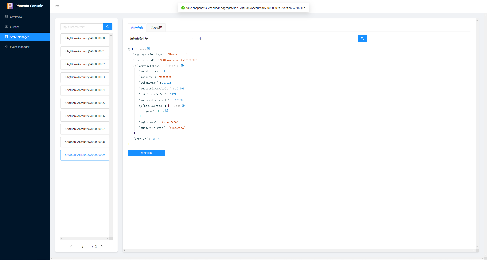
 3. 接着使用 phoenix admin 查询快照列表
    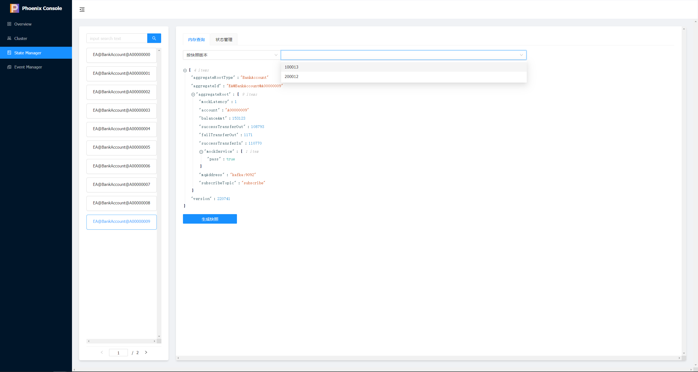
 4. 此时内存中各个账户的余额如下
    
 5. 从 A00000009 账户中转出 100 元，然后使用页面查询 A00000009 的最新状态
    
 6. 使用 bank-account 的下单页面以每秒 1000 笔的速率下单，同时限制账户个数为 1 个，划拨总次数为 100000
 7. 查询快照列表，观察是否自动触发快照
    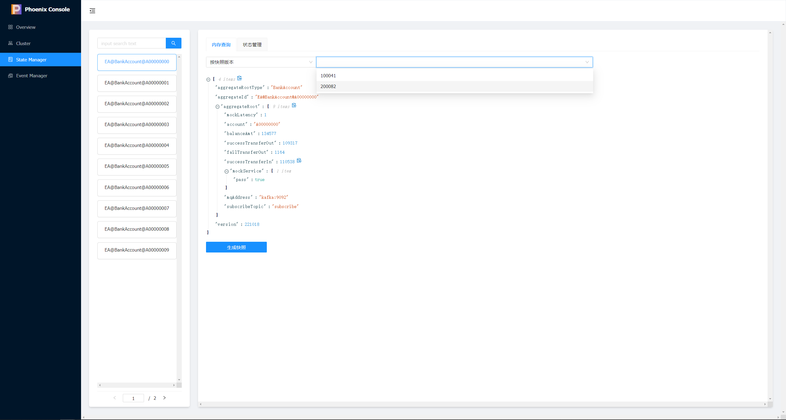

### 测试结果

符合预期，可以证明 Phoenix 提供的 Snapshot 功能够可以正常使用


## 事务功能

### 概述

Phoenix 提供了一套分布式事务的解决方案，引入 phoenix-transaction 模块即可使用。

### 原理介绍

bank-account 提供了随机转账和定向转账两个功能:

 1. 定向转账:指定转出账户和转入账户，以及转账金额
 2. 随机转账:指定账户范围和转账次数，多个账户两两之间随机进行转账操作。

### 测试方案

bank-account 构造了账户转账的案例，模拟了两个账户之间的转账操作。

#### 场景描述

分别使用 bank-account 提供的两个转账接口进行下单测试。

#### 校验方法

 - 定向转账:每次转账之后校验余额
 - 随机转账:转入次数 = 转出次数 && 转出次数 + 错误转出 = 转账次数

### 测试步骤

 1. 使用 bank-account 的下单页面以每秒 100 笔的速率下单，同时限制账户个数为 10 个，转账总次数为 1000
 2. 待下单完毕后，进行校验。使用 bank-account 的内存查询接口查询内存数据
    
 3. 使用定向转账功能，从 A00000000 账户向 A00000001 账户转入 100 元（通过以上图片发现经过随机转账之后 A00000000 账户中余额为 763 元，A00000001 账户中余额为 1240 元）
    转账之后，通过内存查询接口查看账户余额
    

### 测试结果

符合预期，可以证明 Phoenix 提供的事务功能够可以正常使用


## DGC 功能

### 概述

本测试针对 phoenix-dgc 提供的基本功能进行测试。

### 原理介绍

phoenix-dgc 的核心功能是通过对方法的结果进行缓存来达到加速计算的效果，同时为了保证计算结果的准确性，如果涉及到属性值的更新，则会导致缓存失效。下面我们通过购物车案例来进行测试，看 DGC 功能是否能够正常使用

### 测试方案

通过下面这个案例，分别从多个维度进行测试：

- 内存占比测试
- 性能对比测试

```java
@Test
public void test() {
    DgcObjectManager dgcObjectManager = new DgcObjectManager();
    ShoppingCar car = dgcObjectManager.getDgcObject(ShoppingCar.class);
    car.setDiscount(1);

    Order order1 = dgcObjectManager.getDgcObject(Order.class);
    order1.setItemName("apple");
    order1.setQty(100);
    order1.setPrice(8);
    car.getOrderList().add(order1);

    Order order2 = dgcObjectManager.getDgcObject(Order.class);
    order2.setItemName("banana");
    order2.setQty(100);
    order2.setPrice(2);
    car.getOrderList().add(order2);

    log.info("first call car getTotalPayAmount");
    car.getTotalPayAmount();

    log.info("change discount then call car getTotalPayAmount");
    car.setDiscount(0.8);
    car.getTotalPayAmount();

    log.info("change order1 qty then call car getTotalPayAmount");
    car.getOrderList().get(0).setQty(200);
    car.getTotalPayAmount();

    log.info("{}", DgcHelper.showGraph(2));
}

日志输出:

first call car getTotalPayAmount
* get discount <1.0>
* get order itemName<apple> orderAmount<800.0>
* get order itemName<banana> orderAmount<200.0>
* calc total pay amount<1000.0>
change discount then call car getTotalPayAmount
* get discount <0.8>
* calc total pay amount<800.0>
change order1 qty then call car getTotalPayAmount
* get order itemName<apple> orderAmount<1600.0>
* calc total pay amount<1440.0>
```

通过上面案例中的日志输出，可以验证 DGC 功能正常。

### 测试步骤

#### 内存占比测试

DGC 为了达到加速的效果，会在内存中缓存方法的结果，以及方法之间的依赖关系。在 DGC 中将每个方法封装为 DgcKey 

```java
public class DgcKey implements Serializable {
    private static final long serialVersionUID = 4176002715044714991L;
    /** 代理对象 */
    private Object obj;
    /** 1. 调用Observable注解的成员对应的get方法(成员可能是基本类型，自定类，集合类) 2. 调用Compute注解的方法 */
    private Method method;
    // ...
}
```

在整个依赖关系图中，每个节点都是一个 DgcNode, 每个节点中都包含了该节点的缓存值，以及该节点的孩子节点列表/父亲节点列表

```java
public class DgcNode implements Serializable {
    private static final long serialVersionUID = 2701772077242744179L;
    /** 当前节点 */
    private DgcKey current;
    /** 当前节点计算结果 */
    private Object cache;
    /** 孩子节点 */
    private Set<DgcKey> childKeySet = new HashSet<>();
    /** 父亲节点 */
    private Set<DgcKey> parentKeySet = new HashSet<>();
}
```

下面我们通过一个案例来进行一组内存占比测试（该测试仅用来评估参考，具体内存占用情况，还需根据实际项目进行评估&测试）

#### 案例构造

```java
@Model
@Getter
@Setter
public class Order {
    /** 物品名称 */
    @Observable private String itemName;
    /** 物品数量 */
    @Observable private long qty;
    /** 物品价格 */
    @Observable private double price;

    /**
     * 订单金额
     *
     * @return orderAmount
     */
    @Compute
    public double getOrderAmount() {
        num.incrementAndGet();
        double amount = getQty() * getPrice();
        log.info("* get order itemName<{}> orderAmount<{}>", getItemName(), amount);
        return amount;
    }
}

DgcObjectManager dgcObjectManager = new DgcObjectManager();
for (int i = 0; i < 10000; i++) {
	Order order = dgcObjectManager.getDgcObject(Order.class);
	order.setItemName("apple");
	order.setQty(100);
	order.setPrice(8);
	order.getOrderAmount();
}
```

在上面的案例中，共构造了 10000 个 Order 对象，每个 Order 对象在内存中会存在 4 个 Dgckey (三个属性的 get 方法和 getOrderAmount() 方法)，以及 4 个 DgcNode。

执行完之后，内存中存在 40000 个 DgcKey 和 40000 个 DgcNode，他们的内存消耗情况如下：


#### 性能对比测试

下面我们针对 DGC 的性能做一组对比测试，测试案例基于购物车案例进行改造。

根据购物车案例中的计算逻辑，我们可以得出如下依赖关系图。


#### 读多写少场景

针对性能测试，我们对购物车案例进行如下改造：

1. 构造一个购物车实例
2. 给购物车实例增加 1000 个订单实例
3. 计算总金额（计算过程中，以一定的频率对购物车中的折扣进行重新赋值）

为了模拟读多写少的场景，在测试中会以一定的频率重新设置 discount 的值（这个操作对于正常案例来说没有太大影响,对于 DGC 的场景来说,每次更新 discount 的值都会到时缓存失效,从而导致重新计算）

对上面的案例，分别用两种不同的实现来进行测试，最终得出性能对比结果。

**正常案例**

本案例没有使用 DGC 功能。方法的每次调用都会进行完整的计算逻辑。

```java
/** 正常案例 */
public static void normal_test(int crycle) {
    ShoppingCar car = new ShoppingCar();
    car.setDiscount(1);

    List<Order> list = new ArrayList<>();
    for (int i = 0; i < 1000; i++) {
        Order order = new Order();
        order.setItemName("apple" + i);
        order.setQty(100);
        order.setPrice(8);
        list.add(order);
    }
    car.setOrderList(list);

    long startTime = System.currentTimeMillis();
    for (int i = 0; i < crycle; i++) {
        if (i % 15 == 0) {
            car.setDiscount(0.8);
        }
        car.getTotalPayAmount();
    }
    log.debug(
            "====> [循环 <{}> 次] 未开启Dgc功能时耗时：<{}> ms",
            crycle,
            System.currentTimeMillis() - startTime);
}
```

**DGC 案例**

本案例开启 DGC 功能，针对属性的 get 方法，以及 `@Compute` 注解标识的方法，每次计算过一次之后会对计算结果进行缓存，以达到加速效果。当计算逻辑中设计到的属性有更新时，会导致缓存失效。

在本案例中，我们通过以一定频率重新赋值购物车中的折扣的值，来模拟缓存失效的操作。

```java
public static void dgc_test(int crycle) {
    DgcObjectManager dgcObjectManager = new DgcObjectManager();    
    ShoppingCar car = dgcObjectManager.getDgcObject(ShoppingCar.class);
    car.setDiscount(1);

    List<Order> list = new ArrayList<>();
    for (int i = 0; i < 1000; i++) {
        Order order = dgcObjectManager.getDgcObject(Order.class);
        order.setItemName("apple" + i);
        order.setQty(100);
        order.setPrice(8);
        list.add(order);
    }
    car.setOrderList(list);

    long startTime = System.currentTimeMillis();
    for (int i = 0; i < crycle; i++) {
        if (i % 15 == 0) {
            car.setDiscount(0.8);
        }
        car.getTotalPayAmount();
    }
    log.debug(
            "====> [循环 <{}> 次] 开启Dgc功能后耗时：<{}> ms",
            crycle,
            System.currentTimeMillis() - startTime);
}
```

对上面的测试案例分别进行了10次测试，得出如下结果（结果取平均值）

| 循环次数 | 开启DGC(耗时/ms) | 未开启DGC(耗时/ms) |
| -------- | ------- | --------- |
| 100      | 48      | 70        |
| 1000     | 10      | 74        |
| 10000    | 17      | 220       |
| 100000   | 20      | 2200      |
| 1000000  | 120     | 12800     |
| 10000000 | 1100    | 129000    |

#### 写操作耗时场景

为了模拟写操作比较耗时的的场景，在 ShoppingCar 的 getTotalPayAmount 方法中添加一个 1亿 次的空循环。

对上面的测试案例分别进行了10次测试，得出如下结果（结果取平均值）

| 循环次数 | 开启DGC(耗时/ms) | 未开启DGC(耗时/ms) |
| -------- | ------- | --------- |
| 100      | 50      | 80        |
| 1000     | 23      | 90        |
| 10000    | 21      | 340       |
| 100000   | 20      | 2400      |
| 1000000  | 140     | 13600     |
| 10000000 | 1100    | 136000    |

### 测试结果

测试结果参考上面的测试过程。

-----------------

## 兼容性测试
### 概述
Phoenix 使用 JDBC 操作数据库，所以支持所有 JDBC 的数据库，同时 Phoenix 支持 k8s 环境运行和线下环境运行(以上测试全部在 k8s 环境操作，这里主要进行线下环境验证)

### 原理介绍
 1. k8s 环境运行 & 线下环境运行:使用`java -jar`方式运行，组建 Akka 集群正常运行、案例正常。
 2. EventStore 兼容性:分别使用 H2/Oracle/MySQL 作为数据源，测试业务逻辑正常。

### 测试方案
#### 场景描述
在一台机器上运行两个 bank-account 服务(需要配置两个服务端口不能冲突)，

#### 校验方法
- 服务正常:在一个服务上进行划拨测试，检查测试结果是否和指令一致
- Akka 集群正常组建:在另一个服务上查询内存信息是否与第一个服务信息一致。
- EventStore 兼容性:更换数据源下单测试，查看内存数据是否符合预期

### 测试步骤
 1. 更换服务端口分别使用`mvn clean pakcage`编译，得到两个jar包。
 2. 通过`java -jar ***.jar`命令启动服务，这里启动两个用来测试集群组建，
 3. 通过其中一个bank-account页面`localhost:8080`，页面正常打开:
    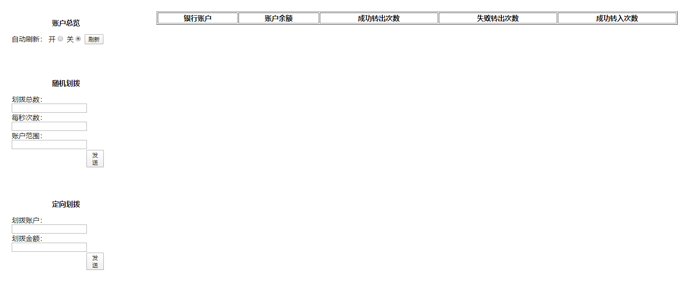
 4. 划拨功能测试，这里设置划拨总数:1000，每秒次数:100，账户范围:10，等待交易完成后刷新页面:
    
 5. 然后访问Grafana监控页面可以查看bank-account服务的处理信息
    
 6. 更换jdbc重启服务测试下单，查看内存数据。

### 测试结果
 1. 计算划拨总数1000为之前设定值，功能正常 (划拨总数 = 成功转出汇总 + 失败转出汇总 + 成功转入汇总) 
 2. 通过 Grafana 监控页面的处理信息可以证明 Akka 集群组建成功
 3. 根据更换数据源下单后的内存数据可以证明 Phoenix 支持多数据源。