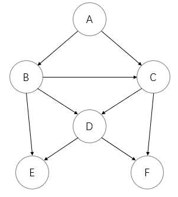
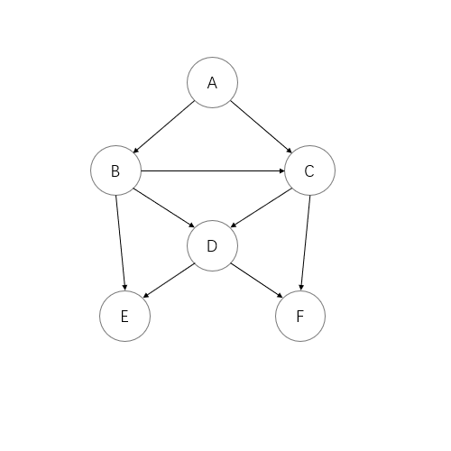
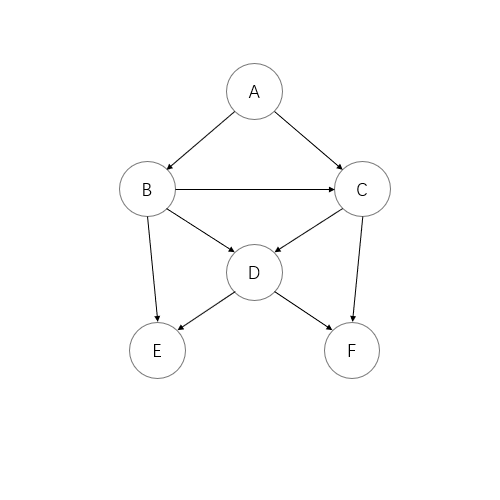
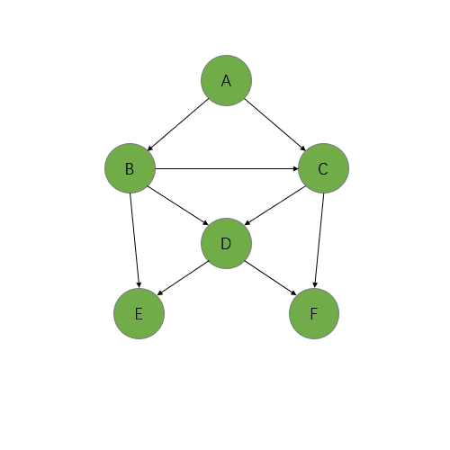

## 背景介绍

在系统开发过程中，经常会遇到一些复杂的业务逻辑，涉及到一系列繁杂的计算逻辑，尤其是在金融应用系统中。针对一个需求的数据，可能需要设计出一个时间复杂度，和空间复杂度都非常高的算法来进行计算。而且经常会面临频繁访问该数据的情况（即使入参不变）。这样会造成频繁的重复计算，对性能不友好。

## DGC概述

`DGC` 全称 Dependence Graph Compute, 用于构建java中对象属性值和对象方法之间的依赖关系，当对象属性值变化后，可自动根据依赖关系图更新对应方法的返回值，从而大大减少重复计算工作量, 提升程序的运行效率。

经过测试，使用 DGC 之后可以使运算效率提高几十倍。 具体的测试数据可参考：[性能测试](../06-phoenix-test/01-features-test.md)

DGC 具体是如何来提升运算效率的呢？ 下面我们通过一段具体的计算逻辑来看一下：

假设有一段计算逻辑，依赖关系图如下所示：



各个计算节点的依赖关系如下：



DGC 会根据相关计算逻辑，在内存中也维护一份如上所示的依赖关系。

1. 计算 A 的值 (这时需要进行全量计算)，计算过程如下



DGC 会在计算的过程中缓存每个计算节点的值（当第一次计算完成之后，会缓存A、B、C、D、E、F这些节点的计算结果）

2. 某一时刻需要重新计算 A 值, 这时不会再计算所有的运算逻辑, 直接返回缓存的数据。（这次计算和上次计算之间没有发生数据改变，所以不需要重新计算，缓存值即为正确的计算结果）

某一时刻当 F 发生改变时，根据依赖关系图 F, D, C, B, A 这些计算节点的缓存值需要置为失效（E 节点的缓存值不失效，因为根据依赖关系图，F 节点的变更不会影响到 E 节点）。 



3. 修改 F 后，重新计算 A，计算过程中如果遇到存在缓存值的计算节点，可以直接读取缓存值，不需要再次执行相关运算逻辑。如果计算节点不存在缓存值，则重新执行运算逻辑，计算完成之后缓存该计算节点的结果。

## 适用场景

`DGC` 适用于读多写少的复杂计算逻辑中（且写方法比较耗时），通过依赖关系图进行局部重新计算，大大减少重复计算工作量, 从而提升程序的运行效率。

> **注意：** 当计算逻辑不复杂（不耗时）时，不适合使用DGC。因为 DGC 内部需要维护对象属性与方法之间的依赖关系，这部分逻辑有一定的复杂度。

```java
// 根据入参 a 和  b, 通过一段具体的逻辑进行运算得出 c
public int demo_method(int a, int b) {
    int c = 运算逻辑;
    return c;
}
```

如果上述方法中的运算逻辑仅仅类似于 `a + b` 这种复杂度的话，不建议使用 DGC （如果强行使用DGC，有可能会导致性能下降）。

当上述方法中的运算逻辑达到一定复杂度时（每次计算在百毫秒 ~ 秒级），推荐使用DGC来进行优化。

