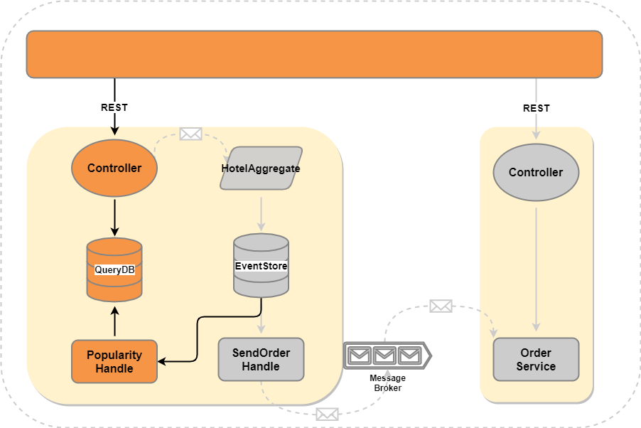

# 流行度分析
了解更多Phoenix应用场景，我们可以单独实现命令查询职责分离(CQRS)的Q端，通过Q端能够更迅速的查询数据。



基于酒店预订服务的示例，我们将增加实现酒店房型关注度排行，被预订最多次的商品被标记为最流行的商品，对流行商品进行排序、分析。

在此页面上，您将学习如何：
- [Spring Data JPA的使用](./popularity-projection#spring-data-jpa的使用)
- [EventPublish的Handle](./popularity-projection#eventpublish的handle)
- [数据监控](./popularity-projection#数据监控)

## Source downloads

我们将示例源码分成了四个分支，您能够前往仓库构建并运行当前功能：[流行度分析](https://github.com/PhoenixIQ/hotel-booking/tree/part-2)

## maven依赖
本案例实现酒店房间的流行度分析功能，基于预订服务工程中的依赖，还需要添加以下依赖：
```xml
<dependency>
    <groupId>com.iquantex</groupId>
    <artifactId>phoenix-event-publish-starter</artifactId>
    <version>2.4.0</version>
</dependency>
<dependency>
    <groupId>org.springframework.boot</groupId>
    <artifactId>spring-boot-starter-data-jpa</artifactId>
</dependency>
```

## 应用配置
本案例实现酒店房间的流行度分析功能，基于预订服务工程中的配置，还需要添加以下配置：
```yaml
spring:
  datasource:
    url: jdbc:h2:file:./data/test;DB_CLOSE_DELAY=-1;DATABASE_TO_UPPER=FALSE;INIT=CREATE SCHEMA IF NOT EXISTS PUBLIC
    username: sa
    password:
    driver-class-name: org.h2.Driver
  jpa:
    hibernate:
      ddl-auto: update
      naming:
        physical-strategy: org.springframework.boot.orm.jpa.hibernate.SpringPhysicalNamingStrategy
    database-platform: org.hibernate.dialect.MySQL5InnoDBDialect
    show-sql: false

quantex:
  phoenix:
    event-publish:
      event-task:
        enabled: true
        topic: hotel-event-pub
```

## Spring Data JPA的使用
Spring Data JPA是一款对象关系映射(ORM)框架，我们使用 JPA 创建数据库存储流行度排行信息。以上依赖和配置已经给出，下面就是JPA的使用：
- 定义 JPA 接口。
- 定义 model 类。

**接口：**
```java
public interface BookingsStoreRepository extends CrudRepository<BookingStore, String> {}
```

**model：**
```java
@Entity
@Data
@Builder
@Table(name = "BOOKING_STORE")
@AllArgsConstructor
@NoArgsConstructor
public class BookingStore implements Serializable {

	@Id
	private String roomType;

	private int bookingsCount;

}
```
这个接口会实现自动配置，我们要使用它存储或者查询时，只需要调用它的 API 即可。

## EventPublish的Handle
如果您不了解[事件发布](../../04-phoenix-event-publish/01-readme.md)和[event-publish配置](../../04-phoenix-event-publish/03-integration.md)，请先阅读文档。

开启 eventPublish 后，事件将发布到指定消息队列中，调用此队列的可以是其他服务、Elasticsearch等。

我们使用eventPublish提供的拦截功能，对预订房间的事件进行重新handle，并使用数据库进行持久化，实现酒店房间类型的流行度分析功能。
```java
@Component
public class PopPublishHandler implements EventHandler<Phoenix.Message, Phoenix.Message> {

	@Autowired
	private BookingsStoreRepository repository;

	/** 使用提供的默认反序列化器，反序列化MQ中的字节数组，得到以Message封装的领域事件 */
	private EventDeserializer<byte[], Message> deserializer = new DefaultMessageDeserializer();

	@Override
	public String getInfo() {
		return null;
	}

	@Override
	public CommittableEventBatchWrapper handleBatch(CommittableEventBatchWrapper batchWrapper) {
		List<EventStoreRecord<Phoenix.Message>> events = batchWrapper.getEvents();
		Iterator<EventStoreRecord<Phoenix.Message>> iterator = events.iterator();
		while (iterator.hasNext()) {
			Message message = deserializer.deserialize(iterator.next().getContent().toByteArray());
			if (message.getPayload() instanceof HotelCreateEvent) {
				String roomType = ((HotelCreateEvent) message.getPayload()).getRestType();
				try {
					BookingStore bookingStore = repository.findById(roomType).get();
					repository.save(BookingStore.builder().roomType(roomType)
							.bookingsCount(bookingStore.getBookingsCount() + 1).build());
				}
				catch (NoSuchElementException e) {
					// 获取不到数据时，get()抛出异常
					repository.save(BookingStore.builder().roomType(roomType).bookingsCount(1).build());
				}
			}
			else if (message.getPayload() instanceof HotelCancelEvent) {
				String roomType = ((HotelCancelEvent) message.getPayload()).getSubNumber().split("@")[0];
				BookingStore bookingStore = repository.findById(roomType).get();
				if (bookingStore.getBookingsCount() == 1) {
					repository.delete(bookingStore);
				}
				else {
					repository.save(BookingStore.builder().roomType(roomType)
							.bookingsCount(bookingStore.getBookingsCount() - 1).build());
				}
			}
		}
		return batchWrapper;
	}

	@Override
	public int getOrder() {
		return 0;
	}

}
```
本案例中我们只使用了事件的拦截功能，如果您想了解更多，请阅读[订阅事件](../../04-phoenix-event-publish/04-client-usage.md)

## 服务调用
这里的服务调用只实现一个查询的逻辑，我们能直接从数据存储端快速获取数据，实现事件写入和读取的分离。
```java
@Slf4j
@RestController
@RequestMapping("hotel")
public class ShoppingController {
    
    // other

	@Autowired
    private BookingsStoreRepository repository;
	
	// other

	@GetMapping("/queryPop")
    public String queryRestRoom() {
        try {
            Map<String, Integer> map = new HashMap<>();
            repository.findAll()
                    .forEach(bookingStore -> map.put(bookingStore.getRoomType(), bookingStore.getBookingsCount()));
            return new ObjectMapper().writeValueAsString(ConvertUtil.Map2Map(ConvertUtil.sortMap(map)));
        }
        catch (JsonProcessingException e) {
            return "query fail: " + e.getMessage();
        }
    }
}
```

## 数据监控
通过Phoenix的事件发布功能，框架本身还实现了对消息的[监控](../../05-phoenix-console/03-business-monitor.md)。

## 快速启动
1. 运行HotelBookingsApplication

2. 查询流行度排行榜
```text
GET http://127.0.0.1:8080/hotel/queryPop
```
返回：
```text
{"情侣套房":3,"大床房":2,"总统套房":1,"标准间":1}
```

