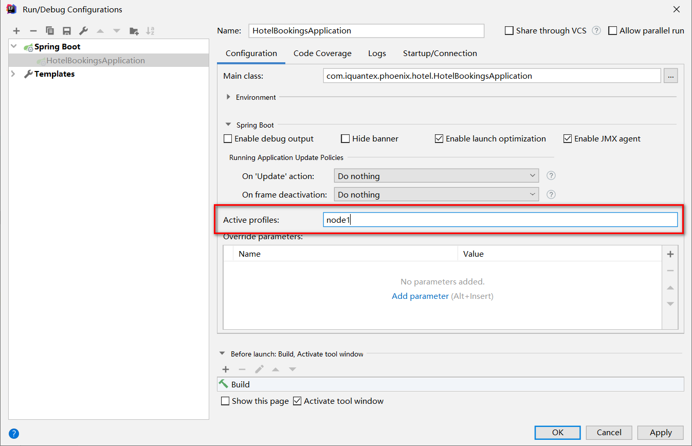
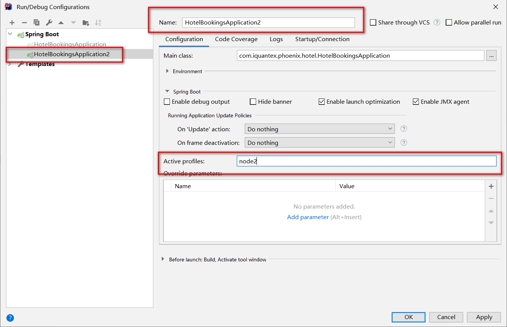

# 简易集群搭建
本章介绍本地搭建简易的 Phoenix 服务集群，如果您想了解更多请参见：[集群配置](../../02-phoenix-core/08-cluster.md)。
## 准备
当您想在本地搭建 Phoenix 集群，那当然是可以的，但您需要准备好 Phoenix 支持的数据库(h2、mysql等)。

如果您本地没有数据库支持，可以使用 Docker 为您搭建一个可用的数据库，下面为您展示一个 [Docker 的配置文件](https://github.com/PhoenixIQ/hotel-booking/tree/main/docker-mysql-config)，您可以试着使用它：

**docker-compose**
```yaml
version: '3.0'
services:
  mysql:
    image: mysql:5.7
    volumes:
      - mysql_data:/var/lib/mysql
    restart: always
    environment:
      - MYSQL_ROOT_PASSWORD=PHOENIX_EXMAPLE
      - MYSQL_DATABASE=bookings
      - MYSQL_USER=phoenix
      - MYSQL_PASSWORD=phoenix
    command: [
      '--explicit_defaults_for_timestamp',
      '--character-set-server=utf8',
      '--collation-server=utf8_general_ci'
    ]
    ports:
      - 3306:3306
  zookeeper:
    image: wurstmeister/zookeeper
    volumes:
      - zookeeper_data:/data
    ports:
      - 2182:2182
  kafka:
    image: wurstmeister/kafka
    ports:
      - 9092:9092
    environment:
      KAFKA_BROKER_ID: 0
      KAFKA_ADVERTISED_LISTENERS: PLAINTEXT://127.0.0.1:9092
      KAFKA_CREATE_TOPICS: "hotel-bookings"
      KAFKA_ZOOKEEPER_CONNECT: zookeeper:2181
      KAFKA_LISTENERS: PLAINTEXT://0.0.0.0:9092
    volumes:
      - kafka_data:/kafka
    depends_on:
      - zookeeper
```
> 使用 MySQL 您还需要添加相关依赖。
```xml
<dependency>
     <groupId>mysql</groupId>
     <artifactId>mysql-connector-java</artifactId>
 </dependency>
```

## 配置
本地配置 Phoenix 集群时，您需要多个不同配置文件，除案例原本的配置外，您还需要改动如下配置：
- JVM配置
- 事件存储配置

为了方便您的使用，我们提供了所有配置，参见：[本地集群配置及docker配置](https://github.com/PhoenixIQ/hotel-booking/tree/main/hotel-server/application/src/main/resources)

**node-1**
```yaml
server: 
  port: 
    8080

spring: 
  profiles:
      active: node1
  datasource:
    url: jdbc:mysql://localhost:3306/bookings?serverTimezone=UTC&useUnicode=true&characterEncoding=UTF8&allowPublicKeyRetrieval=true&useSSL=false
    username: root
    password: PHOENIX_EXMAPLE
    driver-class-name: com.mysql.jdbc.Driver

quantex:
  phoenix:
    akka: 
      seed-node: akka://bookings@127.0.0.1:2551,akka://bookings@127.0.0.1:2552
      arteryCanonicalHostname: 127.0.0.1
      artery-canonical-port: 2551
      management-http-port: 8558
    server:
      event-store:
        driver-class-name: com.mysql.jdbc.Driver
        data-sources:
          - url: jdbc:mysql://localhost:3306/bookings?serverTimezone=UTC&useUnicode=true&characterEncoding=UTF8&allowPublicKeyRetrieval=true&useSSL=false
            username: root
            password: PHOENIX_EXMAPLE
```

**node-2**
```yaml
server: 
  port: 
    8081

spring: 
  profiles:
    active: node2
  datasource:
    url: jdbc:mysql://localhost:3306/bookings2?serverTimezone=UTC&useUnicode=true&characterEncoding=UTF8&allowPublicKeyRetrieval=true&useSSL=false
    username: root
    password: PHOENIX_EXMAPLE
    driver-class-name: com.mysql.jdbc.Driver

quantex:
  phoenix:
    akka: 
      seed-node: akka://bookings@127.0.0.1:2551,akka://bookings@127.0.0.1:2552
      arteryCanonicalHostname: 127.0.0.1
      artery-canonical-port: 2552
      management-http-port: 8558
    server:
      event-store:
        driver-class-name: com.mysql.jdbc.Driver
        data-sources:
          - url: jdbc:mysql://localhost:3306/bookings2?serverTimezone=UTC&useUnicode=true&characterEncoding=UTF8&allowPublicKeyRetrieval=true&useSSL=false
            username: root
            password: PHOENIX_EXMAPLE
```

## 启动
先检查您的服务是否已经做好了所有准备：
- 正在运行的 Kafka 或待启动的 Kafka程序。
- 正在运行的存储工具(h2或MySQL) 或待启动的程序。

> 注：多个节点IP不能相同。

如果您都准备好了，那么就开始使用您的本地集群吧！
1. 根据配置文件，配置Springboot启动参数，指定启动类使用`spring.profiles.active=node1`的配置文件。



2. 同上，再使用启动类启动`spring.profiles.active=node2`的配置文件。



3. 观察控制台：打印`Node [akka://hotel-bookings@10.10.16.11:2552] is JOINING` 说明组集群成功；或者进入`phoenix-console`页面查看服务状态。

> 注：如果您使用内存 Kafka，请在服务启动第二个节点的时候，避免再次使用 Kafka启动程序的配置。

