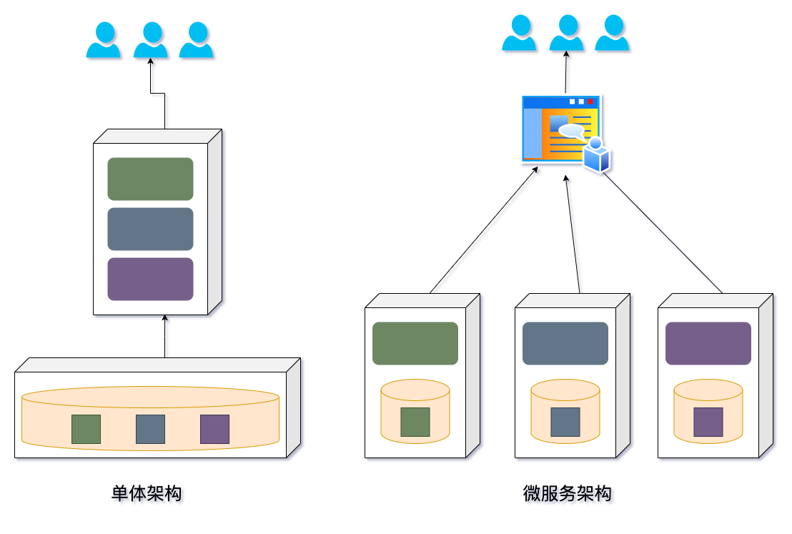
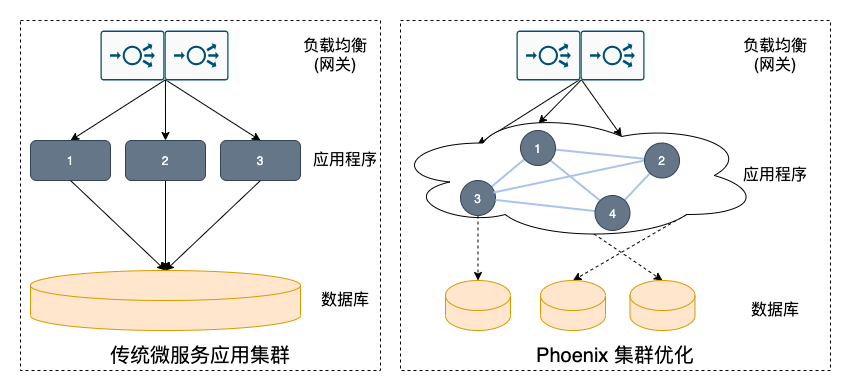

> 事件驱动型微服务就是在微服务架构中使用事件驱动思想。事件驱动系统的核心结构是事件的捕获、通信、处理和持久化，事件驱动架构的系统可以实现最小耦合，在现代分布式程序架构中尤为有用。
>
> 本文从如何在微服务架构中解耦微服务出发，介绍事件驱动型微服务。

## 微服务架构的特征和挑战

在 2014 年 Martin Flower 和 James Lewis 合写的文章《[MicroServices](https://martinfowler.com/articles/microservices.html)》定义了微服务架构风格。
在该文章中概括了"微服务架构"术语的含义：**微服务架构风格是一种通过多个小型微服务组合来构建一个应用的架构风格，这些服务围绕业务能力而非特定的技术构建。每个服务可以采用不同的语言、数据存储技术在独立的进程中运行、自动化部署和运维。
服务间通过轻量级的机制通信。** 并且列举了微服务架构应该具备的九大特征：

- 以微服务而不是类库的方式实现程序组件化
- 围绕业务范围搭建团队
- 产品化思维
- 强终端弱管道
- 分散治理
- 数据去中心化
- 基础设施自动化
- 容错性设计
- 演进式设计

微服务架构将应用系统以业务能力拆分为多个高度自治的微服务，降低耦合的同时也带来了一些分布式数据管理的挑战：

1. 如何识别每个微服务的边界？
2. 如何从多个微服务中检索数据？
3. 如何在多个微服务之间保持数据的一致性？
4. 如何设计跨微服务边界的通信？

单体应用架构的编程思维不适用于微服务架构上，若将原有的编程思维生搬硬套应用在微服务架构中会带来一些问题。如：在单体应用上不同组件之间通过引用进行方法调用。在微服务世界中，服务间通信必须设计一种通信机制，
传统编程思维设计的通信机制一般是 RPC 或者基于 HTTP 的 REST，它们的优点是简单、没有学习成本；缺点都是同步阻塞的请求，并且跨网络进行通信，因此当部分组件发生故障时会引发服务"雪崩"，所有依赖于此组件的服务全部不可用。

因此基于同步调用的服务间的微服务存在以下问题：

1. 代码层面存在耦合
2. 同步调用的通信机制在分布式系统中不可靠

那么为了解决该问题，可以在微服务架构中使用异步、松耦合的事件驱动架构。

## 什么是事件驱动型微服务

在[维基百科](https://en.wikipedia.org/wiki/Event-driven_architecture)中是这样定义了事件驱动架构：**事件驱动系统由事件生产者，事件消费者和事件通道组成，在松散耦合的组件或服务之间传输事件.**

将事件驱动架构应用到微服务架构中时，服务间通信不再通过同步阻塞地网络调用，而是通过向事件通道发送事件和接受事件来完成。这意味着，发送事件的微服务无需知道接受事件的微服务是否存在，
也无需知道下游微服务如何进一步处理事件。因此，围绕事件驱动架构构建微服务系统能够带来一些好处：

1. 松耦合：事件生成方和使用方在逻辑上是分离，松耦合，意味着服务可以独立伸缩，更新和部署。
2. 高性能：异步通信能够获得更快的响应，服务可以立即处理下一个请求，没有时间浪费在阻塞上，整体吞吐率提高。
3. 可用性：松耦合的服务对故障更具弹性，当个别服务不可用时，其他服务不受影响，整体系统仍能对外提供服务，提高了系统的容错能力。
4. 简化审计和事件溯源：基于事件的程序架构实现事件溯源模式十分简单。

事件驱动的异步通信并非新概念，但十分契合微服务架构，因为异步通信能够极大地降低服务之间的耦合。 异步化通信系统实现时会有一些挑战：

1. 系统的设计思维会有所不同: 从面向状态的设计 -> 面向行为(事件)的设计。
2. 如果每个事件都需要被处理，那么如何保证事件的可靠交付？
3. 如何保证处理和发布事件的原子性？

EventSouring的设计模式很适合事件驱动，EventSouring推崇事件是一级公民。Phoenix提供了[EventSouring](./how-event-driven-microservice#phoenix中的eventsourcing)的编程模式，并提供了可靠投递以及原子性处理和发布等功能。

## EventSouring介绍

什么是 EventSouring？在 2005 年 Martin Flower 在企业应用架构模式的进一步发展系列文章中总结了 [EventSouring](https://martinfowler.com/eaaDev/EventSourcing.html) 模式，文中描述了其概念：**将应用程序状态的所有变更捕获为一系列事件**

EventSouring 的设计思想来源自基于关系型数据库存储数据所引发的一些问题。以两个案例举例：

**内存镜像**：微服务架构中，服务高度自治，但来自客户端的请求通常都需要跨多个服务协同。基于数据库存储数据的应用程序不够高效，在微服务内对应用状态的修改需要 I/O 或远程调用；
EventSouring 将状态保存在应用程序内存中，实现了[内存镜像](https://martinfowler.com/bliki/MemoryImage.html)，因此服务内的计算得到加速，使得应用整体性能得到提升。

**溯源能力**：基于数据库存储的银行账户余额只是数据行中的一列数值，不具备历史记录功能，如需查看数据的历史状态必须通过数据库的审计日志或其他审计手段；EventSouring 以一系列不可变事实的事件来描述数据，以账户余额为例，其当前数值为一系列收入、支出事件的结果，
因此基于 EventSouring 持久化程序的状态时具备历史记录的能力，支持溯源和审计。

上述案例以不同角度展示了 EventSouring 的两大优势，除此之外 EventSouring 还具有一些其他优点：

- 性能：因为事件是不可变的，因此在持久化事件时，可使用 append-only 操作，相比于关系型存储模型的 update，事件的存储更简单。
- 简化：将复杂域对象存储到关系型存储中会带来[阻抗失配](https://en.wikipedia.org/wiki/Object%E2%80%93relational_impedance_mismatch)，而存储事件只需要简单保存。
- 审计：EventSouring 保存了系统状态的完整历史记录。
- 故障排除：基于生产环境中事件存储中的副本，可以在测试环境溯源事件以模拟故障的发生。
- 扩展性：EventSouring 中，事件是第一公民，因此十分契合发布/订阅系统，外部系统想要集成，只需要订阅事件即可。

除此之外，基于 EventSouring 开发的应用程序，对数据库的依赖降低，因此可选择合适的事件持久化存储以提升弹性伸缩能力。例如 Phoenix 框架对内部的 EventStore 进行了优化，并借助于 Phoenix 集群的能力，提高了应用系统弹性伸缩的能力。

当然，在程序世界中没有一劳永逸的解决方案(没有银弹)。数据库也并非一无是处，大多数数据库对查询进行了大量优化，而 EventSouring 对数据的表达方式使得类似于"所有金额大于200元的订单"的查询实现困难，数据密集型应用极度依赖查询能力。因此，基于 EventSouring 开发的应用程序面临着如下挑战：

- 性能：当事件增长后，从事件存储中查询，并通过溯源事件加载对象状态的效率会越来越低。
- 版本控制：当业务发展或者需求变更后，事件的类型或者聚合的定义发生了改变，需要考虑应用程序应该如何处理多个版本的事件类型和聚合。
- 复杂查询难以优化

对于查询问题，通用的解决方案是将 EventSouring 与 CQRS 结合使用，互相增加利益。

## CQRS介绍

CQRS 是一种架构模式，CQRS 将系统的操作分为两类：`命令`和`查询`，其核心思想是将两类不同的操作进行分离，在两个独立的服务中实现。这种分离的好处是通过直接
应用单一职责原则来阐明和简化代码，并且能够独立扩展每个服务。不同于 CQS，CQRS 应用的不是代码级别，而是应用程序级别的分离。

对于 EventSouring 来说，CQRS 的出现就像是在夜空中目睹了一颗百年一遇的美丽流星。将 CQRS 与 EventSouring 结合使用弥补了 EventSouring 查询的缺陷，仿佛是为 EventSouring 而生。在两者共生的架构中 EventSouring 用作纯粹的写入模型，并将数据状态投影到读模型，此时开发者可以选择最合适的技术来优化读取模型来实现复杂查询。

不仅如此，CQRS 也能够解决微服务架构中跨服务查询难题：在微服务架构中单独为查询建立读模型并优化以解决跨服务查询的难题(如下图所示)：

## 总结

本文从微服务架构的解耦出发，一步步引入事件驱动架构、EventSouring 和 CQRS，到文末已经足够建立一个成熟的松耦合、可伸缩、高可用、高性能的微服务架构，但此时也引入了复杂性，并且在实际的生产环境中还需要考虑到一些边界条件，以及上述并未解决的一些问题，如：事件的版本控制。

基于此，宽拓自主研发了基于 EventSouring 和 CQRS 实现的事件驱动型微服务框架 [**Phoenix**](https://phoenix.iquantex.com/)帮助开发者落地高性能的事件驱动型微服务架构，Phoenix 的可用性在金融场景的生产环境中得到了验证，后续的文章将从 Phoenix 实现微服务出发，介绍 Phoenix 的能力以及面对问题时 Phoenix 的解决方案。

## 引用

博客和文章：
- [微服务](https://martinfowler.com/articles/microservices.html). Martin Fowler
- [事件驱动的含义](https://martinfowler.com/articles/201701-event-driven.html). Martin Fowler
- [事件溯源](https://martinfowler.com/eaaDev/EventSourcing.html). Martin Fowler
- [CQRS](https://martinfowler.com/bliki/CQRS.html). Martin Fowler
- [基于消息的异步通信](https://docs.microsoft.com/et-ee/dotnet/architecture/microservices/architect-microservice-container-applications/asynchronous-message-based-communication). Microsoft

会议演讲：
- [事件驱动架构的多种含义](https://www.youtube.com/watch？v=STKCRSUsyP0). Martin Fowler
- [创建事件驱动架构的微服务](https://www.youtube.com/watch？v=ksRCq0BJef8). Andrew Schofield
- [不只是事件：开发异步化微服务](https://www.youtube.com/watch？v=kyNL7yCvQQc). Chris Richardson