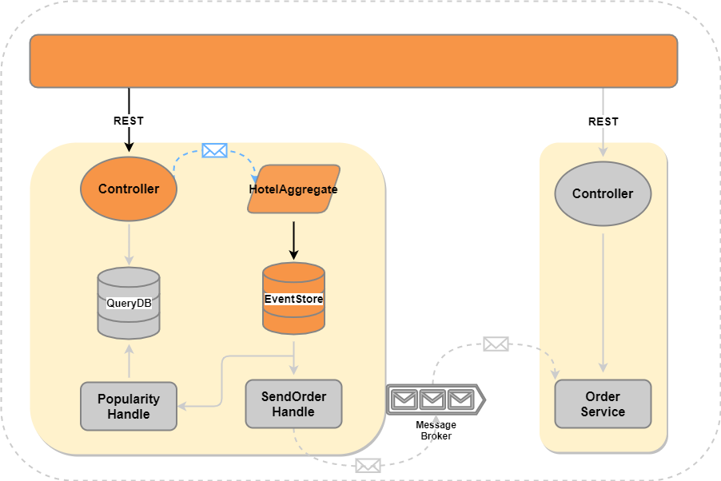

# 酒店预订微服务
下面我们将根据架构图构建一个初步的酒店房间的预订服务，您可以通过该案例对Phoenix有更深的了解。



首先，我们将创建HotelController，一个准备调用预订服务的接口。该实现只会暂时记录调用。稍后，我们将通过更多操作和实际实现来扩展服务。

在此页面上，您将学习如何：
- [定义消息](./03-bookings-microservice.md#消息定义)
- [定义聚合根](./03-bookings-microservice.md#聚合根定义)
- [实现服务调用接口](./03-bookings-microservice.md#服务调用接口定义)
- [在本地初始化并运行 HTTP 服务器和服务](./03-bookings-microservice.md#服务启动)

## Source downloads

我们将示例源码分成了四个分支，您能够前往仓库构建并运行当前功能：[预订服务](https://github.com/PhoenixIQ/hotel-booking/tree/part-1)

## maven依赖
本案例实现酒店预订功能，基于模板工程中的依赖，还需要添加以下依赖：
```xml
<dependencies>
    <!--phoenix-->
    <dependency>
        <groupId>com.iquantex</groupId>
        <artifactId>phoenix-client-starter</artifactId>
        <version>2.5.3</version>
    </dependency>
    <dependency>
        <groupId>com.iquantex</groupId>
        <artifactId>phoenix-server-starter</artifactId>
        <version>2.5.3</version>
    </dependency>
    <!-- kafka -->
    <dependency>
        <groupId>org.springframework.kafka</groupId>
        <artifactId>spring-kafka</artifactId>
    </dependency>
    <dependency>
        <groupId>org.apache.kafka</groupId>
        <artifactId>kafka_2.12</artifactId>
        <version>1.0.0</version>
        <exclusions>
            <exclusion>
                <artifactId>slf4j-log4j12</artifactId>
                <groupId>org.slf4j</groupId>
            </exclusion>
        </exclusions>
    </dependency>
    <dependency>
        <groupId>org.apache.kafka</groupId>
        <artifactId>kafka_2.12</artifactId>
        <version>1.0.0</version>
        <classifier>test</classifier>
        <scope>compile</scope>
        <exclusions>
            <exclusion>
                <artifactId>slf4j-log4j12</artifactId>
                <groupId>org.slf4j</groupId>
            </exclusion>
        </exclusions>
    </dependency>
    <!--内存版kafka: 运行时需要-->
    <dependency>
        <groupId>org.springframework.kafka</groupId>
        <artifactId>spring-kafka-test</artifactId>
        <exclusions>
            <exclusion>
                <artifactId>kafka_2.11</artifactId>
                <groupId>org.apache.kafka</groupId>
            </exclusion>
        </exclusions>
    </dependency>
    <!--tools-->
    <dependency>
        <groupId>org.projectlombok</groupId>
        <artifactId>lombok</artifactId>
        <version>${lombook.version}</version>
    </dependency>
    <dependency>
        <groupId>com.google.protobuf</groupId>
        <artifactId>protobuf-java</artifactId>
        <version>${proto.version}</version>
    </dependency>
</dependencies>
```

## 消息定义
关于Command和Event解释可以[参考文档](../../02-phoenix-core/03-event-souring.md)。

聚合根接收Command产生Event。Command和Event需要实现Serializable接口。

Phoenix 支持 protostuff、javaBean、protobuf 等序列化协议，可以通过以下配置进行指定。

```yaml
quantex.phoenix.server.default-serializer: proto_stuff
```
本文使用 proto_stuff 序列化协议进行示范。

**Command定义​**
```java
@Getter
@AllArgsConstructor
public class HotelCreateCmd implements Serializable {

	private static final long serialVersionUID = 719772692097810576L;
    // 酒店ID
	private String hotelCode;
    // 房间类型
	private String restType;
    // 预约号
	private String subNumber;

}

@Getter
@AllArgsConstructor
public class HotelQueryCmd implements Serializable {

	private static final long serialVersionUID = 5077299466591822621L;

	private String hotelCode;

}

@Getter
@AllArgsConstructor
public class HotelCancelCmd implements Serializable {

	private static final long serialVersionUID = -2900383695028981211L;

	private String hotelCode;

	private String subNumber;

}
```
**Event定义​**
```java
@Getter
@AllArgsConstructor
public class HotelCreateEvent implements Serializable {

	private static final long serialVersionUID = -2347396853431433998L;

	private String hotelCode;

	private String restType;

	private String subNumber;

}

@Getter
@AllArgsConstructor
public class HotelQueryEvent implements Serializable {

	private static final long serialVersionUID = -4428963449385271034L;

	private String hotelCode;

	private Map<String, Integer> restRoom;

}

@Getter
@AllArgsConstructor
public class HotelCancelEvent implements Serializable {

	private static final long serialVersionUID = -1282834235746256697L;

	private String hotelCode;

	private String subNumber;

}
```

## 聚合根定义
聚合根是我们事件处理和事件存储的重要枢纽，详情参见：[实体聚合根](../../02-phoenix-core/02-entity-aggregate.md)

聚合根类定义规则：

- 聚合根类需要使用 @EntityAggregateAnnotation 注解进行标记,aggregateRootType 值需要全局唯一
- 聚合根类需要实现Serializable接口, 并提供 serialVersionUID
- act 方法接收Command，act 方法只能包含一个入参且方法返回值为ActReturn。
- act方法需要增加 @CommandHandler 或 @QueryHandler 注解,其中 aggregateRootId 为聚合根id
- on 方法接收Event，on 方法只能包含一个入参且方法返回值为void

**账户聚合根**
```java
@EntityAggregateAnnotation(aggregateRootType = "HotelAggregate")
public class HotelAggregate implements Serializable {

	private static final long serialVersionUID = -4051924255577694209L;

	/**
	 * 已被预订的房间的预定号
	 */
	private List<String> bookedRoom = new ArrayList<>();

	/**
	 * 剩余房间<type,number> 房间类型: 1. 大床房 2. 标准间 3. 情侣套房 4. 总统套房
	 */
	@Getter
	private Map<String, Integer> restRoom = new HashMap<>();

	/**
	 * 假定各类房间剩余10间
	 */
	public HotelAggregate() {
		restRoom.put("1", 10);
		restRoom.put("2", 10);
		restRoom.put("3", 10);
		restRoom.put("4", 10);
	}

	/**
	 * 查询剩余房间信息
	 * @param cmd
	 * @return
	 */
	@QueryHandler(aggregateRootId = "hotelCode")
	public ActReturn act(HotelQueryCmd cmd) {
		return ActReturn.builder().retCode(RetCode.SUCCESS).event(new HotelQueryEvent(cmd.getHotelCode(), restRoom))
				.build();
	}

	/**
	 * 预约流程
	 * @param cmd
	 * @return
	 */
	@CommandHandler(aggregateRootId = "hotelCode")
	public ActReturn act(HotelCreateCmd cmd) {
		if (restRoom.get(cmd.getRestType()) > 0) {
			return ActReturn.builder().retCode(RetCode.SUCCESS)
					.event(new HotelCreateEvent(cmd.getHotelCode(), cmd.getRestType(), cmd.getSubNumber())).build();
		}
		return ActReturn.builder().retCode(RetCode.FAIL).event(new HotelCreateFailEvent("There is no room left"))
				.build();
	}

	public void on(HotelCreateEvent event) {
		this.bookedRoom.add(event.getSubNumber());
		this.restRoom.put(event.getRestType(), restRoom.get(event.getRestType()) - 1);
	}

	public void on(HotelCreateFailEvent event) {
	}

	/**
	 * 取消预约
	 * @param cmd
	 * @return
	 */
	@CommandHandler(aggregateRootId = "hotelCode")
	public ActReturn act(HotelCancelCmd cmd) {
		if (!bookedRoom.contains(cmd.getSubNumber())) {
			return ActReturn.builder().retCode(RetCode.FAIL)
					.event(new HotelCancelFailEvent("Please check your order number")).build();
		}
		return ActReturn.builder().retCode(RetCode.SUCCESS)
				.event(new HotelCancelEvent(cmd.getHotelCode(), cmd.getSubNumber())).build();
	}

	public void on(HotelCancelEvent event) {
		bookedRoom.removeIf(v -> v.contains(event.getSubNumber()));
		String s = event.getSubNumber().split("@")[0];
		if (restRoom.containsKey(s)) {
			restRoom.put(s, restRoom.get(s) + 1);
		}
	}
}
```

## 服务调用接口定义
增加phoenix-client-starter依赖启动服务后Phoenix会自动注入PhoenixClient Bean，可以通过调用 PhoenixClient 的 send() 发送Command信息。

```java
@RestController
@RequestMapping("hotel")
public class HotelController {

	@Autowired
	private PhoenixClient client;

	@PutMapping("/bookings/{hotelCode}/{roomType}")
	public String bookings(@PathVariable String hotelCode, @PathVariable String roomType) {
		// 生成预约号: roomType@UUID
		String subNumber = roomType + "@" + UUID.randomUUID().toString();
		HotelCreateCmd cmd = new HotelCreateCmd(hotelCode, roomType, subNumber);
		Future<RpcResult> future = client.send(cmd, "hotel-bookings", UUID.randomUUID().toString());
		try {
			Object data = future.get(10, TimeUnit.SECONDS).getData();
			if (data instanceof HotelCreateEvent) {
				return ((HotelCreateEvent) data).getSubNumber();
			}
			return ((HotelCreateFailEvent) data).getMsg();
		}
		catch (InterruptedException | ExecutionException | TimeoutException e) {
			return "rpc error: " + e.getMessage();
		}
	}

	@GetMapping("/query/{hotelCode}")
	public String queryRestRoom(@PathVariable String hotelCode) {
		HotelQueryCmd hotelQueryCmd = new HotelQueryCmd(hotelCode);
		Future<RpcResult> future = client.send(hotelQueryCmd, "hotel-bookings", UUID.randomUUID().toString());
		try {
			HotelQueryEvent event = (HotelQueryEvent) future.get(10, TimeUnit.SECONDS).getData();
			return new ObjectMapper().writeValueAsString(ConvertUtil.Map2Map(event.getRestRoom()));
		}
		catch (InterruptedException | ExecutionException | TimeoutException | JsonProcessingException e) {
			return "rpc error: " + e.getMessage();
		}
	}

	@PutMapping("/cancel/{hotelCode}/{subNumber}")
	public String cancel(@PathVariable String hotelCode, @PathVariable String subNumber) {
		HotelCancelCmd hotelCancelCmd = new HotelCancelCmd(hotelCode, subNumber);
		Future<RpcResult> future = client.send(hotelCancelCmd, "hotel-bookings", UUID.randomUUID().toString());
		try {
			Object data = future.get(10, TimeUnit.SECONDS).getData();
			if (data instanceof HotelCancelEvent) {
				return "cancel ok";
			}
			return ((HotelCancelFailEvent) data).getMsg();
		}
		catch (InterruptedException | ExecutionException | TimeoutException e) {
			return "rpc error: " + e.getMessage();
		}
	}
}
```
## 服务启动
使用 SpringBoot 的服务启动机制，在本地初始化并运行 HTTP 服务器和服务。
```java
@Slf4j
@SpringBootApplication
public class HotelBookingsApplication {
    public static void main(String[] args) {
        try {
            SpringApplication.run(HotelBookingsApplication.class, args);
        }
        catch (Exception e) {
            log.error(e.getMessage(), e);
            System.exit(1);
        }
    }
}
```

## 单元测试
使用 Phoenix 提供的 AggregateFixture 接口模拟聚合根实体，调用聚合根的处理命令处理能力，分别校验 HotelAggregate 的预约、查询和取消功能。
```java
public class HotelAggregateTest {

	private EntityAggregateFixture getFixture() {
		EntityAggregateFixture fixture = new EntityAggregateFixture(HotelAggregate.class.getPackage().getName());
		return fixture;
	}

	/**
	 * 测试预约流程
	 */
	@Test
	public void test_bookings() {
		EntityAggregateFixture fixture = getFixture();
		HotelCreateCmd hotelCreateCmd = new HotelCreateCmd("iHome", RoomType.DOUBLE,
				"1@" + UUID.randomUUID().toString());
		fixture.when(hotelCreateCmd).printIdentify().expectMessage(HotelCreateEvent.class);
		HotelAggregate hotelAggregate = fixture.getAggregateRoot(HotelAggregate.class, "iHome");
		Assert.assertNotNull(hotelAggregate.getRestRoom());
	}

	/**
	 * 测试查询剩余房间
	 */
	@Test
	public void test_queryRestRoom() {
		EntityAggregateFixture fixture = getFixture();
		HotelAggregate hotelAggregate = fixture.getAggregateRoot(HotelAggregate.class, "iHome");
		HotelQueryCmd hotelQueryCmd = new HotelQueryCmd("iHome");
		ActReturn act = hotelAggregate.act(hotelQueryCmd);
		Assert.assertEquals(act.getEvent().getClass(), HotelQueryEvent.class);
	}

	/**
	 * 测试取消预订，预约号不存在
	 */
	@Test
	public void test_cancel() {
		EntityAggregateFixture fixture = getFixture();
		HotelAggregate hotelAggregate = fixture.getAggregateRoot(HotelAggregate.class, "iHome");
		HotelCancelCmd hotelCancelCmd = new HotelCancelCmd("iHome", "1@" + UUID.randomUUID().toString());
		ActReturn act = hotelAggregate.act(hotelCancelCmd);
		Assert.assertEquals(act.getEvent().getClass(), HotelCancelFailEvent.class);
	}
}
```

## 快速启动
1. 运行HotelBookingsApplication

2. 调用预订酒店房间接口
```text
PUT http://127.0.0.1:8080/hotel/bookings/{hotelCode}/{roomType}
```
返回预订号：
```text
2@c0a2a5b4-0d0e-4347-bb33-62ee5dd5f603
```

3. 查询酒店剩余房间情况
```text
GET http://127.0.0.1:8080/hotel/query/{hotelCode}
```
返回：
```text
{"标准间":10,"情侣套房":10,"总统套房":10,"大床房":10}
```

4. 调用取消预订房间接口
```text
PUT http://127.0.0.1:8080/hotel/cancel/{hotelCode}/{subNumber}
```
返回：
```text
cancel ok
```
