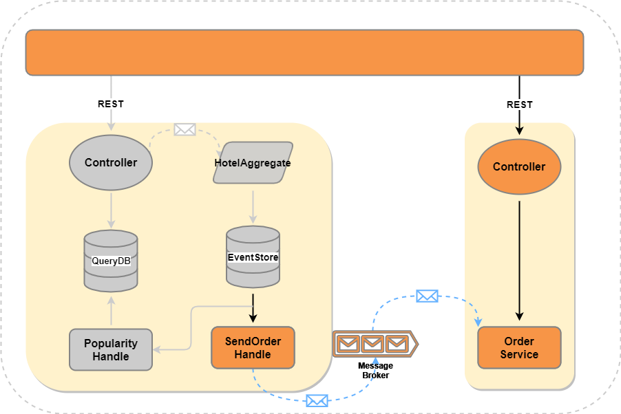

# Order Service
订单服务展示了EventPublish的事件发布与订阅，同时体现出 Phoenix 实现微服务的机制。



订单服务是一个独立的微服务，为了演示启动方便，我们独立的一个order-service的maven模块，但还使用hotel-book来加载启动，这样用户可以本地启动一个进程来感受所有功能。

> 得益于Phoenix Aggregate互相独立的好处，用户可以在一个集群当中运行多个聚合根并灵活拆解和组装。

```text
hotel-booking
├─ .gitignore
├─ LICENSE
├─ README.md
├─ hotel-server
│    ├─ application 
│    ├─ core-api 
│    └─ pom.xml
├─ order-service
│    ├─ pom.xml
└─ pom.xml
```

## Source downloads

我们将示例源码分成了四个分支，您能够前往仓库构建并运行当前功能：[订单服务](https://github.com/PhoenixIQ/hotel-booking/tree/part-3)

## maven依赖
本案例实现酒店房间预订后的订单服务，基于预订服务工程中的依赖，还需要添加以下依赖：
```xml
<dependency>
    <groupId>com.iquantex</groupId>
    <artifactId>phoenix-event-publish-starter</artifactId>
    <version>2.5.3</version>
</dependency>
```

## 应用配置
本案例实现酒店房间预订后的订单服务，基于预订服务工程中的配置，还需要添加以下配置：
```yaml
quantex:
  phoenix:
    event-publish:
      event-task:
        enabled: true
        topic: hotel-event-pub
```

## 查询接口
下面通过订单案例来展示 Phoenix 的微服务特性和EventPublish的其他用法。

订单服务是一个模拟的其他服务，通过酒店预订服务生成的事件来生成该服务的订单，提供订单的精确查询、全部订单查询的功能。

订单服务也使用了 JPA 存储订单数据，使用可参见：[Spring Data JPA的使用](./popularity-projection#spring-data-jpa的使用)

```java
@RestController
@RequestMapping("order")
public class OrderController {

	@Autowired
	private PhoenixClient client;

	@GetMapping("/queryAll/{hotelCode}")
	public String queryAll(@PathVariable String hotelCode) {
		OrderQueryAllCmd orderQueryAllCmd = new OrderQueryAllCmd(hotelCode);
		Future<RpcResult> future = client.send(orderQueryAllCmd, "hotel-bookings", UUID.randomUUID().toString());
		try {
			OrderQueryAllEvent event = (OrderQueryAllEvent) future.get(10, TimeUnit.SECONDS).getData();
			return new ObjectMapper().writeValueAsString(event.getList());
		}
		catch (InterruptedException | ExecutionException | TimeoutException | JsonProcessingException e) {
			return "rpc error: " + e.getMessage();
		}
	}

	@GetMapping("/query/{hotelCode}/{orderNumber}")
	public String queryRestRoom(@PathVariable String hotelCode, @PathVariable String orderNumber) {
		OrderQueryByCmd orderQueryByCmd = new OrderQueryByCmd(hotelCode, orderNumber);
		Future<RpcResult> future = client.send(orderQueryByCmd, "hotel-bookings", UUID.randomUUID().toString());
		try {
			Object obj = future.get(10, TimeUnit.SECONDS).getData();
			if (obj instanceof OrderQueryByEvent) {
				return new ObjectMapper().writeValueAsString(((OrderQueryByEvent) obj).getOrder());
			}
			return new ObjectMapper().writeValueAsString(((OrderQueryFailEvent) obj).getMsg());
		}
		catch (InterruptedException | ExecutionException | TimeoutException | JsonProcessingException e) {
			return "rpc error: " + e.getMessage();
		}
	}

}
```
## Kafka Subscribe
当EventPublish将事件发布到kafka后，这些消息可以被其他系统消费，也可以存储到elasticsearch中。
当某个服务需要订阅这些事件时，需要实现相应的MQ消费模块，通过消费Topic消息的形式取得事件，并进行后续处理。
具体参见：[订阅与广播](../../02-phoenix-core/06-subscribe-pub.md)

```java
@Configuration
@ConditionalOnProperty(value = "quantex.phoenix.event-publish.event-task.enabled", havingValue = "true")
public class EventPublishTopicSubscribeConfig {

	@Value("${spring.application.name}")
	private String appName;

	@Value("${quantex.phoenix.server.mq.address}")
	private String mqAddress;

	@Value("${quantex.phoenix.event-publish.event-task.topic}")
	private String subscribeTopic;

	private EventDeserializer<byte[], Message> deserializer = new DefaultMessageDeserializer();

	@Bean("eventPublishTopicSubscribe")
	public Subscribe customSubscribe() {
		Properties properties = new Properties();
		properties.putIfAbsent(ConsumerConfig.AUTO_OFFSET_RESET_CONFIG, "latest");
		return new KafkaSubscribe(mqAddress, subscribeTopic, appName, properties, new SourceCollect() {
			@Override
			public List<CollectResult> collect(Records records, CollectMetaData collectMetaData) {
				List<CollectResult> collectResults = new ArrayList<>();
				Message message = deserializer.deserialize(records.getValue());
				if (message.getPayload() instanceof HotelCreateEvent) {
					// 反序列化上游事件
					HotelCreateEvent hotelCreateEvent = (HotelCreateEvent) message.getPayload();
					// 根据上游事件要素构造出聚合根的cmd
					OrderCreateCmd orderCreateCmd = OrderCreateCmd.builder().hotelCode(hotelCreateEvent.getHotelCode())
							.subNumber(hotelCreateEvent.getSubNumber()).roomType(hotelCreateEvent.getRoomType())
							.build();
					collectResults.add(new CollectResult(orderCreateCmd, true));
				}
				else if (message.getPayload() instanceof HotelCancelEvent) {
					HotelCancelEvent hotelCancelEvent = (HotelCancelEvent) message.getPayload();
					OrderCancelCmd orderCancelCmd = OrderCancelCmd.builder().hotelCode(hotelCancelEvent.getHotelCode())
							.subNumber(hotelCancelEvent.getSubNumber()).build();
					collectResults.add(new CollectResult(orderCancelCmd, true));
				}
				return collectResults;
			}
		});
	}
}
```

## 聚合根处理
```java
@EntityAggregateAnnotation(aggregateRootType = "OrderAggregate")
public class OrderAggregate implements Serializable {

	private static final long serialVersionUID = -4051924255577694209L;

	private List<OrderCreateEvent> orders = new ArrayList<>();

	@CommandHandler(aggregateRootId = "hotelCode")
	public ActReturn act(OrderQueryAllCmd cmd) {
		OrderQueryAllEvent orderCode = new OrderQueryAllEvent("hotelCode", orders);
		return ActReturn.builder().retCode(RetCode.SUCCESS).event(orderCode).build();
	}

	public void on(OrderQueryAllEvent event) {
	}

	@CommandHandler(aggregateRootId = "hotelCode")
	public ActReturn act(OrderQueryByCmd cmd) {
		boolean flag = false;
		OrderCreateEvent order = null;
		for (OrderCreateEvent event : orders) {
			if (event.getSubNumber().equals(cmd.getOrderNumber())) {
				flag = true;
				order = event;
			}
		}
		if (flag) {
			return ActReturn.builder().retCode(RetCode.SUCCESS).event(new OrderQueryByEvent("hotelCode", order))
					.build();
		}
		return ActReturn.builder().retCode(RetCode.FAIL)
				.event(new OrderQueryFailEvent("hotelCode", "There is no such order number")).build();
	}

	public void on(OrderQueryByEvent event) {
	}

	public void on(OrderQueryFailEvent event) {
	}

	@CommandHandler(aggregateRootId = "hotelCode")
	public ActReturn act(OrderCreateCmd createCmd) {
		return ActReturn.builder().retCode(RetCode.SUCCESS).event(
				new OrderCreateEvent(createCmd.getHotelCode(), createCmd.getRoomType(), createCmd.getSubNumber()))
				.build();
	}

	public void on(OrderCreateEvent event) {
		orders.add(event);
	}

	@CommandHandler(aggregateRootId = "hotelCode")
	public ActReturn act(OrderCancelCmd cmd) {
		return ActReturn.builder().retCode(RetCode.SUCCESS)
				.event(new OrderCancelEvent(cmd.getHotelCode(), cmd.getSubNumber())).build();
	}

	public void on(OrderCancelEvent event) {
		orders.removeIf(e -> {
			if (e.getSubNumber().equals(event.getSubNumber())) {
				return true;
			}
			return false;
		});
	}

}

```

## 单元测试
使用 Phoenix 提供的 AggregateFixture 接口模拟聚合根实体，调用聚合根的处理命令处理能力，分别校验 OrderAggregate 的查询所有订单、查询订单详情、取消订单和创建订单功能。

```java
public class OrderAggregateTest {

	private EntityAggregateFixture fixture;

	@Before
	public void init() {
		fixture = new EntityAggregateFixture(OrderAggregate.class.getPackage().getName());
	}

	@Test
	public void test_queryAll() {
		OrderQueryAllCmd orderQueryAllCmd = new OrderQueryAllCmd("iHome");
		fixture.when(orderQueryAllCmd).printIdentify().expectRetSuccessCode();
	}

	@Test
	public void test_queryBy() {
		OrderQueryByCmd orderQueryByCmd = new OrderQueryByCmd("iHome", "order-1");
		fixture.when(orderQueryByCmd).printIdentify().expectRetFailCode();
	}

	@Test
	public void test_cancel() {
		OrderCancelCmd orderCancelCmd = new OrderCancelCmd("iHome", "order-1");
		fixture.when(orderCancelCmd).printIdentify().expectRetSuccessCode();
	}

	@Test
	public void test_create() {
		OrderCreateCmd orderCreateCmd = new OrderCreateCmd("iHome", RoomType.DOUBLE, "order-1");
		fixture.when(orderCreateCmd).printIdentify().expectRetSuccessCode();
	}

}
```

## 快速启动
1. 运行HotelBookingsApplication

2. 调用所有订单查询接口
```text
GET http://127.0.0.1:8080/order/queryAll/{hotelCode}
```
返回所有订单信息：
```json
[{
	"hotelCode": "iHome",
	"roomType": "STANDARD",
	"subNumber": "2@c424c25f-505f-444e-aec6-e6f4fec2f832"
}, {
	"hotelCode": "iHome",
	"roomType": "COUPLES",
	"subNumber": "3@e96b1926-f02d-4f20-969f-6818be852356"
}, {
	"hotelCode": "iHome",
	"roomType": "COUPLES",
	"subNumber": "3@ea41e115-7c25-4c00-842b-8099af281b28"
}, {
	"hotelCode": "iHome",
	"roomType": "COUPLES",
	"subNumber": "3@7823deb0-918a-45ed-a3b9-3e347da8b84a"
}, {
	"hotelCode": "iHome",
	"roomType": "LUXURIOUS",
	"subNumber": "4@585499e8-ba08-432c-a735-a4588263218b"
}, {
	"hotelCode": "iHome",
	"roomType": "DOUBLE",
	"subNumber": "1@3e03d5f8-fa2f-4fa3-ada5-8bd39b60de0c"
}, {
	"hotelCode": "iHome",
	"roomType": "DOUBLE",
	"subNumber": "1@b2453d84-6a6a-4376-9e35-7420113f62cd"
}]
```

3. 查询订单详情

```text
GET http://127.0.0.1:8080/order/query/{hotelCode}/{orderNumber}
```
返回：
```json
{
	"hotelCode": "iHome",
	"roomType": "COUPLES",
	"subNumber": "3@7823deb0-918a-45ed-a3b9-3e347da8b84a"
}
```

