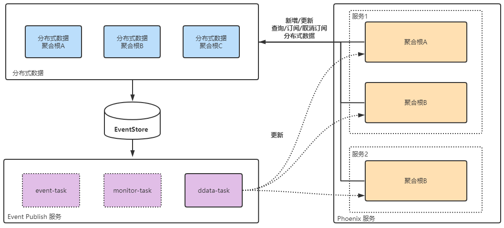

:::danger API May change

此部分的 API 还处于试验阶段, 可能在后续的版本中会发生变更!

:::

## 功能介绍

当需要在 Phoenix 集群中的多个节点间使用共享数据时，可以使用 Phoenix 提供的分布式数据功能。



* 该功能提供了一类特殊的聚合根用来专门维护所有的分布式数据。默认 API 基于 Multi 模式。
  * Multi 模式下, 具体的分布式数据类的 `Class.SimpleName` 作为聚合根 ID, 单个聚合根维护该类下的所有分布式数据.
  * Single 模式下，`Class.SimpleName`  + `ddataCode` 为聚合根 ID, 单独一个聚合根维护分布式数据.
* 该功能提供了一系列的 API 供 Phoenix 服务对分布式数据进行 新增/更新/查询/订阅/取消订阅 等操作，并支持值过期功能。
* 分布式数据提供了 `ExtendDDataSource` 接口, 在值过期或初始化时, 通过该接口获取外部数据更新自身.
* 该功能提供默认的 Event-Publish 任务 ddata-task （该任务默认开启, 可通过 `quantex.phoenix.event-publish.enable-ddata-task=false` 进行关闭）, 当更新分布式数据时, ddata-task 会将分布式数据更新事件转换为分布式数据变更命令, 同时根据该分布式数据与业务聚合根之间的订阅关系, 将分布式数据变更命令进行多播。

## API 介绍

分布式数据主要分为客户端，和基于 Event-Publish 实现数据更新的服务端两个部分。

### 客户端 API

客户端层面的 API 分为两个部分：

- **Phoenix-Client**：轻量客户端  API，没有服务端组件，用于外部向 Phoenix 服务端发起请求
- **Phoenix-Distributed-Data**: 完整的客户端 API，用于聚合根向分布式数据发起请求

两者的共同点是都实现了 `DistributedDataRemote` 接口. 该接口是与分布式数据服务端通信的工具, 可以利用该接口 API 方便的进行分布式数据的维护.该对象不支持序列化.

```java
public interface DistributedDataRemote {

  /**
   * 新增单个分布式数据, 由一个聚合根维护
   *
   * @param ddataCls
   * @param ddataCode
   * @param value
   * @param targetTopic
   */
  <T> boolean addSingleDData(
          Class<T> ddataCls, String ddataCode, Object value, String targetTopic);

  /**
   * 新增带过期时间的单个分布式数据, 由一个聚合根维护
   *
   * @param ddataCls
   * @param ddataCode
   * @param value
   * @param targetTopic
   * @param expireTime 过期时间
   */
  <T> boolean addSingleDData(
          Class<T> ddataCls, String ddataCode, Object value, String targetTopic, Duration expireTime);

  /**
   * 新增分布式数据
   *
   * @param ddataCls
   * @param ddataCode
   * @param value
   * @param targetTopic
   */
  <T> boolean addDData(Class<T> ddataCls, String ddataCode, Object value, String targetTopic);

  /**
   * 新增带过期时间的分布式数据
   *
   * @param ddataCls
   * @param ddataCode
   * @param value
   * @param targetTopic
   * @param expireTime 过期时间
   */
  <T> boolean addDData(
          Class<T> ddataCls, String ddataCode, Object value, String targetTopic,
          Duration expireTime);

  /**
   * 单查询单个聚合根的分布式对象，不维护订阅关系
   *
   * @param ddataCls
   * @param ddataCode
   * @param targetTopic
   * @param <T>
   * @return
   */
  <T> DData<T> querySingleDData(Class<T> ddataCls, String ddataCode, String targetTopic);

  /**
   * 单查询分布式对象，不维护订阅关系
   *
   * @param ddataCls
   * @param ddataCode
   * @param targetTopic
   * @param <T>
   * @return
   */
  <T> DData<T> queryDData(Class<T> ddataCls, String ddataCode, String targetTopic);

  /**
   * 调用远程方式获取单个聚合根的分布式数据并建立订阅关系
   *
   * @param ddataCls
   * @param ddataCode
   * @param targetTopic
   * @param selfTopic
   * @param <T>
   * @return
   */
  <T> DData<T> subscribeSingle(
          Class<T> ddataCls, String ddataCode, String targetTopic, String selfTopic);

  /**
   * 解绑某一订阅者和某一具体单个聚合根的分布式数据之间的订阅关系
   *
   * @param ddataCls
   * @param ddataCode
   * @param targetTopic
   * @param selfTopic
   */
  <T> boolean unsubscribeSingle(
          Class<T> ddataCls, String ddataCode, String targetTopic, String selfTopic);

  /**
   * 调用远程方式获取分布式数据并建立订阅关系
   *
   * @param ddataCls
   * @param ddataCode
   * @param targetTopic
   * @param selfTopic
   * @param <T>
   * @return
   */
  <T> DData<T> subscribe(
          Class<T> ddataCls, String ddataCode, String targetTopic, String selfTopic);

  /**
   * 解绑某一订阅者和某一具体的分布式数据之间的订阅关系
   *
   * @param ddataCls
   * @param ddataCode
   * @param targetTopic
   * @param selfTopic
   */
  <T> boolean unsubscribe(
          Class<T> ddataCls, String ddataCode, String targetTopic, String selfTopic);

  /**
   * 清除该类下所有的分布式数据, 仅作用于 MultiMode
   *
   * @param ddataCls
   * @param targetTopic
   */
  <T> boolean clear(Class<T> ddataCls, String targetTopic);
}
```

#### Phoenix-Client API

Phoenix-Client 包下的分布式数据客户端 API 为 **ClientDistributedDataRemote**, 与服务端不同的是不包含订阅功能（聚合根订阅分布式数据的更新）。

```java
DistributedDataRemote clientDData = new ClientDistributedDataRemote(phoenixClient, javaTimeClock);
// 支持的方法
clientDData.addDData(DData.class, ddataCode, value, targetTopic);
clientDData.addDData(DData.class, ddataCode, value, targetTopic, expireTime);
clientDData.addSingleDData(DData.class, ddataCode, value, targetTopic);
clientDData.addSingleDData(DData.class, ddataCode, value, targetTopic, expireTime);
clientDData.queryDData(DData.class, ddataCode, targetTopic);
clientDData.querySingleDData(DData.class, ddataCode, targetTopic);
clientDData.clear();
// 不支持的方法 UnsupportedOperationException
clientDData.subscribe();
clientDData.unsubscribe();
clientDData.subscribeSingle();
clientDData.unsubscribeSingle();

```

#### Phoenix-Distributed-Data

分布书数据服务端则提供两种 API：`DDataMap` 和 `DistributedDataRemote`

- DistributedDataRemote: 与分布式数据服务端通信的工具,可以利用该API方便的进行分布式数据的维护.该对象不支持序列化.
- DDataMap: 屏蔽与通信细节,提供一个Map结构的使用方式,支持序列化,可以再聚合根当中当做普通对象使用.


```java
public interface DistributeDataManager {

    String NAME = "distributeDataManager";

    /**
     * 获取分布式远程通信工具
     *
     * @return
     */
    DistributedDataRemote getDistributedDataRemote();

    /**
     * 创建一个map结构的分布式数据
     *
     * @param cls
     * @param targetTopic
     * @param selfTopic
     * @param <VALUE>
     * @return
     */
    <VALUE> DDataMap<VALUE> create(Class<VALUE> cls, String targetTopic, String selfTopic);
}

```

### 更新分布式数据

服务端的更新功能，可以通过参数控制。

```yaml
quantex:
  phoenix:
    event-publish:
      enable-ddata-task: true
```

### 支持自定义分布式数据的获取方式

使用分布式数据时，一般在查询/订阅某一个具体的数据之前需要先将该数据维护到分布式数据聚合中。但偶尔也会出现在查询/订阅某一数据时，该数据并不在分布式数据聚合中（之前没有维护），这个时候不期望应为不存在而报错或者返回null，而是希望能够调用用户端的某一方法来完成该数据的初始化同时维护到分布式数据聚合中方便后续使用。

Phoenix 提供如下接口，由用户提供具体实现。当查询/订阅某一数据时，如果该数据不存在，则调用该接口来完成初始化并维护到分布式数据聚合中。

:::info

当 ExtendDDataSource 返回 `null` 时,  `null` 将会被缓存到分布式数据中, 不会再次调用.

仅当显式调用 API 传入 `null` 删除时, 才会再次调用 ExtendDDataSource

:::

```java
/**
 * 扩展获取分布式数据接口
 */
public interface ExtendDDataSource {

    String NAME = "extendDDataSource";

    /**
     * 查询指定对象，具体逻辑由用户决定
     *
     * @param cls
     * @param ddataCode
     * @return
     */
    Object query(Class cls, String ddataCode);
}
```

使用案例如下：

:::info[提示]

注意：在注入 Bean 的时候必须要指定 Bean 的 name 为 `ExtendDDataSource.NAME`

:::


```java
@Configuration
public class ExtendDDataSourceBean {

    @Bean(name = ExtendDDataSource.NAME)
    public ExtendDDataSource customExtendDDataSource() {
        return new DdataExtendDDataSource();
    }

    class DdataExtendDDataSource implements ExtendDDataSource {

        @Override
        public Object query(Class cls, String ddataCode) {
            if (MarketInfo.class.equals(cls)) {
                return new MarketInfo(ddataCode, 100);
            }
            // else if ...
            return null;
        }
    }
}
```

### 值过期功能

分布式数据支持类似于 Redis 键过期的**值过期机制**

目前的过期时间分为本地过期时间以及远程过期时间.

分布式数据过期时间为 `Long` 类型的时间戳. 当 Phoenix 实例的系统时间超过该时间戳时, 并发生了查询时触发.

#### 1. 本地过期时间

本地过期时间指的是 `DDataMap` 中设置的过期时间, 作用域为 `DDataMap`, 即分布式数据的缓存. 

**分布式数据缓存**过期后:

- 触发 RPC 向远程的分布式数据聚合根获取值.

设置本地过期时间的方式:

- 通过 `updateLocal()` 的重载方法主动设置过期时间.
- 通过聚合根接收 `DdataChangeCmd` 更新 `DDataMap` 来同步本地过期时间.

#### 2. 远程过期时间

远程过期时间指的是 `分布式数据聚合根` 中值的过期时间. 作用域为该分布式数据.

设置远程过期时间的方式:

- `DistributedDataRemote.addDData()` 方法主动设置远程过期时间
- `ExtendDDataSource` 返回带过期时间的分布式数据包装类 `ExpireDData<T>`

**分布式数据值**过期后:

1. 当与 `ExtendDDataSource` 一起使用时, 值过期后从 `ExtendDDataSource` 获取新值.
2. 当用户没有自定义 `ExtendDDataSource`时, 值过期后清除.


:::caution[注意]

值过期后，订阅者接收值过期的变更不是可靠的，可能会存在订阅者没有接收到分布式数据值过期后变更的 DdataChangeCmd。

:::

#### 3. 自定义过期时间的时钟

分布式数据值过期时间默认使用 UTC 时间的 `java.time.Clock.SystemClock`, 开发者也可以通过以下配置自定义时区的时钟:

1. 配置关闭 `UTC` 时钟
2. 在 Spring 容器中增加 `java.time.Clock` Bean

```yaml
quantex:
  phoenix:
    server:
      ddata-utc-clock: false # 配置关闭 utc 时钟
```
```java
/**
 * 开发者自定义时钟Bean
 */
@Bean(name = "customClock")
public Clock customClock() {
    return Clock.system(ZoneId.of("UTC"));
}
```

## 使用说明

1. 引用依赖

```xml
<!-- 完整客户端和服务端 -->
<dependency>
  <groupId>com.iquantex</groupId>
  <artifactId>phoenix-distributed-data-starter</artifactId>
  <version>2.5.5</version>
</dependency>

<!-- 单客户端 API，供 Phoenix 客户端使用 -->

<dependency>
  <groupId>com.iquantex</groupId>
  <artifactId>phoenix-client-starter</artifactId>
  <version>2.5.5</version>
</dependency>

```

2. 使用案例1: DistributedDataRemote
```java
@Autowired private DistributeDataManager distributeDataManager;
        
// 1. 添加分布式数据
distributeDataManager
        .getDistributedDataRemote()
        .addDData(MarketInfo.class, secCode, market1, SysConfig.getInstance().targetTopic);
//2. 查询分布式数据
distributeDataManager
        .getDistributedDataRemote()
        .queryDData(cls, ddataCode, targetTopic);
// 3. 获取并订阅分布式数据
distributeDataManager
        .getDistributedDataRemote()
        .subscribe(cls, ddataCode, targetTopic, selfTopic)
// 4. 取消订阅
distributeDataManager
        .getDistributedDataRemote()
        .unsubscribe(MarketInfo.class,secuCode,SysConfig.getInstance().targetTopic,SysConfig.getInstance().selfTopic);
```


3. 使用案例2: DDataMap

```java
@Getter private DDataMap<MarketInfo> marketInfoDDataMap;
@Autowired private DistributeDataManager distributeDataManager;

marketInfoDDataMap = distributeDataManager.create(
        MarketInfo.class,
        SysConfig.getInstance().targetTopic,
        SysConfig.getInstance().selfTopic);

// 1. 查询分布式数据（不建立订阅关系）
marketInfoDData.query(market.getSecuCode());
// 2. 查询分布式数据（建立订阅关系）
marketInfoDData.get(market.getSecuCode());
// 3. 移除本地缓存 & 移除订阅关系
marketInfoDData.remove(market.getSecuCode());
// 4. 更新本地缓存的值
marketInfoDData.updateLocal(newMarket.getSecuCode(), newMarket);
```

3. 更新分布式数据

在使用分布式数据API时,如果聚合根订阅了分布式数据,在数据变更时则会以命令的方式推送到聚合根.用户需要接收该命令,灵活选择是否需要更新本地缓存.使用方式如下:

```java
@EntityAggregateAnnotation(aggregateRootType = "Demo")
public class DemoAggregate implements Serializable {
    private static final long serialVersionUID = -2549468778385293048L;

    @Getter private DistributedData.DDataMap<String, MarketInfo> marketInfoDDataMap;

    @InnerCommandHandler
    public ActReturn act(DdataChangeCmd cmd) {
        // 更新缓存的方式有 3 种.
        // 1. 直接根据 DdataChangeCmd 命令更新
        marketInfoDDataMap.updateLocal(cmd);
        // 2. 有选择的更新（当分布式数据带有过期时间时,会丢失该值）
        marketInfoDDataMap.updateLocal(cmd.getDdataCode(), (MarketInfo) cmd.getDdata());
        // 3. 判断是否为过期时间, 附加本地过期时间
        if (cmd.getExpireTime() != null){
            marketInfoDDataMap.updateLocal(cmd.getDdataCode(), (MarketInfo) cmd.getDdata(), cmd.getExpireTime());
        }
        // 当使用了批量删除所有分布式数据时, 会出现没有 ddataCode 的情况, 除了上面的 1 方案, 都需要额外增加以下判断.
        if (cmd.isClearAll()) {
          marketInfoDDataMap.clear();
        } else {
            // ...
        }
        
        return ActReturn.builder()
                .retCode(RetCode.SUCCESS)
                .retMessage("ok")
                .event(new DdataChangeEvent())
                .build();
    }
}
```