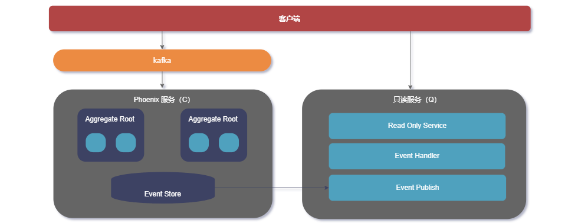

## Phoenix 架构 \{#architecture\}

Phoenix 是一款高性能、事件驱动型的微服务框架。它提供了一套领域驱动设计模式(DDD)的实现模型，以实体聚合根作为业务计算的基本单元，在整个业务计算的流程中，聚合根对象之间相互隔离，仅以消息(Message)进行交互。Phoenix 框架对聚合根对象的状态管理和多层次交互的实现进行了封装。使得业务开发人员只需要关注业务逻辑本身即可。

在 Phoenix 的整个架构设计中，提供了如下能力：

1. Phoenix 通过借助 Kafka 等消息中间件来完成相互之间的通信。通过对客户端代码进行封装，为用户提供方便易用的 API。
2. 实体聚合根采用 Event Sourcing 的思想，将整个聚合根的状态变更持久化为一系列不可变的事件。使得实体聚合根具备历史记录的能力，支持溯源和审计。
3. Phoenix 实现了事件的可靠交付。
4. Phoenix 将事件持久化至 Event Store，使得实体聚合根支持随时溯源，同时还支持通过快照来加速溯源过程。
5. Phoenix 支持订阅能力，可以将第三方服务的数据通过转换、投递至Phoenix 服务。
6. Phoenix 支持发布的能力，可以将 Phoenix 服务产生的事件进行转换，投递至第三方服务。
7. Phoenix 提供事务模块用来解决分布式事务问题，目前支持的事务模式有SAGA与TCC。

## 客户端通信模型 \{#client-communication\}

在事件驱动型微服务架构中，服务之间通常会借助事件通道来完成异步的通信。从而使整个系统可以获得松耦合、高性能等方面的好处。

利用 Phoenix 开发的服务，通过借助 Kafka 等消息中间件来完成相互之间的通信。Phoenix 通过对客户端代码进行封装，为用户提供方便易用的 API，同时可以保证消息投递的精确一次性语义。

Phoenix 客户端支持以下几种交互方式：

- 异步: 使用异步消息实现单向通知比较简单。客户端将消息（通常是命令式消息）发送到 kafka。Phoenix 服务订阅订阅并处理该消息，但是服务不会发回回复。
- RPC: RPC请求在面向用户端使用时很有用。客户端将消息发送给Kafka之后，会等待Phoenix处理完消息来回复。Phoenix内部处理是异步的。

## 服务间通讯模型 \{#server-communication\}

Phoenix 除了提供客户端的交互方式之外，还支持通过发布订阅的模式来完成服务之间的交互。

> 假设有一下场景：
> 
> 在一个大型的分布式系统中，存在两个服务（服务A、服务B），其中有一个业务场景会使得服务A产生事件A，当A事件产生时，需要通知服务B完成后续任务。

要完成服务之间的通信，存在很多方式。 如果使用 Phoenix 框架，可以使用 Event Publish 能力来实现此场景。

采用 Phoenix 开发的服务，服务处理过程中的事件会被持久化至 Event Store。Event Publish 功能，通过读取Event Store 中的所有事件，按照不同的业务需求，进行筛选、转换，最终投递至 kafka 队列中（具体逻辑可以由用户自己实现）。

其他服务可以通过订阅 kafka 的相关主题来完成交互。

Phoenix Event Publish 通过对核心逻辑进行封装，用户仅需要实现一个固定的接口，提供业务逻辑就可以了。Event Publish 可以保证 Event Store 中所有事件的可靠发布。

详细的 API 介绍可参考：[Phoenix Event Publish](/docs/phoenix-event-publish/event-publish-readme), [Phoenix Subscribe](/docs/phoenix-core/phoenix-subscribe-pub)

## DDD(领域驱动设计) \{#ddd\}

在介绍Phoenix的编程模型之前，应当先了解一下DDD。[DDD - Domain Driven Design](https://en.wikipedia.org/wiki/Domain-driven_design) 是一种处理高度复杂领域的设计思想，它试图分离技术实现的复杂性，并围绕业务概念构建领域模型来控制业务的复杂性，以解决软件难以理解，难以演进的问题。

DDD 不是架构，而是一种架构设计方法论，它通过边界划分将复杂业务领域简单化，帮我们设计出清晰的领域和应用边界，可以很容易地实现架构演进。

#### 聚合根 \{#aggregate\}

通过DDD的方法划分好领域之后，针对每个领域下的各个聚合需要识别出来聚合根，聚合根是聚合的唯一入口，所有对于聚合内部实体的命令都需要通过聚合根。

如果把聚合比作组织，那聚合根就是这个组织的负责人。聚合根也称为根实体，它不仅是实体，还是聚合的管理者。首先它作为实体本身，拥有实体的属性和业务行为，实现自身的业务逻辑。其次它作为聚合的管理者，在聚合内部负责协调实体和值对象按照固定的业务规则协同完成共同的业务逻辑。

聚合之间通过聚合根 ID 关联引用，如果需要访问其它聚合的实体，就要先访问聚合根，再导航到聚合内部实体，外部对象不能直接访问聚合内实体。

在使用Phoenix开发服务时，首先会定义聚合根，聚合根是Phoenix的处理消息的入口。Phoenix提供给用户的所有功能都是围绕着聚合根展开的：
1. EventSourcing: Phoenix对于聚合根提供EventSourcing的编程api，使用户可以方便构建出EventSourcing模型。
2. [Actor Model](https://en.wikipedia.org/wiki/Actor_model): Phoenix把每个聚合根实例和一个Actor绑定，保证聚合根内部处理是线程安全并且是强一致的。
3. ACID: Phoenix可以保证在聚合根内部处理一个命令是持久性，强隔离性和一致性以及原子性的。
4. Saga: Phoenix提供方便进行Saga编程的事务性聚合根，用来协调多个实体聚合根来完成分布式事务。

## Phoenix中的EventSourcing \{#event-sourcing\}

通过前文的描述，[事件溯源](/docs/phoenix/why-event-driven-microservice#eventsourcing)的好处是显而易见的。下面来看下 Phoenix 如何将这种独特而强大的方法付诸实现。

下面简单描述一下，从客户端发送命令（Command）通知 Phoenix 服务做修改，到 Phoenix 服务处理的整个流程。

1. 客户端发送命令（Command）到 MQ（kafka）
2. 订阅者接收到命令之后，调用 Command Handler 进行处理。
3. Command Handler 内部根据命令所指定的聚合根ID，找到具体的聚合根对象
4. 聚合根对象处理该 Command 并产生事件（Event），框架根据 Event 来修改聚合根状态
5. 框架负责自动持久化事件到 Event Store

> 在一个命令的处理过程中，框架保证 Command 的处理与 Event 持久化**保持原子性**，同时保证聚合根内部处理是满足强ACID的，除此之外，Phoenix 还可以保证被消费到的数据能够被**精确一次性处理**。

Phoenix 通过上面的处理流程，将状态修改持久化为一系列的事件。通过事件表示对象的状态，而事件是只会增加不会修改。这就能让数据库里的表示对象的数据非常稳定，不可能存在DELETE或UPDATE等操作。因为一个事件就是表示一个事实，事实是不能被磨灭或修改的。这种特性可以让领域模型非常稳定，在数据库级别不会产生并发更新同一条数据的问题。

由于 Phoenix 使用了 Event Sourcing 技术，所以可以直接在 Event Store 中自动做到聚合根并发修改的冲突检测，以及同一个命令的重复处理检测。并且能够自动做并发处理或重新发布该命令所产生的事件。

## Phoenix 中的 CQRS \{#cqrs\}

CQRS全称是：Command Query Responsibility Segregation，即命令查询职责分离。一个命令表示一种意图，表示命令系统做什么修改，命令的执行结果通常不需要返回；一个查询表示向系统查询数据并返回。另外一个重要的概念就是事件，事件表示领域中的聚合根的状态发生变化后产生的事件，基本对应DDD中的领域事件；

CQRS架构的核心出发点是将整个系统的架构分割为读和写两部分，从而方便我们对读写两端进行分开优化；

通过上面的描述，可以发现 Phoenix 实现了 Event Sourcing 模型，使得 Phoenix 服务可以天然的作为一个 C 端模型。同时还可以借助 Phoenix 提供的 [Event Publish](/docs/phoenix-event-publish/event-publish-readme) 功能(Event
 Publish 可以做到事件最少一次性投递)来协助构建 Q 端服务。

