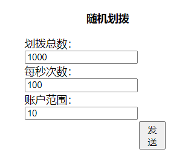
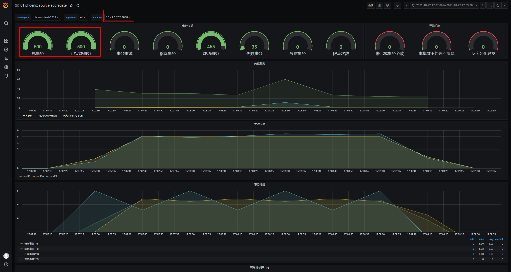
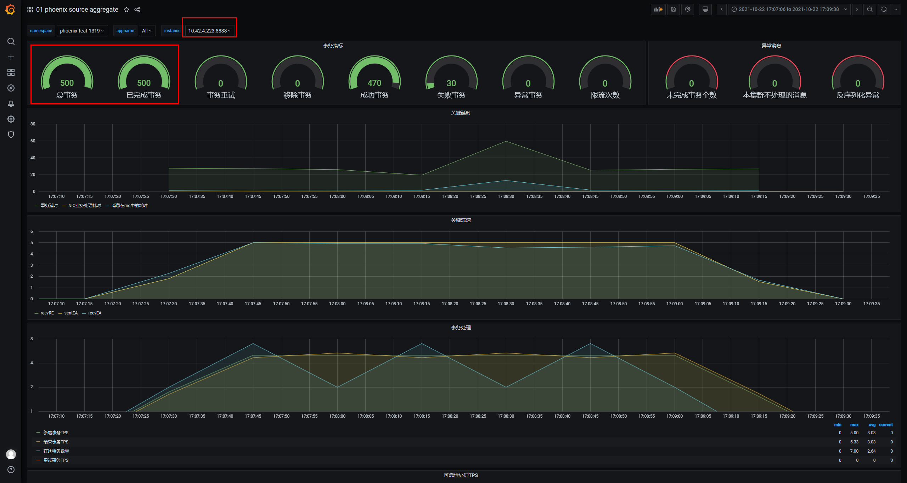
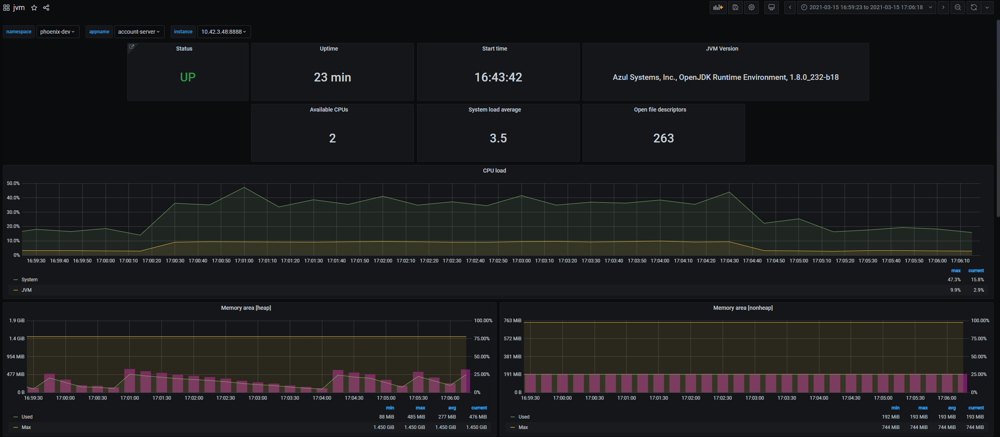
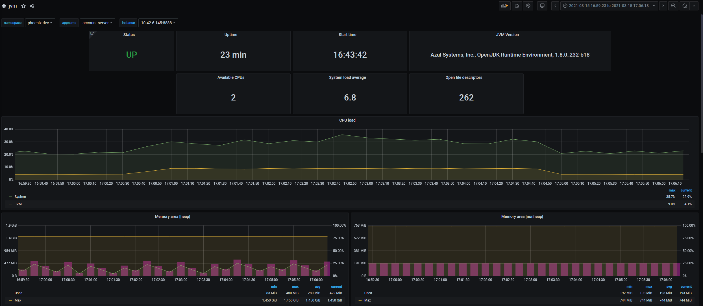

## 概述

均衡性直接标识着一个负载均衡算法/系统的优劣。Phoenix 内部有诸多负载均衡点，我们关心这些负载均衡能否很好的将流量分配在多个处理单元中。

Phoenix 中的均衡性测试将通过以下几个维度展开:

1. 聚合根分布: 校验 atLeastOneActor 分布和 AggregateActor 分布在多个实例的情况下是否均匀
2. Kafka 的消息分布: 查看每个 Topic 的每个 Partition 消息数量是否均衡
3. 数据库记录分布: 查看 EventStore 分库情况下的数据量是否均匀
4. 整体流量分布: 查看每个实例节点的处理流量是否均匀
5. CPU 使用分布: 查看每个实例 CPU 的使用是否一样

## 聚合根均衡性测试

### 测试场景

在 Kubernetes 环境部署 bank-account 服务集群，前端发起批量随机划拨请求，处理完毕后，观察集群内每个节点上分布的聚合根数量。

### 校验方法

观察 Grafana 上的 phoenix overview 监控面板，看聚合根的分布是否均匀。

### 测试步骤

1. 在 Kubernetes 环境中，使用 bank-account 服务，部署 2 个节点。

   

2. 发起随机划拨请求，划拨总数为 1000。

   

3. 处理完毕所有请求后，观察 phoenix source aggregate 监控面板。

   
   

4. 观察可得一个节点处理了 100002 条消息，另一个节点处理了 99998 条消息，且每个节点分布了五个聚合根。

## 消息均衡性测试

### 测试场景

在 Kubernetes 环境部署 bank-account 服务集群，前端发起批量划拨请求，处理完毕后，观察 Kafka 各个 Partition 里的消息数量。

### 校验方法

通过 `Kafka tool` 工具，连接集群使用的 Kafka，观察每个 Partition 的消息分布是否均匀。

### 测试步骤

1. 在 Kubernetes 环境中，使用 bank-account 服务，部署 2 个节点。

2. 发起随机划拨请求，划拨总数为 1000。

3. 处理完毕所有请求后，观察 `Kafka tool` 中每个 Partition 的消息数量。

   

4. 观察可得，消息在 Kafka 的多 Partition 内是分布均匀的。

## EventStore 均衡性测试

### 测试场景

在 Kubernetes 环境部署 bank-account 服务集群，前端发起批量划拨请求，处理完毕后，观察服务所使用的每个数据库中的 `event_store` 表的数据量。

### 校验方法

通过 `select count(1) from event_store` 语句查询数据量，观察数据量是否大致相等。

### 测试步骤

1. 在 Kubernetes 环境中，使用 bank-account 服务，部署 3 个节点；通过配置多个数据源让服务均衡的分布记录（参考：[Phoenix-server配置](/docs/phoenix-core/phoenix-core-config#server)）。

2. 发起随机划拨请求，划拨总数为 1000。

3. 观察每个数据库中 `event_store` 表的数据量。

   

4. bank-account 服务所采用的的 `event_store` 表分布于两个数据库中，观察可得，在每个数据库里分布的记录也是均匀的。

## 流量均衡性测试

### 测试场景

在 Kubernetes 环境部署 bank-account 服务集群，前端发起批量划拨请求，处理完毕后，观察集群内每个节点的处理速率。

### 校验方法

 通过 Grafana 中的 Phoenix 监控中的速率图表，观察每个节点的速率是否大致相同。

### 测试步骤

1. 在 Kubernetes 环境中，使用 bank-account 服务，部署 2 个节点。

2. 发起随机划拨请求，划拨总数为 200000，每秒发起 800 次。

   

3. 观察 Grafana 的 phoenix message 监控面板。

   

4. 观察可得，每个节点处理的流量是相当均匀的。

## CPU均衡性测试

### 测试场景

在 Kubernetes 环境部署 bank-account 服务集群，前端发起批量转账请求，处理完毕后，观察这段时间每个节点的 CPU 使用率。

### 校验方法

观察 Rancher 上每个服务节点的 CPU 使用图，观察每个节点的 CPU 占用是否大致相同。

### 测试步骤

1. 在 Kubernetes 环境中，使用 bank-account 服务，部署 2 个节点。

2. 发起随机划拨请求，划拨总数为 200000，每秒发起 800 次。

3. 通过 phoenix admin 的 JVM 监控面板查看各节点的 CPU 使用率。

   
   

4. 观察可得，处理过程中，两个节点的 CPU 占用率也是非常均匀的。

## 结论

经验证，Phoenix 能保证每一个负载均衡点都具有非常好均衡性，因而整体上来说，Phoenix 具有非常高的均衡性。