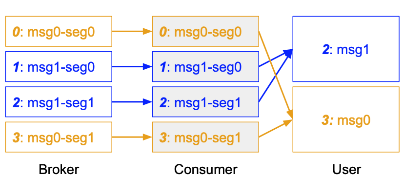
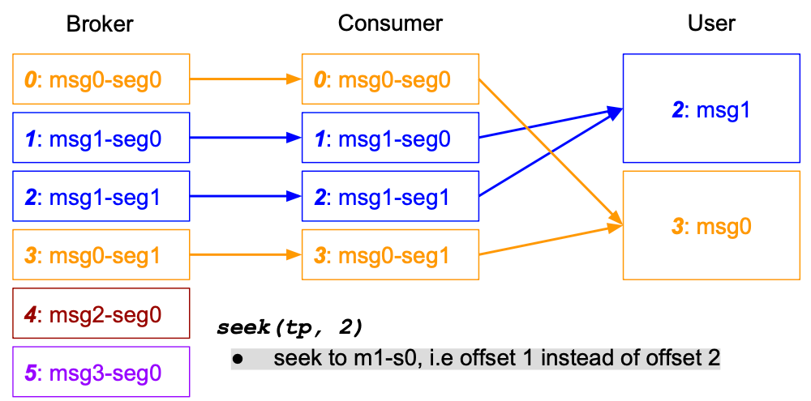
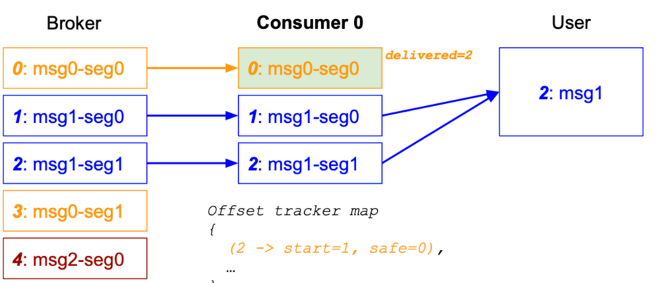
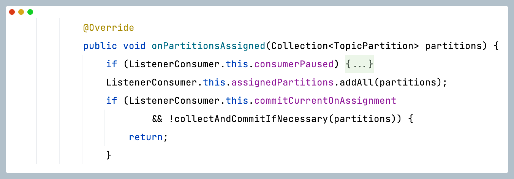
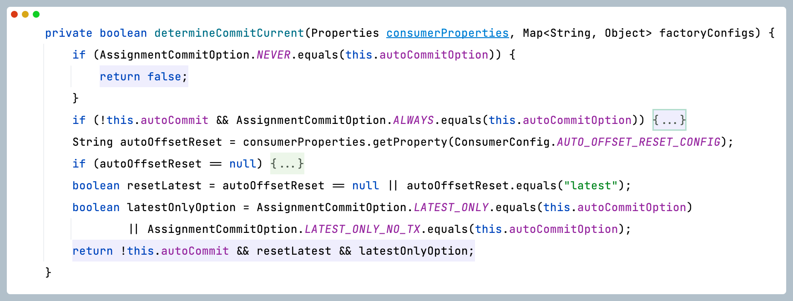

本文档分为两个部分（都是对 Phoenix-Kafka 能力做的一些扩展）：

1. Kafka 增强扩展：让 Phoenix Kafka Client 支持 LargeMessage 的消息发送
2. Kafka 分区选择器：为 Phoenix 内部模块消息发送（Producer）定义发送的分区选择策略

## 一. Kafka 增强扩展 \{#kafka-extend\}

> 这里的 Kafka 增强扩展只是 Phoenix 对 KafkaClient 的预留了扩展接口, 内置了 Linkedin 的 KafkaClient 作为 Apache KafkaClient
> 的增强扩展

### 简介 \{#kafka-extend-introduce\}

Phoenix 框架为了解决 Kafka 消息传输中的 LargeMessage 问题，提供/预留了可配置 KafkaClient 增强扩展，其中一种解决方案是 Chunk
Message，在探索之后本着不重复造轮子的原则，Phoenix 内置集成了支持 LargeMessage 的
[Linkedin Kafka Client](https://github.com/linkedin/li-apache-kafka-clients)

> 当然，通过更改配置后，Kafka 也支持超过默认大小的消息，Linkedin（原 Kafka 开发者）做了相关的 [Benchmark](https://engineering.linkedin.com/kafka/benchmarking-apache-kafka-2-million-writes-second-three-cheap-machines).
>
> 但是不优化的情况下，Large messages 可能会对 Broker 和 JVM 造成影响，然后拖慢 JVM 速度

当然，除了 Phoenix 的方案外，Kafka Large Message 也有其他解决方案，本文档不具体展开：

- Kafka 和外部存储中是用基于引用的消息传递（Reference-based）
- 在 KafkaClient 中使用无需外部存储的内置 Large Message 支持（Phoenix 所用）
- 内置 Large Message 支持 + 分层存储（tiered storage）

### 使用场景 \{#kafka-extend-scene\}

Kafka 扩展（主要是 Large Message 的支持）需要双端使用统一客户端（Consumer、Producer），目前识别到的场景有：

:::info
关于 CLIENT_CONSUMER 等 Phoenix 模块配置在 com.iquantex.phoenix.core.connect.kafka.PhoenixKafkaClientModule 中定义
:::
 
- 当聚合根发出/回复的事件大小超出 Kafka 限制时：`CLIENT_CONSUMER <-> SERVER_PRODUCER`  (用于PhoenixClient RPC
  模式下响应的接收)
- 当 EventPublish 发出的事件大小超出 Kafka 限制时：`EVENT_PUBLISH_PRODUCER <-> spring.consumer` （用 spring kafka 外部订阅）
- 当 PhoenixClient 发出的命令大于 Kafka 限制时：`CLIENT_PRODUCER <-> SERVER_CONSUMER`（用于PhoenixClient RPC、异步模式）
- 当 KafkaTemplate（spring kafka 客户端）发出的命令大于 Kafka 限制时：`spring.producer <-> SERVER_CONSUMER`（外部发送给
  Phoenix 订阅、也可以是用户的自定义订阅）
- 不使用 Phoenix，仅使用 Kafka 扩展：`spring.producer <-> spring.consumer`


### 使用说明 \{#kafka-extend-usage\}


:::caution 注意
Phoenix Kafka Extend 目前仅支持 K/V 为 `<String,byte[]>` 的序列化和反序列化. 如果需要支持 `<String,String>`，请传入时使用 `String.getBytes()` 
或提前将 Value 序列化
:::

#### 0. 引入 Kafka Extend 依赖 \{#kafka-extend-dependency\}

请注意，`phoenix-kafka-extend` 依赖 Phoenix 核心 API 包 `phoenix-core`

```xml
<dependency>
    <groupId>com.iquantex</groupId>
    <artifactId>phoenix-kafka-extend-starter</artifactId>
    <version>2.6.0</version>
</dependency>
```

#### 1. Phoenix Client、内部订阅等 \{#kafka-extend-client\}

:::tip 提示
当您在 Kubernetes 环境中通过环境变量配置 `spring-kafka-properties` 时，可以用下面这种格式：

`QUANTEX_PHOENIX_KAFKA_EXTEND_SPRING-KAFKA-PROPERTIES_BOOTSTRAP_SERVERS` 也可以使用 `QUANTEX_PHOENIX_KAFKA_EXTEND_SPRING_KAFKA_PROPERTIES_BOOTSTRAP_SERVERS`
:::


默认开启配置后，Phoenix 会自动将 Apache Kafka Client 替换成 Linkedin Kafka Clien

```yaml
quantex:
  phoenix:
    kafka:
      extend:
        # 是否开启 Phoenix Kafka Extend
        enabled: true
        # 是否让 Server 端对 Client 的回复使用 Kafka 增强 Client （RPC 场景，需要同时开启 client-consumer）
        server-producer-enabled: true
        # 是否让 Client 端接收 Server 的响应使用 Kafka 增强 Client（RPC 场景，需要同时开启 server-producer）
        client-consumer-enabled: true
        # 是否让 Client 端发送给 Server 的命令使用 Kafka 增强 Client（默认消息入口场景，需要同时开启 server-consumer）
        client-producer-enabled: true
        # 是否让 Server 端接收 MQ 订阅使用 Kafka 增强 Client（默认订阅场景，需要同时开启 client-producer 或接收的外部 Client 支持）
        server-consumer-enabled: true
        # 是否让 EventPublish 端发送给外部的消息使用 Kafka 增强 Client（需要外部的 KafkaConsumer 支持增强 Client，可以用 Phoenix-Spring 的集成）
        event-publish-producer-enabled: true
        # 是否开启 Spring Consumer 的 Kafka 增强 Client，Phoenix 会注册一个 ConsumerFactory Bean
        spring-consumer-enabled: true
        # 是否开启 Spring Producer 的 Kafka 增强 Client，Phoenix 会注册一个 ProducerFactory Bean
        spring-producer-enabled: true
        # Spring 的 Kafka 增强 Client 的配置
        spring-kafka-properties:
          "bootstrap.servers": 127.0.0.1:9092,127.0.0.1:9092,127.0.0.1:9092
        # Linkedin Kafka 配置
        # Producer: 普通消息的最大大小，超出则开始切分. 默认 50kb
        max-message-bytes: 51200
        # Consumer: 用于缓冲不完整大消息段的内存总大小上限（默认是 30mb）
        message-buffer-capacity: 32000000
        # Consumer: LargeMessage 起始 Offset 和当前 Offset 最大差距值，超出则认为 Large Message 已不完整。默认 1000
        message-expiration-offset-gap: 1000
        # Consumer: 每个分区要跟踪 Offset 的最大消息数，默认 500 
        max-offset-track-pre-partition: 500
```

#### 2. 自定义订阅 \{#kafka-extend-subscribe\}

:::info 注意事项
当 KafkaExtend 用于扩展时，从 Kafka 接收的消息体积可能会大于 256KB，此时会超出 Phoenix 内部 akka 的限制，如果需要让大于 256KB 的消息发能够
发送到聚合根，则需要更改配置，如更改为 4MB 的相关配置为：（使用 `quantex.phoenix.akka.akka-conf` 自定义 akka 配置）

```CONF
akka.remote.artery.advanced.maximum-frame-size= 4096 KiB
```
:::

当开启 Kafka Extend 后，Phoenix 会向 Spring 注册一个 `com.iquantex.phoenix.core.connect.kafka.KafkaClientProvider` 的 SpringBean.

用户可以拿到该 Bean 并注册到 KafkaSubscribe 中：

```java
@Bean
public Subscribe customSubscribe(KafkaClientProvider clientProvider) {
    Properties properties = new Properties();
    properties.putIfAbsent(ConsumerConfig.AUTO_OFFSET_RESET_CONFIG, "latest");
    return new KafkaSubscribe(
            mqAddress,
            subscribeTopic,
            appName,
            properties,
            new SelfDeseriSchema(),
            clientProvider.getConsumer(PhoenixKafkaClientModule.SERVER_CONSUMER)); // 是用和 SERVER_CONSUMER 一样的配置
        
// 假设用户不希望 Server 订阅使用 Kafka Extend，仅对自己的某个自定义订阅需要，则可以是用默认的增强 Consumer
ConsumerFactory factory = clientProvider.getConsumer(PhoenixKafkaClientModule.ENHANCE_PRODUCER);        
}
```

#### 3. Spring Kafka Producer 集成 \{#kafka-extend-producer\}

当用户想要在 Phoenix 外部（其他服务）使用 Phoenix Kafka Extend 时，通过开关，Phoenix 会向 Spring 注册 KafkaClient Factory 的 SpringBean，用户只需要修改 Spring Kafka Client 的配置即可。


```java
/**
 * 在注册 KafkaTemplate Bean 时，从 Spring IOC 中取出名为：phoenix-kafka-producer-extend 的 Spring 接口 ProducerFactory 的实现实例. 然后作为 KafkaTemplate 的参数传入 KafkaTemplate
 */
@Bean
public KafkaTemplate<String, byte[]> kafkaTemplate(
        @Qualifier(value = "phoenix-kafka-producer-extend")
                ProducerFactory<String, byte[]> producerFactory) {
    return new KafkaTemplate<String, byte[]>(producerFactory);
}
```

#### 4. Spring Kafka Consumer 集成 \{#kafka-extend-consumer\}

当用户想要在 Phoenix 外部（其他服务）使用 Phoenix Kafka Extend 时，通过开关，Phoenix 会向 Spring 注册 KafkaClient Factory 的 SpringBean，用户只需要修改 Spring Kafka Client 的配置即可。


```java
/**
 * 同理，只需要更改 ConcurrentKafkaListenerContainerFactory 的 ConsumerFactory 即可.
 * Phoenix 会注入名为 phoenix-kafka-consumer-extend 的 Spring 接口 ConsumerFactory 的实现实例
 */
@Bean
public ConcurrentKafkaListenerContainerFactory<String, byte[]> kafkaListenerContainerFactory(
        @Qualifier(value = "phoenix-kafka-consumer-extend")
                ConsumerFactory<String, byte[]> consumerFactory) {
    ConcurrentKafkaListenerContainerFactory<String, byte[]> factory =
            new ConcurrentKafkaListenerContainerFactory<>();
    factory.setConsumerFactory(consumerFactory);
    factory.setBatchListener(true);
    factory.getContainerProperties().setAckMode(ContainerProperties.AckMode.MANUAL_IMMEDIATE);
    return factory;
}
```

### 内部处理 \{#kafka-extend-internal\}

本文档只做简单介绍，详细请参考：https://github.com/linkedin/li-apache-kafka-clients

#### 1. Offset \{#kafka-extend-offset\}

Kafka Extend 在处理 Large Message 时，会以最后一个 Segment 的 Offset 作为消息的 Offset



#### 2. Offset Tracking  \{#kafka-extend-tracking\}

Kafka Extend 会在 Records 的 Header 中添加 Large Message 的信息，并在 Client 内部维护，当 Msg1 的消息传输发生问题时，用户可以从 Msg1 的第一个 Segment 开始消费（seek）



#### 3. Rebalanced \{#kafka-extend-rebalanced\}

当 Msg1 未被交付给 User 时，此时重平衡后从 offset=0 开始消费



当 Msg1 成功交付给 User 之后，Commit 中附加 Header 带上 delivered=2 的信息，并在重平衡后从 offset=3 开始消费并交付给 User


#### 4. 内存开销 \{#kafka-extend-memory-cost\}

- 生产者：除了消息切分（splitter）和消息拷贝外，没有额外的内存开销
- 消费者
  - `buffer.capacity`：消费者会缓存固定长度的消息
  - `expiration.offset.gap`：当 Offset 和 Large Message 的起始 Offset 超出一个差值，则认为该消息不完全，KafkaExtend 会丢弃该消息

#### 5. 性能开销 \{#kafka-extend-perf-cost\}

- 额外的消息切分（split）和组装（assemble） Segment 的序列化开销
- Consumer 中 MessageBuffer 的开销
- Consumer 中 Offset Tracking 的开销（每个消息占用 24 bytes）


#### 6. 兼容性 \{#kafka-extend-compatible\}

Linkedin Kafka 相关的 Client 包有：

- `com.linkedin.kafka.clients:li-apache-kafka-clients`：Phoenix 使用，用于 LargeMessage 支持
- `com.linkedin.kafka:kafka-clients`：li-apache-kafka-clients 的依赖，Phoenix 默认排除，可使用 Apache Kafka Client

虽然 Linked 的 `li-apache-kafka-clients`对`com.linkedin.kafka:kafka-clients`的依赖可使用 Apache Kafka Client 代替，但仍然有一些方法是 Linkedin Kafka Client 独有的。
因此，假设用户需要更好的 `li-apache-kafka-clients` 支持，请使用 Linkedin 自己的 KafkaClient（和 Apache Kafka Client 冲突，类名几乎一致） 请根据自身需要选择。

在 Kafka Extend 中使用 Apache Kafka Client 可能会遇到一些兼容问题，例如 Producer flush() 方法的 `NoSuchMethodException`.(不支持 Timeout，不影响主流程，会走入旁路)

#### 7. 消息路由 \{#kafka-extend-router\}

此处的消息路由是指 Kafka 超大消息经过 KafkaExtend 处理之后的后续路径，通常来说在仅使用 KafkaExtend 的 Producer 下时没有任何问题的（因为已经是在 Phoenix 中
消息流转的最后一步。当 KafkaExtend 用于订阅时，可能会让消息超出 Phoenix 内部消息流转的大小限制（256KB）。下面分别是影响的路径和不影响的路径：

- EventPublish KafkaProducer：不受影响，消息不会在集群内传递
- DistributionData Broadcast；不受影响，消息不会在集群内传递
- PhoenixServer Producer：（通常用于回复 PhoenixClient 实现 RPC）不受影响，在这里消息会跨 Actor，但不会跨 JVM，跨集群节点
- Spring KafkaProducer：此阶段不受影响，取决于 Producer 发往的 Topic 是否是由 Phoenix 消费
- Spring KafkaConsumer：不受影响，这里是直接由用户代码处理消息，不经过 Phoenix 集群及 Actor 处理
- PhoenixClient：此阶段不受影响，但后续发往的 PhoenixServer 处理可能会受影响
- PhoenixServer Subscribe：受影响，主要是发往聚合根的 Command 大小会被 Phoenix 内部的 Actor 通信大小所限制（可配置更高）

对于 Phoenix 集群内部的大体积“命令”的消息传输，目前可以通过配置 Akka 配置：`akka.remote.artery.advanced.maximum-frame-size` 短暂支持。
但更大体积的消息传输意味着更高的丢失概率，即使在可靠交付的保证下，也会让消息的延迟增加；并且这个配置存在上限，对于超大体积（大于 10MB），则不建议用这种方式。

后续 Phoenix 会支持内部大体积消息的 Chunk Message（分块传输），这能让 Phoenix 内部支持上超大体积的（大于 10MB）消息传输

## 二. 自定义 Kafka 分区选择器 \{#partition-selector\}

Phoenix 支持对 KafkaProducer 发送的消息实现分区选择策略, 支持配置的模块如下：

- phoenix-client：消息发送到 Server 订阅的主 Topic 时，分区的选择策略
- phoenix-server: 消息响应/回复到 PhoenixClient/其他回复路径的 Topic 时，分区的选择策略
- phoenix-event-publish：事件投递通过 EventPublish 投递时，分区的选择策略
- phoenix-distribution-data：分布式数据发布更新事件时，分区的选择策略

:::tip 提示
除了作为分区选择器之外，该接口实现也可以用于监控用途. 例如在内部采集流量后, 返回 -1 的分区号，此时 Phoenix 不会选定投递的分区，而是让 Kafka 根据 Key 自行决定。
:::

### 接口实现 \{#partition-selector-api\}

```java
public interface PartitionSelector {

    /** 选择 Kafka 默认的分区策略. */
    int KAFKA_DEFAULT = -1;

    /**
     * 通过消息的key选择一个目标分区
     *
     * @param key {@link org.apache.kafka.clients.producer.ProducerRecord} Key
     * @param topic Topic
     * @param partitionInfos Topic Partitions
     * @return
     */
    int select(String key, String topic, List<PartitionInfo> partitionInfos);
}
```

### 配置实现 \{#partition-selector-config\}

下面所示的配置并非默认值，而是当用户不自定义时选择的"默认分区选择器"，Spring 配置的默认值为 null

```yaml
quantex:
  phoenix:
    client:
      mq:
        # 自定义分区选择器实现（发送到 Phoenix MQ 订阅）
        partition-selector-class-name: com.iquantex.phoenix.core.connect.kafka.OriginPartitionSelector
    server:
      mq:
        # 自定义分区选择器实现（回复给 Client Topic）
        partition-selector-class-name: com.iquantex.phoenix.core.connect.kafka.OriginPartitionSelector
    event-publish:
      event-task:
        # 自定义分区选择器实现（EventPublish 到指定 Topic）
        partition-selector-class-name: com.iquantex.phoenix.eventpublish.mq.kafka.DefaultKafkaPartitionSelector
      d-data-task:
        # 自定义分区选择器实现（DData 发送到 Phoenix MQ 订阅）
        partition-selector-class-name: com.iquantex.phoenix.eventpublish.mq.kafka.DefaultKafkaPartitionSelector
```


## FAQ \{#faq\}

### 1. KafkaProducer NoSuchMethodException \{#no-such-method\}

正常现象，不影响主流程，参考兼容性问题

```log
[ WARN] [ispatcher-27] [c.producer.LiKafkaProducerImpl]: Wrapped KafkaProducer does not support time-bounded flush. MDC: {}
java.lang.NoSuchMethodException: org.apache.kafka.clients.producer.KafkaProducer.flush(long, java.util.concurrent.TimeUnit)
	at java.lang.Class.getMethod(Class.java:1786)
	at com.linkedin.kafka.clients.producer.LiKafkaProducerImpl.<init>(LiKafkaProducerImpl.java:188)
	at com.linkedin.kafka.clients.producer.LiKafkaProducerImpl.<init>(LiKafkaProducerImpl.java:154)
	at com.iquantex.phoenix.client.mq.impl.kafka.LinkedKafkaProducerFactory.createProducer(LinkedKafkaProducerFactory.java:26)
	at com.iquantex.phoenix.core.connect.kafka.KafkaServerProducer.init(KafkaServerProducer.java:85)
	at com.iquantex.phoenix.server.akka.SenderActor.preStart(SenderActor.java:39)
	at akka.actor.Actor.aroundPreStart(Actor.scala:548)
	at akka.actor.Actor.aroundPreStart$(Actor.scala:548)
	at akka.actor.AbstractActor.aroundPreStart(AbstractActor.scala:220)
	at akka.actor.ActorCell.create(ActorCell.scala:643)
	at akka.actor.ActorCell.invokeAll$1(ActorCell.scala:513)
	at akka.actor.ActorCell.systemInvoke(ActorCell.scala:535)
	at akka.dispatch.Mailbox.processAllSystemMessages(Mailbox.scala:295)
	at akka.dispatch.Mailbox.run(Mailbox.scala:230)
	at java.util.concurrent.ThreadPoolExecutor.runWorker(ThreadPoolExecutor.java:1149)
	at java.util.concurrent.ThreadPoolExecutor$Worker.run(ThreadPoolExecutor.java:624)
	at java.lang.Thread.run(Thread.java:750)
```

### 2. Uncaught exception in thread 'kafka-producer-network-thread \{#uncaught\}

这是因为 Linkedin Kafka Client 不支持部分方法，和 Spring 的兼容有点问题，解决方案是不在 Spring KafkaTemplate 中是用 KafkaExtend

```log
[2023-06-01 14:53:25,197] [ERROR] [| producer-9] [kafka.common.utils.KafkaThread]: Uncaught exception in thread 'kafka-producer-network-thread | producer-9': MDC: {}
java.lang.AbstractMethodError: Method com/linkedin/kafka/clients/producer/LiKafkaProducerImpl.close(Ljava/time/Duration;)V is abstract
	at com.linkedin.kafka.clients.producer.LiKafkaProducerImpl.close(LiKafkaProducerImpl.java)
	at org.springframework.kafka.core.KafkaTemplate.closeProducer(KafkaTemplate.java:382)
	at org.springframework.kafka.core.KafkaTemplate.lambda$buildCallback$4(KafkaTemplate.java:433)
	at com.linkedin.kafka.clients.producer.LiKafkaProducerImpl$ErrorLoggingCallback.onCompletion(LiKafkaProducerImpl.java:525)
	at com.linkedin.kafka.clients.largemessage.LargeMessageCallback.onCompletion(LargeMessageCallback.java:49)
	at org.apache.kafka.clients.producer.KafkaProducer$InterceptorCallback.onCompletion(KafkaProducer.java:1348)
	at org.apache.kafka.clients.producer.internals.ProducerBatch.completeFutureAndFireCallbacks(ProducerBatch.java:227)
	at org.apache.kafka.clients.producer.internals.ProducerBatch.done(ProducerBatch.java:196)
	at org.apache.kafka.clients.producer.internals.Sender.completeBatch(Sender.java:707)
	at org.apache.kafka.clients.producer.internals.Sender.completeBatch(Sender.java:688)
	at org.apache.kafka.clients.producer.internals.Sender.handleProduceResponse(Sender.java:596)
	at org.apache.kafka.clients.producer.internals.Sender.access$100(Sender.java:74)
	at org.apache.kafka.clients.producer.internals.Sender$1.onComplete(Sender.java:798)
	at org.apache.kafka.clients.ClientResponse.onComplete(ClientResponse.java:109)
	at org.apache.kafka.clients.NetworkClient.completeResponses(NetworkClient.java:569)
	at org.apache.kafka.clients.NetworkClient.poll(NetworkClient.java:561)
	at org.apache.kafka.clients.producer.internals.Sender.runOnce(Sender.java:335)
	at org.apache.kafka.clients.producer.internals.Sender.run(Sender.java:244)
	at java.lang.Thread.run(Thread.java:750)
```


### 3. 分区选择器的分区数量问题 \{#shard-num\}

分区选择器的分区数量仅会在第一次获取时通过 KafkaClient `partitionsFor(String topic)` 获取，然后此结果被缓存用于加速。

当 Topic 的分区数量改变时，Phoenix 仍以本地内存缓存为准，而不会主动更新分区数量（这一点也体现在 Phoenix 的 MQ 订阅上）


### 4. OversizedPayloadException \{#oversize\}

```log
akka.remote.OversizedPayloadException: Discarding oversized payload sent to ... : max allowed size 262144 bytes, actual size of encoded ... was ... bytes.
```

这是因为发送的消息大小超出了 Phoenix 默认消息的 256KB 大小的限制，如需要更改为 4MB 的相关配置为：（使用 `quantex.phoenix.akka.akka-conf` 自定义 akka 配置）

```CONF
akka.remote.artery.advanced.maximum-frame-size = 4096 KiB
```

### 5. java.lang.AbstractMethodError \{#method-error\}

在 spring-kafka 版本是 2.5.x 及以上时（例如 spring-boot 2.3.7.RELEASE）使用 `phoenix-kafka-extend` 会导致该错误，完整错误信息如下：

```log
java.lang.AbstractMethodError: com.linkedin.kafka.clients.consumer.LiKafkaConsumerImpl.committed(Ljava/util/Set;)Ljava/util/Map;
```

这是因为 2.5.x 版本的 Spring kafka 的 KafkaMessageListenerContainer 使用了一个  `phoenix-kafka-extend` 中 Linkined Kafka Client 未实现的 KafkaConsumer 批量提交方法.

在 KafkaMessageListenerContainer 源码中，该方法有个前置条件：`commitCurrentOnAssignment`，我们可以通过该条件跳过该方法，从而解决 Linkined Kafka Client 未实现 `commited(Set<TopicPartitions> topicPartitions)` 的问题



通过该前置条件的赋值方法，我们可以通过修改 ContainerProperties.AssignmentCommitOption 来简单解决此问题



解决方案如下，同理，在 commitCurrentOnAssignment 的赋值方法 `determineCommitCurrent()` 通过走向其他分支（最终必须是 false）来实现跳过也能简单修复此问题。

除此之外，也可以通过降级等方式解决此问题。

```java
@Bean
public ConcurrentKafkaListenerContainerFactory<String, byte[]> kafkaListenerContainerFactory(
@Qualifier(value = "phoenix-kafka-consumer-extend")
                ConsumerFactory<String, byte[]> consumerFactory) {
        ConcurrentKafkaListenerContainerFactory<String, byte[]> factory =
        new ConcurrentKafkaListenerContainerFactory<>();
        factory.setConsumerFactory(consumerFactory);
        factory.setBatchListener(true);
        factory.getContainerProperties().setAckMode(ContainerProperties.AckMode.MANUAL_IMMEDIATE);
        // 避免 Spring Kafka 使用批量 Commited
        factory.getContainerProperties().setAssignmentCommitOption(ContainerProperties.AssignmentCommitOption.NEVER);
        return factory;
}
```

### 6. LargeMessageSendException \{#large-message-send\}

这种情况是配置的 `quantex.phoenix.kafka.extend.max-message-bytes` 与 Kafka Server 的最大消息大小不匹配，Kafka Extend 要求此配置低于 Kafka Server 的配置大小，这是因为 Kafka Extend 会在拆分的消息中附加一些元数据（消息分了多少批来发送，消息总长度，消息序号等）


```log

[0000-00-00 00:00:00] [ERROR] [| producer-3] [c.producer.LiKafkaProducerImpl]: Unable to send event [No Custom Info] with message id e7cfbd58b48445a2b28df03c03ba7226 to kafka topic xxxx-xxxx-xxx MDC: {}
com.linkedin.kafka.clients.largemessage.errors.LargeMessageSendException: Error when sending large message. Sent 1 of 11 segments.
	at com.linkedin.kafka.clients.largemessage.LargeMessageCallback.onCompletion(LargeMessageCallback.java:53)
	at org.apache.kafka.clients.producer.KafkaProducer$InterceptorCallback.onCompletion(KafkaProducer.java:1348)
	at org.apache.kafka.clients.producer.internals.ProducerBatch.completeFutureAndFireCallbacks(ProducerBatch.java:227)
	at org.apache.kafka.clients.producer.internals.ProducerBatch.done(ProducerBatch.java:196)
	at org.apache.kafka.clients.producer.internals.Sender.completeBatch(Sender.java:707)
	at org.apache.kafka.clients.producer.internals.Sender.completeBatch(Sender.java:688)
	at org.apache.kafka.clients.producer.internals.Sender.handleProduceResponse(Sender.java:596)
	at org.apache.kafka.clients.producer.internals.Sender.access$100(Sender.java:74)
	at org.apache.kafka.clients.producer.internals.Sender$1.onComplete(Sender.java:798)
	at org.apache.kafka.clients.ClientResponse.onComplete(ClientResponse.java:109)
	at org.apache.kafka.clients.NetworkClient.completeResponses(NetworkClient.java:569)
	at org.apache.kafka.clients.NetworkClient.poll(NetworkClient.java:561)
	at org.apache.kafka.clients.producer.internals.Sender.runOnce(Sender.java:335)
	at org.apache.kafka.clients.producer.internals.Sender.run(Sender.java:244)
	at java.lang.Thread.run(Thread.java:750)
Caused by: org.apache.kafka.common.errors.RecordTooLargeException: The request included a message larger than the max message size the server will accept.
```

### 7. InvalidProtocolBufferException \{#invalid\}

这种情况下，主要是发送端使用了 Kafka Extend，并发送了超出 `quantex.phoenix.kafka.extend.max-message-bytes` 大小的事件，但接收端未正确配置成 Kafka Extend 的消费者。

如果是 Spring Kafka Listener，则需要修改 `org.springframework.kafka.config.ConcurrentKafkaListenerContainerFactory` 中的 ConsumerFactory 为 Kafka Extend 的 Spring Bean.

```log
Caused by: com.google.protobuf.InvalidProtocolBufferException: Protocol message contained an invalid tag (zero).
	at com.google.protobuf.InvalidProtocolBufferException.invalidTag(InvalidProtocolBufferException.java:105)
	at com.google.protobuf.CodedInputStream$ArrayDecoder.readTag(CodedInputStream.java:609)
	at com.iquantex.phoenix.core.message.protobuf.Phoenix$Message.<init>(Phoenix.java:637)
	at com.iquantex.phoenix.core.message.protobuf.Phoenix$Message.<init>(Phoenix.java:593)
	at com.iquantex.phoenix.core.message.protobuf.Phoenix$Message$1.parsePartialFrom(Phoenix.java:4687)
	at com.iquantex.phoenix.core.message.protobuf.Phoenix$Message$1.parsePartialFrom(Phoenix.java:4681)
	at com.google.protobuf.AbstractParser.parsePartialFrom(AbstractParser.java:163)
	at com.google.protobuf.AbstractParser.parseFrom(AbstractParser.java:197)
	at com.google.protobuf.AbstractParser.parseFrom(AbstractParser.java:209)
	at com.google.protobuf.AbstractParser.parseFrom(AbstractParser.java:214)
	at com.google.protobuf.AbstractParser.parseFrom(AbstractParser.java:49)
	at com.iquantex.phoenix.core.message.protobuf.Phoenix$Message.parseFrom(Phoenix.java:2213)
	at com.iquantex.phoenix.core.message.Message.<init>(Message.java:40)
	at com.iquantex.phoenix.eventpublish.deserializer.DefaultMessageDeserializer.deserialize(DefaultMessageDeserializer.java:21)
	... 24 common frames omitted
```


### 8. 适用场景/不适用场景 \{#scene\}

Kafka Extend 适用于部分，低频的消息中存在较大的体积的场景，使用 Kafka Extend 时并不会总是将消息拆分成分块，普通事件（大小低于`quantex.phoenix.kafka.extend.max-message-bytes`）总是会按照原来的方式传递。

Kafka Extend 不适用于频繁、多数的消息都是较大体积的场景，如每秒 1000 笔 10mb 大小的消息，这种情况下几乎要求 Kafka Broker 支持 10gb/s 的磁盘写入速度，特别是聚合根频繁使用大体积事件，这会导致数据库压力过大，最后导致消息积压，
又会导致内存压力过大。

如，默认配置下 EventPublish 是读取 128 行数据为一个批次，内存上最多存储 64 个批次，此时内存上最多能拥有 8192 ~= 8GB（假设一行的数据/事件大小是 1MB），这会导致 JVM 发生 OOM。

因此 Kafka Extend 支持大体积消息并不意味着 Phoenix 用户在聚合根及业务设计上不用考虑内存开销。相反，使用了 Kafka Extend 意味着了放开了消息体积的限制，那么更应该谨慎考虑背后所带来的内存开销。

